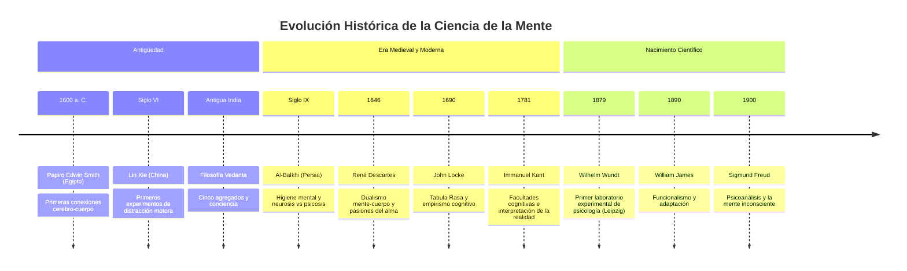

## El papiro de Edwin Smith

Quizás el reconocimiento más antiguo que se conoce del cerebro y de su funcionamiento se encuentra en el "Papiro Edwin Smith". Llamado así por el individuo que lo compro en la decada de 1800, se cree que este pergamino data de alrededor del año 1600 AC. En particular, este pergamino describe detalles sobre el tratamiento activo de varias condiciones medicas y lesiones diferentes que son importantes de entender. No solo incluye lesiones e intentos de tratar dolencias como una herida abierta, sino también información sobre el cerebro, los nervios y como las lesiones de ciertos tipos pueden crear ciertos efectos secundarios no deseados.

En particular, se hablo de que las lesiones cerebrales perjudicarian tanto las funciones motoras como las sensoriales. Esto es relevante: identifica el hecho de que el cerebro es responsable de controlar el cuerpo. No solo se señalaron las lesiones, sino que también se anatoron las primeras explicaciones que se registraron sobre las estructuras del cerebro, así como la forma de tratar las lesiones y cuando saber que no se debe hacer. *

Anuque este documento en particular no explicaba mucho sobre el conductismo, si que crea una base para la idea deque la psicología y el cerebro se convient en un campo medico legitimo y, por tanto, científico. Los conocimientos que contiene este pergamino superan con creces incluso a Hipocrates, considerado el fundador de la medicina moderna, que vivio 1000 años después de la redaccion de este pergamino.

### El primer experimento de psicología

Sin embargo, quizá el inicio de los estudios psicológicos se produjo con la experimentación de Lin Xie en el siglo \({}^{\rm VI}\) de nuestra era. Este experimento pretendia comprender la vulnerabilidad de las personas a la distracción y, en concreto, implicaba la realizacion de pruebas activas a varias personas para determinar lo que eran capaces de hacer cuando estaban distraidas.

En particular, Lin Xie hizo que las personas dibujaran un cuadrado con un mano mientras dibujaban activamente un circulo con la orta para determinar si podian controlar ambos lados de su cuerpo de diferentes maneras al mismo tiempo. Anuque esto no nos proporciona mucha información hoy en dia, se cree comunmente que es el nacimiento del estudio de la mente y de lo que la humanidad puede hacer como ciencia experimental. Al igual que con el "Papiro de Edwin Smith", entonces, esto es importante de reconocer no por la contribucion en si, sino porque comenzó a sentar las bases para entender la psicología como una ciencia en lugar de como un aspecto de la filosofía.

### El Vedanta

Avanzando en la historia, el siguiente reconocimiento importante de la psicología pudo verse en el _Vedanta_ de la India. Se trata de una serie de escritos filosóficos budistas que reconocen el sentido del yo. En particular, abordó varios conceptos que cualquier persona con incluso muy poco conocimiento de la psicología reconoceria como palabras clave psicológicas comunes. En particular, el Vedanta abordó los sentiimentos de la mente de varias maneras. Estas fueron el reconocimiento de los agregados, la vacuidad, el no-ser y la atención plena.

En particular, los agregados abarcaban la comprensión de cinco conceptos distintos. Estos eran la forma, la sensación, la percepción, las formaciones mentales y la conciencia. La forma reconconcia la existencia física o material de cualquier cosa, en particular en relación con los cuatro elementos de tierra, agua, fuego o viento. La sensación se referia a cualquier tipo de interacción sensorial con los objetos de forma positiva, negativa o neutra. La percepción se refiere a la comprensión de un proceso sensorial y mental. En efecto, permite reconocer y etiquetar algo, como el reconocimiento de que el pequeño animal cuadrupedo peludo que tienes delante es un gato, o que la planta que tienes al lado es de color verde. Las formaciones mentales se refieren a la capacidad de crear una comprensión de las actividades. Es la idea de condicionar un sentimento o una acción a partir de la exposición a un objeto. Por último, la conciencia se refiere a la percepción de algo que te rodea o que tienes delante, así como a la capacidad de comprender sus componentes.

### Abu Zayd Ahmed ibn al-Balkhi y la psique

Al pasar de la India a Oriente Medio, nos encontramos con un erudito persa que se intereso especialmente por la ciencia y la psicología. Fue el primero en introducir la salud mental y la higiene mental, considerandolas un método para tratar el alma. En particular, escribió _Sustento para el cuerpo y el alma_, llamandolo un forma de salud espiritual. En su obra, describio que la salud física y la mental están directamente conectadas entre si, reconociendo que la salud espiritual y la psicológica están intrinsecamente entrelazadas y que los medicos de la época hacian demasiado hincapie en el cuerpo sin tratar nunca también la mente.

En particular, afirmaba que, dado que las personas son tanto su alma (o mente) como su cuerpo, es importante que ambos esten sanos. Además, estaba seguro de que si el cuerpo enferma, la psique pierde su capacidad de funcionamiento, refiriendose al hecho de que cuando un esta enfermo fisicamente, suele sentirse agotado, nublado e incapaz de funcionar realmente de forma adecuada. Si la psique enferma, entonces, por supuesto, el cuerpo también reaccionaria de la misma manera, lo que llevaria a respuestas físicas a las enfermedades mentales.

Además, fue el primero en reconocer que existe una diferencia entre la neurosis y la psicosis, afirmando que la neurosis es angustiosa, pero aun permite el funcionamiento, mientras que la psicosis implica una desconexion entre la realidad y la fantasía. Identifico cuatro trastornos emocionales distintos, que tal vez reconocza como bastante similares a varios de los trastornos más conocidos en la actualidad. Se trata del miedo y la angiedad, la ira y la agresividad, la tristeza y la depresión, y la obsesión. Al hablar de la depresión, se consideraron tres tipos: la depresión normal, la depresión endogena que es una respuesta a algo físico, y la depresión clinica, que es más reactiva.

Al-Balkhi también fue capaz de identificar el tratamiento para estas enfermedades, como hablar de la perdida, aconsejar y asesorar, y también las maneras internas, como aprender a desarrollar otros métodos de pensamiento para ayudar a sobrellevarlas. Efectivamente, este fue el primer paso real hacía la psicología que se conoce hoy en dia.

### La Filosofias de la Mente

Hasta hace relativamente poco tiempo, la psicología no se consideraba una ciencia como lo es hoy. Más bien, se consideraba una rama de la filosofía hasta bien entrado el siglo XIX. Si usted esta familiarizado con la filosofía en absoluto, puede reconocer algunos de los nombres más grandes que se discuten aquí. Filosofos influyentes como Immanuel Kant, Rene Descartes, David Hume y John Locke se ocuparon de abordar el misterio de la mente humana. Estos filosofos, que siempre han sido pensadores profundos, trataron de explicar por que nos comportamos como lo hacemos, aportando ideas que se convertirian en la vanguardia de la psicología moderna.

### Rene Descartes

Incluso si no esta especialmente familiarizado con los filosofos, es probable que conozca a Descartes. Considerado el padre de la filosofía moderna, fue responsable de difundir mucho más que ideas o pensamientos filosóficos: también contribuyo en gran medida al calculo y, lo que es más importante para este libro, a la idea del dualismo: un concepto dentro de la psicología que reconoce que existe una diferencia inherente entre la mente y el cuerpo. En efecto, el dualismo declara que la mente es una cosa que no es física, en comparacion con el cerebro, que es físico y reconoce la division entre ambos.

Con sus monumentales palabras, "Cogito, ergo sum" (pienso; por tanto, soy), Descartes abordó el concepto de dualismo de frente. Reconoció que la mente y el cuerpo tenían que interactuar en algun lugar, y creyo que la glandula pineal era la zona a traves de la cual la mente podia interactuar con el cuerpo.

En su obra _Las pasiones del alma_, escrita en 1646, declaró que habia espiritus animales que influian en el alma humana; estos espiritus se conocian como pasiones, y habia seis que el identificaba. Estas eran el asombro, el amor, el odio, el deseo, la alegría y la tristeza. Como se puede identificar, estas son bastante similares a las emociones universales, faltando solo algunas de ellas. En efecto, la idea era que la glandula pineal servia de conexión entre el alma (o la mente) y el cuerpo, pero los espiritus animales podian secuestrar esa conexión, haciendo que el cuerpo reaccionara de formas no necessariamente previstas.

### John Locke

Siguiento con el tema de los filosofos y la psicología, debemos fijarnos ahora en John Locke. En particular, se intereso por las capacidades cognitivas de las personas. En su _Ensayo sobre el entendimiento humano_, Locke trato de abordar el fundamento del conocimiento humano. Determinó que la mente era efectivamente una pizarra en blanco al nacer, sin nada almacenado en ella. Piensa en la mente de un recién nacido como un disco duro nuevo que aun no se ha conectado al ordenador. A continuación, describe que, con el tiempo, la mente se llena de información y aprende a traves de la experiencia. Estaba decidido a rechazar la idea comunmente aceptada de las ideas innatas, como la de que todas las personas nacen con la capacidad de hacer o creer algo.

Sin embargo, Locke rechazo ese concepto y afirmó que la idea de las ideas innatas, como la de reconocer algo como dulce, no se debe a que los serees humanos comprendan la dulzura de forma innata, sino a que la exposición a la dulzura se produce de forma increiblemente temprana, antes de que los nios sean capaces de empezar a comunicar lo que saben. Efectivamente, Locke abordó la idea del aprendizaje y el conocimiento.

### David Hume

A mediados del siglo XVII, la continua busqueda de la comprension de la mente humana continuo con el _Tratado de la Naturaleza Humana_ de David Hume, concebido como una especie de combinacion entre empirismo, escepticismo y naturalismo. Efectivamente,

Discutio la idea de la ética en relación con la mente: describio que las personas estaban esclavizadas a sus pasiones, marcando una diferencia entre la moral y la razón. En efecto, quería abordar como y por que las personas toman las decisiones que toman.

Hume también abordó su propia teoría de la mente y las pasiones: determinó que lo que llamariamos emociones y deseos (las "pasiones" de Hume) son impresiones en lugar de ser ideas. Las pasiones sentidas, eliedo, la pena, la al eagria, la esperanza, la aversion y el deseo, proceden directamente del dolor o del placer. Además, sus pasionesindirectas, como el orgullo, la verguenza, el amor y el odio, son un poco más complejas e indirectas; a diferencia de las pasiones enumeradas anteriormente, las pasiones indirectas no impulsan el comportamiento sino que influyen en el pensamiento.

Esto puede resumirse como un intento de identificar como nuestros sentimientos hacía las situaciones determinan los comportamientos. Aunque hay mucho más en Hume que el simple aprendizaje de las emociones, esta es la parte más relevante para el avance de la psicología.

### Immanuel Kant

El filosofo aleman Immanuel Kant contribuyo con sus escritos a que la psicología se convirtiera en una disciplina propria. Kant consideraba que la psicología de su época estaba demasiado alejada de la verdadera experiencia humana y se centraba demasiado en los procesos internos. En su lugar, trato de investigar el funcionamiento de la mente. Quería responder a las preguntas sobre como se alcanza el conocimiento, cuanto podemos saber sobre un objeto, o como podemos incluso aprender para empezar.

En la psicología de su época, el conocimiento no era más que una replica del mundo exterior dentro de la mente. Sin embargo, Kant reconoció que la mente es demasiado compleja para ser simplemente un reflejo de la información sensorial, y en su lugar dijo que adquirimos conocimiento a traves de las facultades cognitivas. Efectivamente, aprendemos de nuestro entorno, pero lo que aprendemos no es exactamente lo que vemos delante de nosotros: hay que interpretarlo. La mente no solo aprende, sino que recibe información, la entiende, la procesa y aprende de ella, todo ello unido al sentido del yo. En efecto, la mente es un conglomerado de todas las facultades mentales reunidas.

### De lo Filosófico a lo Científico

Con el tiempo, surgió el puente de la filosofía hacía su propia disciplina. Hasta mediados del siglo XIX, se consideraba poco más que teoría, que se dejaba a los filosofos para que debatieran y entendieran en medio de su politica y metafisica. Sin embargo, con el tiempo, quedo claro que la psicología se diferenciaba mucho de la verdadera filosofía. Mientras que ambas estaban infinitamente fascinadas por entender por que algo sucedia o como funcionaba, la psicología no dependia de la lógica. La filosofía en si es un campo increiblemente dependiente de la lógica: todo debe encajar dentro de cierto s límites, y si no encajan dentro de esos límites, entonces es probable que sean rechazados de la discusion filosófica.

Sin embargo, a medida que la psicología se volvia más y más compleja, con preguntas que considerar, como por ejemplo por que algunas personas tendian a comportarse de una manera en respuesta a una cosa, pero otra persona responderia de manera totalmente difereente, quedo claro que la psicología requeriria algo más que lógica y observación. Se requeria la experimentación.

Fue la creciente comprension de la fisiologia, así como la necesidad de estudios científicos, lo que comenzó a impulsar realmente la psicología en su propia disciplina, totalmente separada de la filosofía. Quedo claro que el estudio continuado de la mente requeriria ese nivel de estructura científica hacía ella, como se vio a traves del trabajo del fisiologo aleman de mediados de 1800, Wilhelm Wundt.

### Wilhelm Wundt y los principios de la psicología fisiológica

En 1874, Wundt publicó un libro conocido como _Principios de Psicología Fisiologica_. Este fue considerado en gran medida como uno de los primeros vinculos entre la fisiologia y el estudio de la cognicion y el comportamiento humanos. Su apertura del primer laboratorio de psicología del mundo en 1879 se conocio como el inicio de la psicología propia, y comenzó a impulsar los estudios empiricos.

Wundt se centro en la psicología como estudio de la conciencia, utilizando experimentos para estudiar los procesos mentales. La única forma en que esto era posible en ese momento era mediante el uso de la introspección. La introspección era el acto de reflexion informal, así como lo que Wundt definia como el proceso de autoobservacion experimental. En efecto, tomaba a varias personas y las entrenaba para que se convirtieran en sus propios psicólogos; les enseñaba a analizar cuidadosamente sus propios pensamientos, tan libres de juicios o prejuicios como fuera posible.

Por supuesto, la mayoría de la gente considera que los métodos de Wundt para recopilar datos están tan lejos de ser-imparciales como podrían serlo -después de todo, no hay manera de monitorear realmente el funcionamiento interno de la mente de otra persona con el fin de probar su veracidad, y debido a eso, sus métodos hoy en dia probablemente serian rechazados como no científicos, pero no hay duda de que esta investigacion fue monumental para impulsar la psicología en su propia disciplina.

Se calcula que el laboratorio de Wundt educo a unos 17.000 estudiantes, difundiendo la idea de la psicología como concepto propio a lo largo y ancho. Es innegable que, si bien muchas de sus ideas fueron desconfirmadas y perdieron influencia con el paso del tiempo, sus propias acciones actuaron como catalizador del cambio hacía la psicología científica.

### La Diffusion de la Psicología

Con la difusion de la psicología por parte de Wundt a traves de su laboratorio educativo, empezaron a surgir también ootras ramas. En particular, dos se hicieron notables en el progreso de la psicología: El estructuralismo y el funcionalismo. Estas fueron las dos primeras escuelas de una cadena de muchas que la psicología llegaria a ver. Proporcionar paradigmas a traves de los cuales mirar el impacto de la psicología, utilizando varias reglas y pensamientos comunes que guiarian el proceso.

### Edward Titchener y el estructuralismo

El estructuralismo se convirtió en la primera escuela de pensamiento de la psicología. Dentro de esta escuela de pensamiento, se creia que la conciencia podia dividirse en componentes más pequeños, y a traves de la comprensión de esos componentes, se podría empezar a entender la mente. Al igual que Wundt, Titchener hizo uso de la introspección como modo principal de recogida de datos. Titchener hizo uso de varios aspectos de la psicología de Wundt, aunque con su propio giro.

Desgraciadamente, el estructuralismo nunca llego a arraigar en el campo, y como Titchener acabo muriendo, también lo hizo el estructuralismo.

### William James y el funcionalismo

Con el auge de un escuela de psicología, empezaron a surgir otras, todas compitiendo por el dominio del campo. Como respuesta y desafio casi directo al estructuralismo de Titchener, surgió el funcionalismo. Uno de los primeros psicólogos estadounidenses importantes, William James, escribo un libro conocido como _Los Principios de la Psicologia_. Con este libro, logro dominar el campo de la psicología estadounidense, y su libro se convirtió rapidamente en el nuevo estandar que se utilizo. La información contenida en este libro no fue titulada directamente como funcionalismo, pero sirvio como base para la escuela de pensamiento.

Cuando el funcionalismo entro en escena, aporto una comprensión de como funcionan los comportamientos. En particular, se preocupo por saber como los comportamientos beneficia a cualquier persona. Trataban de ver como cierto s comportamientos favorecian la situación mientras que otros lo hacian mucho menos. Efectivamente, mientras que tanto el estructuralismo como el funcionalismo hacian hincapie en el estudio de la mente inconsciente, el funcionalismo priorizaba la observación de la conciencia como un proceso continuo a traves del cual se procesaba todo.

El funcionalismo también se extinguio después de un tiempo, aunque las teorías que dejo fueron bastante influyentes.

### El Auge del Psicoanalisis

A finales del siglo XIX, otro nombre familiar para la mayoría de la gente entro en escena: Sigmund Freud. Neurologo austriaco, se convirtió en el fundador del psicoanalisis. Lo que diferencio al psicoanalisis de sus h homologos fue, sobre todo, la capacidad de empezar a tratar terapeuticamente los problemas que han surgido. Efectivamente, la idea del psicoanalisis impulsa la idea de la mente inconsciente que lo impulsa todo, y al llevar la información del inconsciente a la parte consciente de la mente, se puede lograr la catarsis, es decir, la capacidad de hacer frente al problema en cuestion.

Efectivamente, Freud fundó lo que se convertiria en uno de los aspectos más influyentes de la psicología moderna: El arte de la terapia. Los principios del psicoanalisis se alinean muy estrechamente con lo que se veria en tecnicas modernas como la terapia cognitivo-conductual, en la que se cree que los pensamientos inconscientes influyen en los sentimientos, que impulsan cierto s comportamientos, y que se puede empezar a reestructurar esos pensamientos en algo más funcional si se traen a la mente consciente para abordarlos.

El psicoanalisis trajo consigo el enfque psicodinamico de la psicología, alejandose de las ideas del psado y centrándose en el hecho de que la mente tiene varios aspectos que deben ser considerados.

Hoy en dia, muchos de los aspectos propios de Freud se consideran bastante anticuados, como la creencia de questo todo esta motivado por el sexo y la agresion sexual. Sin embargo, los principios que utilizo para tratar a otras personas siguen siendo increiblemente influyentes en la psicología actual.

Y con ello, hemos llegado a la primera de las perspectivas modernas de la psicología. Esa fue una visión general de miles de años de desarrollo, llevando a la psicología de la filosofía teórica a una ciencia dura que se rige por la evidencia, los números y el método científico.

## 📖 Capítulo 2: ¿Que es la Psicología?

Con la historia de la Psicología detras de nosotros, es hora de comenzar a profundizar en la comprension de la psicología como un campo. La psicología en si misma es increiblemente influyente: es necesario ser capaz de entender la mente para poder tratarla realmente. A medida que aprendemos más y más sobre la mente, es imperativo que nuestra capacidad para estudiarla también crezca. Mientras que antes se asumia que algun tipo de trastomo emocional era resultado directo de un demonio o espiritu, ahora se sabe que se debe a ortas causas, como trastornos de la personalidad o enfermedades mentales. A veces, es de naturaleza biológica, como tener una estructura física del cerebro diferente, mientras que otras veces reta tra de respuestas aprendidas a una situación o a unos estimulos.

Sin embargo, la propia psicología, como estudio de la mente, es fundamental para aprender.

A medida que se aprende y se desarrolla, obtenemos mucha más información sobre lo que ocurre con otras personas. Aprendemos a reconocer lo que retiene a ortas personas y lo que las impulsa a avanzar. Vermos lo que lleva a las personas a comportarse de forma altruista o a cuidar de su familia, y lo que las lleva a perjudicar a los demas. Entender la psicología es entender el ser humano y entender el ser humano es poder entender como tratar a los demas con amabilidad y empatía.

### El Estudio de la Mente

Por definicion, la psicología es el estudio científico de la mente y el comportamiento, y así lo ha hecho. Sin embargo, la mente y el comportamiento tienen mucho que ver; piense en todos los campos que existen dentro de la psicología. Hay campos dedicados a entender el desarrollo human normal, a ver como crecen y aprenden los niños. Otros campos se dedican a la psicología anormal y a ver como es de importante y como tratarla. Algunos estudian como se aprende, mientras que otros estudian como las drogas y otras sustancias pueden afectar al cuerpo y a la mente. En definitiva, la psicología abarca todo lo relacionado con la mente, tanto mental como fisicamente.

La psicología logra esto teniendo cuatro objetivos principales: Describir, explicar, predecir y cambiar la forma en que la gente piensa y actúa. Repasaremos cada uno de estos objetivos en un momento, pero lo que es fundamental, entender aquí es que estos objetivos impulsan la psicología. Dejan claro que actuamos de ciertas maneras por ciertas razones y ven, para entenderlo con el fin de hacer cualquier cambio si es necesario.

> [! NOTE]
> **Hito Clave:** La transición de ver los desequilibrios psicológicos como posesiones místicas hacía explicaciones neurofisiológicas y conductuales comenzó formalmente con el Papiro de Edwin Smith y se consolidó en el laboratorio de Wundt en 1879.