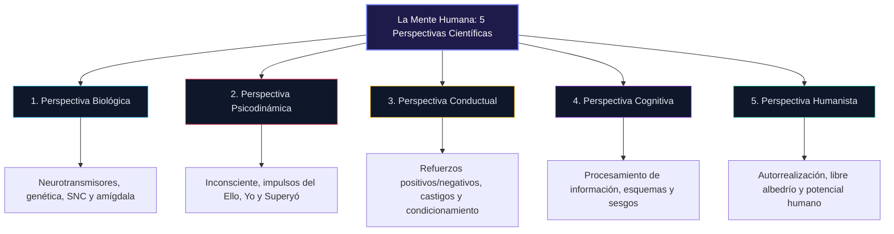

## Cambier

Por ultimo, una vez que hayas sido capaz de describir, explicar y predecir los comportamientos, podras empezar a entender como influir en el cambio de otras personas. Puedes buscar ayudar a controlar un comportamiento negativo, como que alguien que sufre de ansiedad aprenda a lidiar con esos sentimentos. Puede que te propongas observar a alguien que padece un trastorno obsesivo-compulsivo, averiguar sus factores desencadenantes y, a continuacion, averiguar cual es la mejor manera de ayudarle a cambiar ese comportamiento.

Efectivamente, el cambio permite modificar los comportamientos para que las personas desarrollen mecanismos de afrontamiento saludables, incluso cuando se entrentan a situaciones dificiles, trastornos o luchas que dificultan el funcionamiento normal. Se puede aprender a superar las fobias un vez que se comprende y predice la causa, o se puede aprender a solucionar los problemas de regulacion emocional. Puedes desafiar la depresion. Puedes corregir los pensamientos negativos. Puedes empezar a tratar eficazmente la mente de la otra persona cuando sepas como esta implicada la mente.

El estudio de la psicologia puede dividirse en gran medida en cinco perspectivas distintas, cada una de las cuales desea centrarse en una parte totalmente diferente de la mente. Estas perspectivas diferentes son la perspectiva biologica, la perspectiva psicodinamica, la perspectiva conductual, la perspectiva cognitiva y la perspectivahumanista.

Efectivamente, alguien que estudia un tema como la depresion desde la perspectiva biologica se va a centrar en la biologia que hay detras de la depresion que se esta estudiando: se fijara en los neurotransmittershores y en las ares dele cerebro que son responsables de los sentimientos. Sin embargo, alguien en la perspectiva conductual puede estar buscando la forma en que el mundo externo es directamente responsable de influir en esos sentimientos de delepresion.

Vamos a analizar las cinco perspectivas para tener una idea solida de todos los aspectos de lo que ocurre en la mente. Aunque tener un enfoque especifico puede ser increiblemente util, se necesitan los cinco para tener una vision adecuada y completa de lo que esta sucediendo.

### La Perspectiva Biologica

Como habra supuesto, el enfoque biologico trata de como el cuerpo influye en la mente. En concreto, se trata de entender el vinculo entre los estados mentales y el cuerpo de otra persona. Si te sientes feliz,¿qué ocurre en el cuerpo? Hay un cambio fisiologico en respuesta a tus sentimientos, y la perspectiva biologica esta increiblemente interesada en investigarlo.

Efectivamente, entonces, estaras investigando como funciona el cerebro.

Dentro de la perspectiva biologica, efectivamente, tu y tu conciencia sois la suma colectiva de tu cuerpo. Todo tu cerebro se une para trabajar a traves de impulsos electricos y quimicos, y esos pequenos impulsos son los que creean. En el gran debate de la naturaleza contra la crianza, esta es la parte de la naturaleza. Considera que la biologia del cerebro y del cuerpo es lo que importa para determinar los comportamientos y pensamientos de la otra persona.

Al igual que las ortas perspectivas, la perspectiva biologica esta totalmente interesada en comprender a las personas y sus comportamientos. Sin embargo, quieren observar otros aspectos. La genetica entra en juego, al igual que los cambios fisicos del cerebro. Pueden interesarse especialmente en como la genetica influye en todo tipo de aspectos de la personalidad, como la depresion o la ansiedad, o en como los danos cerebrales pueden provocar diversos problemas de capacidad o comportamiento. En particular, los psicologos biologicos estudiaran a los gemelos identicicos, aprendiendo todo lo que puedan sobre las tendencias de las personas frente a lo que realmente hacen.

Cuando se utiliza la perspectiva biologica, es probable que se empleen herramientas para observar el cerebro de la forma mas directa posible. Escáneres como el PET o el MRI pueden permitir a los psicologos ver la estructura fisica del cerebro para empezar a hacer inferencias sobre los aspectos conductuales de la persona.

En particular, la perspectiva biologica es muy poderosa: cuando se utiliza la perspectiva biologica, se esta asegurando que se entiende la fisiologia y, a veces, eso es suficiente. Si se sabe que alguien ha sufrido un derrame cerebral masivo y se puede ver exactamente donde esta el dano, por ejemplo, se puede empezar a predecir exactamente que partes de su comportamiento pueden verse afectadas. Tambien significa que cierto s cambios de comportamiento pueden abordarse como un signo de un problema medico fisico, como una lesion cerebral o un tumor.

Esta es tambien la perspectiva que se encargaria de garantizar la eficacia de la medicacion. Cuando se entiende la causa fisiologica, es mucho mas facil empezar a identificar la mejor manera de medicar el problema. Si hay ciertas partes del cerebro que estan luchando para crear suficiente cantidad de un determinado neurotransmitter, por ejemplo, entonces se puede medicar para ayudar al cuerpo ayudar a la mente.
El enfoque psicodinámico comenzo con el psicoanálisis de Sigmund Freud, pero con el tiempo crescio hasta abarcam tambien otras teorias, como las de Karl Jung, Erik Erikson y Alfred Adler. Dentro de la teoria psicodinámica, se cree que los acontecimientos de la primera infancia influyen en casi todo. Efectivamente, durante el periodo de la primera infancia, uno es especialmente susceptible de suffir da nos y, por lo tanto, de interiorizar cuestiones dentro de su mente inconsciente. Estos conducen a problemas de comportamiento que son el resultado de la mente inconsciente.

En particular, veras que dentro de la perspectiva psicodinámica se hace hincapie en la mente inconsciente. Piensa en la mente como un iceberg: solo la punta es visible. Puedes ver la parte consciente de la mente o la punta del iceberg, pero la gran mayoria esta oculta bajo la superficie del agua. Efectivamente, la mente inconsciente lo alberga casi todo. Todos tus impulsos motivacionales se alojan en el inconsciente. Tus sentimientos provendran de el, tus motivos estaran arraigados en el y tus decisiones se basaran en el.

La mente inconsciente, aunque es increiblemente poderosa, tambien es increiblemente impressionable. Por tanto, esto, hace que el enfoque del comportamiento humano pase de la naturaleza a la crianza.

Ademas, dentro de la perspectiva psicodinámica, se ven tres partes de la personalidad que surgen: El id, el ego y el super-ego.

Tu id se refiere a los instintos, es heredado y contiene toda tu personalidad natural y tus tendencias de comportamiento. El ego es la parte de la mente que esta destinada a mitigar las exigencias y los deseos del id, que es principalmente bastante irreal, y del mundo que nos rodea. Es la parte que toma las decisiones. Por ultimo, el superego es la serie de valores y moral que se aprende tanto de la sociedad como de los padres.

El id y el super-ego se consideran la mente inconsciente: ambos luchan por ganarse el favor de la mente (ego). Efectivamente, tus tendencias instintivas hacia el sexo y el comportamiento agresivo estaran constantemente intentando que actues de forma impulsiva, mientras que la parte aprendida intenta mantenerte a raya para garantizar que no hagas algo que no debes.

El conflicto conduce a la singedad, a la que el ego debe hacer frente de alguna manera. Estos mecanismos de afrontamiento se convierten en el metodo a traves del cual se comporta. Efectivamente, entonces, la mente consciente es la esclava de la mente inconsciente, con la mente inconsciente tomando las decisiones y controlando. Sin embargo, la mente inconsciente tambien se ve influenciada regulamente por caracteristicas e instancias externas. Un trauma puede, por ejemplo, provocar un cambio en la mente inconsciente, que luego se nota en el comportamiento.

### La Perspectiva del Comportamiento

La perspectiva conductista hace hincapie en el entorno que influye en tus comportamientos. Afirma que se puede entrenar eficazmente para hacer casi cualquier cosa si alguien esta dispuesto a esforzarse en ello. Cuando se cree en la perspectiva conductista, se rechaza la idea del libre albedrio: se declara efectivamente que todo comportamiento, se aprende mediante refuerzos o castigos.

Los refuerzos se refieren a las consecuencias que se producen despues de un comportamiento que es positivo o negativo. El positivo se refiere al hecho de que se haya puesto algo, mientras que el negativo se refiere al hecho de que se haya quitado algo. En este caso, el refuerzo positivo es una situacion agradable que se anade para animar al que el comportamiento continuie. Un refuerzo negativo, por tanto, es una situacion que se retira, normalmente desagradable, en respuesta a un comportamiento para animar a que siga ocurriendo en el futuro.

Por otro lado, el castigo es el acto de que ocurra algo para desalentar un comportamiento. Es lo contrario del refuerzo en el sentido de que esta disenado para desanimar, mientras que el refuerzo lo hace. Al igual que el refuerzo, el castigo puede ser tanto positivo como negativo. Por ejemplo, el castigo positivo puede consistir en anadir tareas adicionales como represalia por no escuchar o mentir sobre una situacion. Por otro lado, el refuerzo negativo es el acto de quitar algo agradable para disuadir el comportamiento en el futuro. Por ejemplo, imagina que tu hija adolescente no ha entregado varias tareas y le quitas el movil hasta que las entregue todas. Usted le quita algo agradable, en este caso, su telefono movil, para desalentar la conducta de seguir fatando a las tareas.

Los conductistas creen que los procesos anteriores son los que hacen que el comportamiento continuie o se interrumpa. Cuando uno disfruta de una situacion o recibe algo agradable como respuesta, quiere animarse a hacer algo. Cuando te das cuenta de que tienes la misma mala respuesta cada vez que intentas hacer algo, vas a aprender a no hacer mas esa conducta por querer evitar el estimulo negativo. Efectivamente, en el conductismo, los pensamientos no importan, sino los comportamientos. No importa lo enfadado que este alguien por las consecuencias o lo injusto que su hijo crea que fue perder su movil: lo que importa es el resultado final.

> [!IMPORTANT]
> **Síntesis Estratégica:** Ninguna perspectiva explica la conducta humana de forma aislada. La psicología estratégica moderna integra la neuroquímica (Biológica), los patrones aprendidos (Conductual) y los sesgos perceptivos (Cognitiva) para obtener una radiografía completa del comportamiento.
