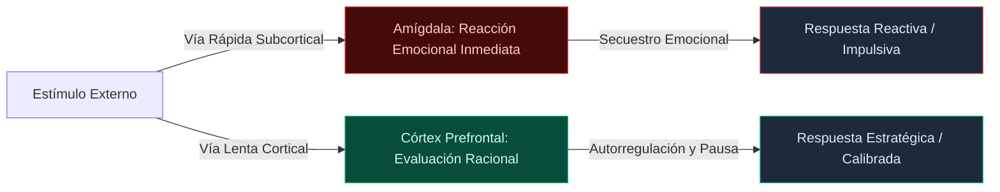

## Autoregulacion

La autorregulacion es el segundo de los pilares de la inteligencia emocional. Cuando eres capaz de utilizar la autorregulacion, eres capaz de gestionar us propias emociones. Con el autocontrol, eres capaz de asegurarte de que tus emociones se expresan siempre de un modo eficaz y apropiado. Si expresas tus emociones de una manera poco apropiada, o si cedes a cualquier impulso emocional que sientas, es probable que quemes los puentes en las relaciones con bastante rapidez, lo que hace que esta sea una habilidad critica. Por muy satisfactorio que resulte en el momento gritar a un cliente, no seria tan satisfactorio perder el trabajo como consecuencia de ello.

las emociones de los demas si se desea ser capaz de entender las emociones de la gente, y no es probable que se pueda reconocer las emociones de otas personas si no se entienden primero los propios sentimentos.

La conciencia organizativa se refiere a su capacidad para gestionar la forma en que se explica a los demas. Se trata de su capacidad para asegurarse de que siempre habla a un nivel que sea fácilmente comprensible para los demas. Eres capaz de asegurarte de que los niveles de comprension de los que te rodean esten siempre en línea con los adecuados. Piensa en como seria una presentacion dirigida a niños de jardin de infancia si se la dieras a estudiantes de secundaria: no se molestarian en prestarle atención porque seria demasiado simple para que valiera la pena escucharla. Del mismo modo, si se hiciera esa misma presentacion a un grupo de niños de jardin de infancia a pesar de estar dirigida a estudiantes de secundaria, los niños probablemente no entenderian mucho. Sin embargo, cuando seas capaz de utilizar la conciencia organizativa, podrás asegurarte de que siempre te dirigies a la audiencia adecuada cuando intentes hablar con otra persona, lo que te permitira retener la atención durante más tiempo y de forma más eficaz.

Por último, la orientacion al servicio se refiere a la voluntad de ayudar a otras personas. Implica estar dispuesto a contribuir a los esfuerzos y, al mismo tiempo, mostrar que esta felizmente dispuesto a ayudar a guiar a su grupo hacía el objetivo desedo. Cuando se utiliza esto, se puede asegurar que también se escucha con eficacia.

**Condicental social**

* **Fmpatia**
* **Conciencia**

organizativa**
* **Orientacion al servicio**

**Gestion de las relaciones**

El último pilar de la inteligencia emocional es la gestion de las relaciones. Este pilar en particular se refiere a la capacidad de gestionar las relaciones e influur en otras personas. Sin embargo, para desarrollar la gestion de las relaciones, primero hay que desarrollar todos los demas pilares. La gestion de las relaciones requiere que seas muy consciente de tus propias emociones y comportamientos, así como que seas capaz de controlarlos. También requiere una sólida comprension de los demas. Las habilidades de la gestion de las relaciones incluyen la capacidad de inspirar liderazgo, influur en los demas, gestionar los conflictos, desencadenar el cambio, desarrollar a los demas y ser habil en el trabajo en equipo.

La gestion de las relaciones crea lideres inspiradores capaces de dirigir a otras personas. Tanto si es un lider por autoridad o respeto como si trabaja como mentor de otras personas, esta habilidad es fundamental si quiere ser capaz de dirigir a otros. Esto es lo que hace que la gente este dispuesta a seguirte en primer lugar.

La influencia permite a los expertos en gestion de relaciones asegurarse de que pueden convencer a otras personas de que hagan lo que hay que hacer. Son persuasivos, elocuentes, motivadores y capaces de llamar a la gente a la acción con facilidad. Esta habilidad es fundamental para dirigir a los demas, ya que si no puedes conseguir que los demas hagan lo que tienen que hacer, no puedes dirigirlos.

La gestion de conflictos otorga a estos individuos la capacidad de gestionar las relaciones con otras personas, ya sea de forma interpersonal o entre dos personas. Son capaces de facilitar la comunicación necesaria entre las personas para garantizar que todos puedan salir de una situación con la sensación de haber sido escuchados y apoyados. Efectivamente, la gestion de conflictos permite poner fin a las discusiones u opiniones garantizando que todos terminen en la misma página.

El gestor de relaciones es capaz de facilitar el cambio en el mundo, aunque tenga que ser el catalizador de esc cambio. Esta dispuesto a apoyar cualquier cambio que sea necesario, incluso si eso significica que debe adoptar una posición difícil o incomoda. Haran todo lo que sea necesario para que ese cambio se produzca.

Debido a la posición única del lider, tiene que ser capaz de entender como interactuan otras personas entre si. Si puedes ver a dos personas que interactuan entre si de una manera determinada, normalmente puedes empezar a averiguar quien trabaja mejor con quien. Ser capaz de entender como interactuan las personas significica que puedes formar equipos de forma eficaz, y ser capaz de ver las habilidades de otras personas significica que podrás orientarlas en la direccion correcta para asegurar que todo el mundo este siempre creciendo y avanzando hacía sus mayores potenciales.

Por último, el lider debe estar dispuesto y ser capaz de trabajar con otras personas de forma eficaz, pase lo que pase. Para ello, debe ser capaz de enfrentarse con facilidad a cualquier cambio que pueda surgir.

[MISSING_PAGE_EMPTY:35]

### Emociones e Inteligencia Emocional

Las emociones y la inteligencia emocional están intrinsecamente combinadas solo por el hecho de que ambas están involucradas en el acto de sentir y reconocer las emociones. Como has visto, las emociones son una especie de columna vertebral de todo el proceso de la inteligencia emocional. Debes empezar por entender tus propias emociones si quieres ser capaz de progressar más allá de esa primera etapa de autoconciencia, y sin esa conciencia de tus propias emociones, no puedes esperar entender a otras personas. Si no puedes entender a los demas,?como puedes esperar que los demas esten dispuestos y sean capaces de escucharte como lider? Si no eres capaz de sentir tus propias emociones,?como puedes esperar que los demas esten dispuestos a aguantarte a ti y a tu dramatismo si surge algun conflicto?

Lo que es importante señalar es que, a pesar de que la inteligencia emocional se centra principalmente en comportarse de forma no impulsiva desde el punto de vista emocional, no busca una prohibicion general de las emociones en general. De hecho, la inteligencia emocional anima encracidamente a las personas a sentir sus emociones siempre que sea posible y pertinente. Cuando sientes tus emociones, sientes lo que tu cuerpo y tu mente inconsciente quieren que sientas. Tus emociones, como aprenderás en el capitulo 4, son increiblemente importantes. Siven para mantenerte regulado y, por eso, nunca debes ignorarlas o despreciarlas por completo.

En lugar de ignorar las emociones, la inteligencia emocional trata de regular el acto de comportarse impulsivamente como respuesta. Cuando seas capaz de convertirte en una persona emocionalmente inteligente, estaras aprendiendo efectivamente a detenerte cuando sientas emociones fuertes para poder regularlas. Seras capaz de evitar que actues de forma inadecuada.

Imagina por un momento que estas increiblemente enfadado: quizá acabas de descubir que tu hijo ha roto el reloj que te regalo tu difinto padre. Estas absolutamente furioso, ya que era la última pertenencia preciosa de el que tenias, y ahora se ha roto. Si eres emocionalmente inteligente, reconoces ese enfado, te permites sentir esas emociones porque ser capaz de sentirlas es importante para encontrar algun tipo de cierre o resolucion.

Sin embargo, a pesar de reconocer tu ira y seguir sintiendola, eres capaz de recordarte a ti mismo que reaccionar con ira no es la decisión correcta en este caso. Te recuerdas a ti mismo que actuar con ira no haria más que disgustar a tu hijo, que no como romper intencionadamente el reloj. Ha sido un desafortunado accidente, y su hijo esta destrozado por ello. Eso se notaba en su cara.

Cuando eres capaz de reconocer tus emociones, reconociendo el valor que aportan, puedes utilizarlas para informarte. Puedes usar el sentimiento de esa emoción como tu señal inconsciente para recordarte a ti mismo que debes ir más despacio, relajarte y seguir avanzando. Efectivamente, puedes asegurarte de que eres capaz de utilizar tus emociones y el conocimiento de que estas sintiendo esa emoción para ayudarte a autorregularte.

Sin embargo, más allá de eso, imagine que es consciente de las emociones de los demas.

Teniendo en cuenta que las emociones son indicativas de una necesidad que actualmente no esta siendo satisfecha, cuando eres capaz de utilizar la inteligencia emocional para poder leer mejor los sentimientos de los que te rodean, también eres capaz de entender las necesidades de aquellos que te rodean y que pueden necesitar tu ayuda más pronto que tarde. Cuando puedes entender las necesidades de otras personas, también eres capaz de comprender mucho más. Puedes entender cual es la mejor manera de asegurar que otras personas tengan sus necesidades cubiertas, y con eso, puedes convertirre en un lider eficaz.

Las emociones son fundamentales: las sentimos por razones increiblemente importantes y tratar de ignorarlas, incluso cuando intentamos pensar con una mentalidad racional, es hacer un flaco favor a los que te rodean.

### Inteligencia Emocional y Empatía

La empatía es una de las habilidades más importantes de la inteligencia emocional. Aunque ser capaz de identificar tus propias emociones siempre es importante, lo que más importa en muchos casos es saber empatizar. Esto es lo que salva la distancia entre centrale en uno mismo y ser capaz de interactuar con precision con los demas.

Si volvemos a ver los cuatro pilares de la inteligencia emocional, nos daremos cuenta de que dos de ellos se centranen el yo, mientras que los otros dos se dirigen hacía los demas. La forma de pasar del yo a los demas es a traves de la capacidad de empatía.

Por ejemplo, imagine que es capaz de reconocer sus propios estados emocionales. Tienes bastante confianza en tu capacidad para entender como te sientes: has aprendido el lenguaje corporal que necesitas conocer. Has descubierto la mejor manera de identificar cuando intervenir en tus propios arrebatos emocionales. Sabes cuales son tus desencadenantes emocionales más comunes. Pero, _z_puede entender lo que sienten otras personas?

Ser capaz de entender tus propios sentiminentos no es una habilidad repentina para entender a los demas, ya que el bienestar capaz de entender las emociones de los demas requiere empatía, pero para entender realmente la retroalimentacion que recibes a traves de la empatía, también debes entender tu propio estado emocional.

### Formas de empatía

La empatía en si misma se define como la capacidad de relacionarse con otras personas, y existe principalmente entres formas diferentes. Se puede empatizar de forma cognitiva, emocional o compasiva. Cuando empatizas cognitivaamente, comprendes los sentiminentos de la orta persona desde una perspectiva directa: sabes lo que esta sintiendo simplemente porque reconoces las señales. Sin embargo, no hay ningun apego emocional por tu parte. No te importa especialmente lo que la orta persona siente, simplemente sabes que lo siente.

Sin embargo, cuando empatizas emocionalmente, eres capaz de entender los sentiminentos de la orta persona al sentirlos tu mismo. Te relacionas efectivamente con la orta persona de tal manera que eres capaz de sentir lo mismo. Ves a alguien sufrir y sientes su dolor como si fuera el tuyo. Aunque no lo hagas sin querer, la mayoría de las veces la empatía emocionali implica que te pongas automaticamente en la posición de la orta persona en tu mente. Sabes que estarias triste y asustado si no tuvieras un lugar donde vivir y el invierno se acercara rapidamente.

Cuando empatizas de forma compasiva, que es la forma de empatía que la inteligencia emocional enfatiza, estas combinando efectivamente las dos anteriores. Comprendes los sentiminentos de la persona de forma cognitiva, lo que permite tener una idea sólida de los sentiminentos de la orta persona. También eres capaz de comprender las emociones de la orta persona al relacionarte con ella. Cuando empatizas tanto cognitiva como emocionalmente, sueles sentir empatía emocional, lo que te impulsa a actuar de alguna manera. Sentir una relación tanto cognitiva como emocional con la orta persona te impulsa a actuar de alguna manera para asegurarte de que también se ocupen de ti. Quieres ayudarles; sin embargo, puedes asegurarte de que puedes satisfacer activamente sus necesidades para aliviar su suffimiento. Rara vez hay un motivo para ti que no sea ayudar. Tu empatía compasiva es una especie de llamada a la acción que obedeces para asegurarte de satisfacer activamente las necesidades de los que te rodean.

### El propósito de la empatía

La empatía tiene principalmente dos propositos que están directamente relacionados con la inteligencia emocional: Actua como una forma a traves de la cual puedes autorregularte, y actúa como un medio de comunicación, principalmente de señales emocionales no verbales. Cuando eres capaz de empatizar, entonces eres capaz de regular, así como de leer las señales para entender mejor las necesidades de los que te rodean.

Sin embargo, antes de profundizar en ello, considere por un momento _por que_ necesitariamos sentir empatía en algun grado.?Para que sirve la empatía¿Por que es importante? La respuesta es muy sencilla: somos una especie social. De hecho, casi toda la inteligencia emocional solo es relevante porque somos una especie social. Cuando se vive en grupo, ya sea unidad familiar, un vecindario, un tribu o toda una ciudad o pueblo, hay que ser capaz de comunicarse. Los sees humanos, porque dependemos de los demas para sobrevivir, tenemos que ser capaces de comunicarnos con los demas con claridad.

Piensa por un momento en los seres humanos "en la naturaleza": estamos hablando de seres humanos que aun no han dado el paso hacía las civilizaciones modernas. Estamos hablando especificamente de los humanos que no tenían otra opcion que cazar y cultivar su propia comida para sobrevivir. Tenían que existir en grupos. Los humanos cazaban también en grupo con otras personas, lo que les permitia abatir presas más grandes, lo que es fundamental si se tiene en cuenta lo debiles que son los humanos en comparacion con otros animales. Los humanos tenían que confiar en sus tribus para ayudar a proporcionar proteccion y cazar. Dependian unos de otros para vivir y viajar en este tipo de tribus.

La empatía permite utilizar la comunicación no verbal. Cuando estes corriendo con un grupo de personas en muchas situaciones de vida o muerte, vas a querer entender las emociones de los que te rodean, y que esas emociones te proporcionaran todo tipo de información. Podrás saber que los que te rodean tienen miedo cuando hay peligro, o están tristes cuando necesitan ayuda. Sin embargo, más allá de eso, podrás ver cuales son sus necesidades para ayudarles a satisfacerlas. Te sentiras impulsado a actuar porque puedes sentir las necesidades de la otra persona, y estas dispuesto a ayudar.

Cuando un esta dispuesto a ayudar, anima a la otra persona a estar dispuesta a ayudarle cuando se encuentre en un momento de necesidad. El altruismo, ese comportamiento de ayudar a otra persona sin iningun beneficiio, y muy posiblemente en detrimento de un mismo, solo es un rasgo eficaz en una especie que es principalmente altruista, por lo que la empatía nos mantiene en el buen camino. Sabes que necesitas asegurarte de que los que te rodean están cuidados y alimentados, así que te aseguras de tener siempre suificiente comida para compartir. Por supuesto, si alguna vez pasaras por momentos difíciles, ellos estarian más que contextos de corresponder y compartir contigo.

Sin embargo, más allá de la supervivencia, la empatía también puede beneficiar a las relaciones interpersonales. Cuando eres capaz de empatizar con otras personas, sabes como manejarte con la otra persona. Piensa en el ejemplo de tu hijo rompiendo el reloj de tu padre: podias ver que tu hijo estaba disgustado y se sentia culpable por la situación, y ser capaz de ver la mirada de tu hijo te ayudo a recordar que no debias reprenderle o juzgarle de una manera que pudiera ser perjudicial para el. Te autorregulaste como respuesta directa a la empatía con tu hijo.

Otro ejemplo de esto podría ser en acción teniendo una discusion con alguien. Tal vez estes tratando de encontrar la mejor manera de hacer que algo funcione. Tu compañero sigue sugiriendo cosas, pero tu rechazas todas y cada una de sus ideas. Sigues rechazandolas simplemente porque no tienen sentido dado el contexto, y al hacerlo, acabas estresandola. Puedes ver que ella esta empezando a estresarse, y puedes sentir esa familiar punzada de empatía, y eres capaz de darte cuenta de lo que esta pasando: Tu estas causando el estres. Estas siendo demasiado controlador y necesitas regular de alguna manera lo que estas haciendo.

Así, podrás reducir la escala y hacer varias concesiones a tu pareja, lo que le permitira dejar de estresarse tanto. Al hacer esto, te aseguras de que tu pareja sea atendida. Te aseguras de que tu pareja se sienta valorada en lugar de estresada. Al ser capaz de reconocer que tus propias emociones estaban causando algun tipo de estres grave u otra emoción negativa en otra persona, puedes empezar a retirarlo y asegurarte de no seguir comportandote de forma perjudicial.

### Inteligencia Emocional y Comunicación

La inteligencia emocional también tiene un impacto significativo en la capacidad de comunicación. Esto tiene sentido: no es posible ser influyente si no se puede comunicar de alguna manera con otras personas. Al ser más consciente de como sus propios sentiminentos emocionales pueden alterar sus patrones de habla y lenguaje corporal, puede empezar a controlar esto. Si sabe que esta estresado, podrá utilizar sus habilidades de inteligencia emocional para asegurarse de que se esta comportando activamente de forma que le sirva. Podrás tomarte esa pausa extra para comunicarte con claridad porque eres consciente de tus tendencias.

La comunicación se vuelve entonces más eficaz simplemente porque eres capaz de regularte mejor. Sabes que estas hablando demasiado rapido porque estas estresado, así que tomas el control manualmente y hablas deliberadamente de forma más lenta y controlada. Al hacer esto, le quitas el poder a tu ansiedad en primer lugar, lo que te permite comunicarte con claridad.

En definitiva, al igual que el desarrollo de la inteligencia emocional fue fundamental en la construccion de la empatía, también lo es en el ámbito de la comunicación. Debes ser capaz de ser emocionalmente inteligente si quieres comunicarte de la manera más eficaz posible. Recuerda que la mejor manera de mantener la cordura cuando estas estresado es hacer un esfuerzo por inspirar y espirar profundamente antes de hablar para responder a la pregunta.

Como nota final, recuerda que puedes utilizar tus emociones en tu beneficiio. Puedes aprovechar tus emociones para permititre comunicar con claridad. Recuerda que tus emociones no son un signo de debilidad, ni requieren una eliminacion total. Hay momentos y lugares para utilizar tus emociones, y si consideras que la situación actual es la adecuada, deberias hacer uso de ellas. Hacerlo te permite dejar tu punto de vista aun más claro, y si tus emociones, son las apropiadas para cualquier situación que estes comunicando, tu propio despliegue de emociones puede ayudarte a enfatizar aun más tu punto de vista y lo apasionado que eres.

[MISSING_PAGE_EMPTY:40]

## 📖 Capítulo 4: Emociones y Estado Psicológico

Es fundamental comprender los estados emocianales cuando se habla de contacto de persona a persona. Las emociones pueden complicar fuertemente casi todo lo relacionado con la interacción con otra persona, cambiando la forma de abordarla. Cuando abordas tu estado psicológico en cualquier momento con tus emociones, descubres que estas siempre interfieren constantemente en el.

Tus emociones están constantemente en un estado de fluctuacion, debido a la propia naturaleza de las emociones. Siempre están cambiando de persona a persona, y eso es importante tenerlo en cuenta. Cuando eres muy consciente del hecho de que tus emociones siempre estarán interactuando directamente con tu mente y tus comportamientos.

Imagina que ya te sientes bastante molesto al salir a la carretera para conducir a casa desde el trabajo. Ya estabas frustrado y, por eso, mientras conduces, cuando otra persona te corta el paso, tocas el claxon con rabia. Tocando el claxon con rabia, intentas adelantarle para acabar con el, pero la otra persona lo interpreta como un intento de carrera. Acelera para impedir que le pases, y eso fue suticiente para empeorar la situación.

Al final del dia, casi tienes un accidente antes de desviarte de la carretera principal y entrar en otra calle, maldiciendo y enfadado. Luego legas a cas y eres increiblemente contante con tus hijos y tu pareja, todo porque y tienes esa mentalidad combativa, y acabas molestando a las personas que simplemente estaban contentas de que llegaras a casa.

**El Propósito de las Emociones**Las emociones en si tienen dos propositos principales: permiten la comunicación no verbal, que es fundamental por si misma, y permiten la motivacion constante para mantenerte vivo. Efectivamente, tus emociones existen porque tu mente inconsciente necesita un método para interactuar con el mundo que le rodea.

Teniendo en cuenta que la mente tiene dos partes distintas, la consciente y la inconsciente, es importante reconocer que ambas rara vez, o nunca, se comunican entre si. Son incapaces de comunicarse de forma activa y faible entre las dos, y por ello, no siempre son tan eficaces como podrían serlo.

La mente inconsciente busca guiar el comportamiento: se encarga de todo lo que no requiere atención a lo largo delia, como prestar atención a lo que tienes que hacer, como tienes que hacerlo y asegurarte de que eres capaz de hacer lo que tienes que hacer sin desperdiciar el espacio de tu mente consciente.

Piensa por un momento en que tu mente consciente es la responsable directa de tus percepciones y decisiones conscientes: se encarga del trabajo pesado y de todo lo que requiere atención. Por ejemplo, considere el acto de escribir un correo electronico: su mente consciente es capaz de decidir exactamente lo que desea escribir, mientras que su mente inconsciente se encarga de teclear activamente para transmitir el punto adecuadamente. Esto significa que la mente inconsciente se encarga de las tareas más insignificantes, prestando atención a como se escribe y controlando manualmente los dedos, para que tu no tengas que hacerlo.

La mente inconsciente suele ser la más rapida de las dos, simplemente porque es automática. Ocurre sin que la mente consciente tenga la oportunidad de influir en ella. Simplemente se hace lo que se espera que se haga. Por supesto, _puedes_ anularla conscientemente si sabes lo que vas a hacer, pero en la mayoría de los casos, no vas a ver que eso ocurra.

Ahora bien, escribir un correo electronico es relativamente poco arriesgado: no importa mucho si se comete un errori tipografico porque lo único que hay que hacer es corregrillo. Sin embargo, imaginemos que estamos considerando una situación más peligrosa. Tal vez estes conducciendo por la carretera cuando un camion se cruza de repente en tu camino en medio del trafico. Pisas los frenos para evitar chocar con ellos antes de darte cuenta de lo que ocurre: tu mente inconsciente ha sido la responsable.

#### Comunicación

Llegados a este punto, es hora de profundizar en las emociones como modo de comunicación. Cuando sientes una emoción, tu cuerpo cambia naturalmente como respuesta. Puede que te sientas encogido hacía dentro cuando estas genervioso, encorvado y maldiciendo tus brazos para protegerte. Puede que te encuentres intentando activamente evitarel contacto visual.

La comunicación no verbal abarca gran parte de la forma en que nos comunicamos con otras personas. Tiene en cuenta el lenguaje corporal, por ejemplo, lo cerca o lejos que estas dispuesto a ponerte de los demas, o la probabilidad de que hagas alguna concesion en tu forma de acercarte a otra persona. Lo que es especialmente importante recorder es que, al interactuar con otras personas, hay que tener en cuenta que su lenguaje corporal es incriblemente revelador, y es es porque su lenguaje corporal habla de sus emociones.

Piense por un momento en la terapia cognitivo-conductual. Si no esta familiarizado con esta terapia, es una combinacion de terapia cognitiva y terapia conductual. Considera que los pensamientos influyen en las emociones, las emociones influyen en los comportamientos y los comportamientos refuerzan los pensamientos. Esto significica que si se puede leer el lenguaje corporal, se puede analizar para identificar la emoción que se siente. Si puedes averiguar que emoción se esta sintiendo en un momento dado, puedes empezar a averiguar por que se esta sintiendo esa emoción en primer lugar, lo que te permitira acceder mejor a la mente de los demas. Esto te permitira obtener una valiosa retroalimentacion a la que, de otro modo, no tendrias acceso. Cuando entiendes la mentalidad de otra persona, entonces eres más capaz de interactuar con ella. Usted puede hacer un punto para comportarse de manera que usted sabe que son propicias para el comportamiento que usted quiere porque usted sabe acerca de este ciclo de pensamientos, sentimientos y comportamiento, y usted recononce que su propio lenguaje corporal permite la comunicación hacía la otra persona.

### Motivadores

Ahora, veamos tus emociones como motivadoras: considera como, cuando estabas en peligro, conducciendo por la carretera, fenaste de golpe sin ser consciente de ello. Esto se debe a que, en ese momento, en tu estado extremo de emoción, tu mente inconsciente tomo el control. Fue capaz de guiarte en el proceso de pisar el freno para protegerte porque la mente inconsciente se dedica en gran medida a mantenerte vivo y funcional. Necesitas ser capaz de protegerte a ti mismo para mantenerte vivo.

Tus emociones funcionan cuando tu mente inconsciente siente la necesidad de intervenir activamente en un proceso o intentar hacer algo. Efectivamente, las emociones están diseñadas para inclinarte hacía los comportamientos que tienen más sentido para tu propia situación. Piensa en como te sentirias si alguien te acosara continuamente en el trabajo: te enfadarias. Esta es una respuesta directa a la falta de satisfaccion de tu necesidad de límites. Tus límites se traspasan una y otra vez y, por mucho que intentes decirle a la persona que te deje en paz, te das cuenta de que las violaciones de los límites se reipten una y otra vez, así que acabas perdiendo la esperanza de llegar a la persona y le gritas. Tu ira te motivo a imponer tus propios límites, que estaban siendo ignorados.

Cada una de tus emociones primarias sirve para un propósito motivacional muy específico: te guian hacía algun tipo de comportamiento establecido para asegurarte de que tus necesidades interpersonalales básicas están satisfechas. Eres capaz de imponer que necesitas, por ejemplo, que alguien te ayude cuando tienes miedo o estas triste. Comunicas algo claro: hay algo que va mal, e incluso puede haber potencialmente algun nivel de peligro al que también hay que prestar la debida atención.

Cuando tienes en cuenta las emociones como motivador, empiezan a ser increiblemente fáciles de entender. Cuando te sientes enfadado, sabes que te están rompiendo algun tipo de límite y eso te frustra. Cuando te sientes triste, sabes que es porque algo te esta haciendo daño, y sientes la necesidad de luchar contra ello o de conseguir apoyo, y sistemes cisevamente.

Sin embargo, en la actualidad, muchas veces, las situaciones que desencadenan nuestras emociones no se ajustan tanto a lo que solia decirse que se desarrollaba en la naturaleza.

Puede que sientas miedo, pero ese miedo proviene de un lugar de temor a perder algo en lugar de un miedo a la muerte o a ser amenazado. Efectivamente, reaccionaras con miedo ante una situación que en realidad no justifica una reacción tan fuerte. Por ejemplo, que alguien comente algo cruel en tu página de las redes sociales es diferente a sentire realmente amenazado por la situación en cuestion, como si estuvieras mirando la boca de un puma o algun otro animal que estuviera principalmente decidido a comerte y matarte.

Esto significica que la mayoría de las veces, tus impulsos emocionales suelen ser burdas reacciones exageradas a lo que de otro modo deberían haber sido. No es necesario reaccionar como si alguien intentara matarte si implemente de tice que no esta de acuerdo contigo, ni tampoco es necesario atacar activamente y pelear a muerte por algun tipo de malentendido o por quien se queda con el último paquete de papel higienico en el supermercado.

Por supuesto, eso no significica en absoluto que tus emociones no sean importantes o que no debas tenerlas en cuenta. Tus emociones son fundamentales en varios contextos, y ser capaz de reconocer tus emociones puede ayudarte a saber exactamente como te sientes en cada momento. Lo importante, sin embargo, es saber cuando poner esa distancia entre un mismo y lo que esta sucediendo, y cuando esos impulsos emocionales desarrollados a lo largo de milenios de supervivencia del más fuerte en la naturaleza son realmente apropiados para actuar.

### La Causa de las Emociones

A pesar de los intentos de explicar la causa de las emociones, que van desde los espiritus y las pasiones de la antigua psicología filosófica hasta suponer que se trata de algun tipo de acontecimiento hormonal, la única constante entre las explicaciones de todos sobre lo que causa las emociones es que no hay una respuesta definitiva. De hecho, hay seis teorías principales sobre lo que hace que las personas tengan emociones en primer lugar y lo que las desencadena. En esta seccion, abordaremos las seis teorías, permitiendole llegar a su propia explicación y teoría al escucharlas. Las seis principales teorías de la emoción son la teoría evolutiva, la teoría de la valoracion cognitiva, la teoría de la retroalimentacion facial, la teoría de James-Lange, la teoría de Cannon-Bard y la teoría de Schacter-Singer.

En última instancia, estas teorías pueden entenderse de tres maneras: como fisiologicas por naturaleza, afirmando que el cuerpo es lo que causa las emociones, como neuroologicas en teoría, afirmando que el cerebro es responsable de las emociones, y como cognitivas en teoría, afirmando que los pensamientos y los estados mentales son influyentes sobre las emociones.

**Teoría de la evolución**

Partiendo de Charles Darwin, la Teoría de la Evolución afirma que las emociones existen para que los animales sean capaces de sobrevivir y reproducirse. Efectivamente, sentimos algunas emociones positivas que nos llevan a aparearmos, mientras que otras emociones nos incitan a luchar o a huir. En definitiva, segun esta teoría, las emociones son adaptativas: son motivadoras y permiten responder rapidamente al entorno.

Entender como funcionan las emociones en los demas también permite la supervivencia adaptativa: cuando eres capaz de entender los sentiminentos de los demas, puedes asegurarte de forma efectiva de que eres capaz de protegerte. Por ejemplo, si sabes que el sentimiento de enfado hace que la gente sea volitil y este preparada para defenderse si surge la necesidad, puedes ver a alguien mostrando comportamientos defensivos o agresivos y distanciarte intencionadamente de el. Te aseguraras de forma efectiva de mantenerte seguro y comodo porque tes estas esforzando por evitar fomentar calquier comportamiento que pueda resultar problematico para ti. Eres capaz de responder eficazmente porque entiendes los signos emocionales del otro animal o persona.

**Teoría de la valoracion cognitiva**

Dentro de las teorías de valoracion, queda claro que el pensamiento debe ocurir antes de que se produzca una emoción. En efecto, dentro de una serie de acontecimientos que desencadenan una emoción, el pensamiento que se produce después del estimulo es lo que determina las emociones. Piensa en que puedes sentitre absolutamente aterrorizado al ver una arana, pero otra persona esta más que feliz de pasearse con su tarantula como mascota, colgada del hombro. La razón por la que a ti te aterra una arana que a otra persona le produce una gran alegría es el proceso de pensamiento que hay detras.

**La teoría de la retroalimentacion facial**

A lo largo de los a nos se ha observado que, a veces, las respuestas del cuerpo si tienen un impacto directo en las emociones, en lugar de ser una consecuencia de esa emoción. Algunas personas llevan esto al extremo: asumen que son los cambios en los musculos faciales, entonces, los que causan las emociones. Piensa que si tenes que sonreir a elguien, con el tiempo, empiezas a pasarlo mejor de lo que lo harias de otra manera. Esto se debe a que se esta comprometiendo con sus musculos faciales y estos son los responsables directos.

Esto puede parecer descabellado para algunos, pero considere que tanto Charles Darwin como William James, de quien oira hablar más adelante, reconocieron ese vinculo entre lo físico y lo emocional. Gracias al apoyo de gente como Darwin y James, personas que creen en estas teorías, la teoría de la retroalimentacion facial logro convertires en una de las más conocidas.

**Teoría de James-Lange**Sin embargo, quizá la teoría más conocida sobre la causa de las emociones sea la de James-Lange. En concreto, esta teoría fue descarrollada por el psicólogo William James y el fisiologo Carl Lange. Juntos, ambos elaboraron una teoría que afirmaba que las respuestas emocionales nacen como resultado de las reacciones fisiologicas a los acontecimientos.

Esto puede parecer complicado, pero considera por un momento lo que ocurre cuando ves a un lobo o a un oso o a otro depredador mirandotte fijamente desde tu patio. Lo más probable es que sienta que su ritmo cardiaco se acelera. Notaras que tu cuerpo parece temblar y se enfria. Su patrón de respiración cambia. Estas respuestas fisiologicas deben interpretarse de alguna manera. Después de todo, piense que varias de esas sensaciones son similares a la excitacion extrema. Si estas extremadamente excitado, también sentiras que tu ritmo cardiaco y tu respiración aumentan.

La teoría de James-Lange dice, por tanto, que la única diferencia entre que tu sensación de corazón acelerado sea por excitacion o por terror es como piensas en ello. En esencia, estas preparado para interpretat tu respuesta fisiológica, y eso te proporciona tu emoción. En lugar de sentir que tu corazón se acelera porque estas asustado, te sientes asustado porque tu corazón se acelera activamente.

### La teoría de Cannon-Bard

Otra teoría comun es la conocida como teoría de Cannon-Bard, que se propone mostrar el desacuerdo con la teoría de James-Lange. En efecto, dado que es totalmente posible y esperable que las personas tengan respuestas fisiologicas por diversos motivos, es imposible decir que es unicamente lo físico lo que determina lo emocional. Además, como los estados emocionales son tan rapidos, es imposible que sean el resultado de cambios físicos. Al fin y al cabo, sentimos la emoción inmediatamente con los sintomas; si lo físico fuera lo primero, habría un ligero desfase entre el inicio de la emoción y la reacción fisiológica.

Para abordar estos problemas con la teoría de la emoción de James-Lange, nació la teoría de Cannon-Bard. Dentro de esta teoría, Cannon sugiere que las emociones son el resultado del talamo dentro del cerebro para responder a algun tipo de estimulo. Ese mensaje se envia y desencadena la experiencia emocional al mismo tiempo que desencadena la fisiológica. En efecto, el único mensaje se interpreta de dos maneras diferentes.

Por ejemplo, imagina que sales hacía tu coche y te encuentras con un oso que te mira fijamente. Su cuerpo recibe el estimulo y registra visualmente la presencia deloso. El talamo trata de responder al oso. En respuesta, el mensaje del talamo te hace sentir aterrorizado y, al mismo tiempo, crea tus sensaciones de miedo: te sientes tembloroso y nervioso, por ejemplo. Sientes que tu corazón se acelera. Tienes ganas de corner.

### Teoría de Schachter-Singer

La última teoría que abordaremos es la de Schacter-Singer, también conocida comunmente como la teoría de los dos factores. Se trata de una teoría cognitiva en la que la respuesta fisiológica debe ocurri primero antes de la creacion de una emoción. En respuesta a lo fisiológico, entonces debes averiguar por que se produce esa excitacion y luego etiquetarla tu mismo. Efectivamente, solo entonces se puede averiguar la emoción.

Esta teoría es bastante similar a las teorías de Cannon-Bard y James-Lange, y se basa en ambas para crear una nueva que explique el funcionamiento de las emociones. Consideremos en primer lugar como la teoría de James-Lange propone que las emociones se basan en inferencias de la reacción física a un estimulo y como la teoría de Schachter-Singer lo refleja. Tanto el modelo de James-Lange como el de Schachter-Singer señalan que las personas hacen esas inferencias de lo físico a lo emocional, utilizando una interpretacion cognitiva.

En cuanto a la teoría de Cannon-Bard, ambos coinciden en que una misma reacción física puede provocar varias emociones diferentes. Por ejemplo, puedes reconocer una sensación concreta, como el temblor, como miedo en una situación en la que estas mirando al oso, pero a veces, el temblor puede ser el resultado directo de tu propia excitacion por algo.

Así que, si el modelo de Schachter-Singer implica una respuesta física que se interpreta cognitivamente, imagina que acabas de salir a la calle y que ese oso esta ahi sentado, mirandote. Notas que empiezas a temblar y que tu corazón late con fuerza. Miras al oso y reconoces que la presencia del oso es lo que te hace sentir estos signos de excitacion: eres hiperconsciente de la presencia del oso. A continuación, debes entender lo que significa la visión del oso: reconoces que la presencia del oso se considera una amenaza y respondes en consecucencia. Reconoces que la presencia del oso es una amenaza y que la amenaza debe enfrentarse con sentimientos de miedo. Por lo tanto, determinas que el temblor y la aceleracion del corazón que sentiste al ver al oso es miedo.

