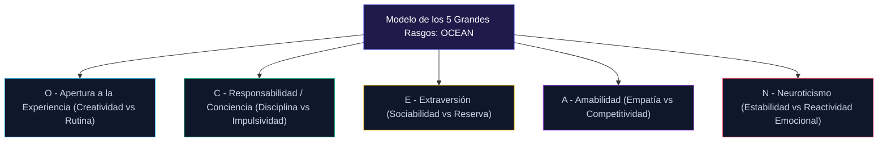

## Conciencia

Este rasgo de la personalidad tiene que ver con lo reflexivo que es alguien como individuo. Tiene en cuenta la probabilidad de que alguien sea capaz de controlar sus impulsos o de asegurarse de que trabaja constantemente para conseguir sus objetivos. Las personas más concienzudas suelen ser las que prestan una atención meticulosa a los detalles. Sienten la necesidad de planificar exactamente como se desarrollaran las cosas y siempre tienen en cuenta como se sentiran los demas como resultado de sus propios comportamientos y tendencias.

Por otro lado, los que no son especialmente conscientes suelen despreciar la estructura. Las cosas sucederan cuando sucedan y no un momento antes. No les importa, y a veces incluso prefrieren, la imprevisibilidad del caos y no suelen ser especialmente disciplinados. Dejaran las cosas para más tarde o simplemente fracasaran a la hora de cumplir los plazos o los objetivos.
personas extravertidas tienden a sentires llenas de energía cuando se relacionan con otras personas o participan en la interacción social. Suelen disfrutar de los demas y se desiviven por salir y socializar.

A los que no son especialmente extravertidos se les suele llamar introvertidos, y los introvertidos suelen ser bastante resevados. Sienten que deben gastar energía cuando interactuan y se relacionan con la gente en publicó. En lugar de sentires energizados por la actividad social, se sienten agotados y a menudo sienten la necesidad de retiarse y relajarse. Esto no significica que sean necesariamente antisociales, sino que la socializacion, por mucho que les guste, es agotadora, y necesitan dedicar tiempo a recargarse después.

### Amabilidad

Este rasgo contempla la confianza, la ambilidad y otros comportamientos que se considerarian prosociales. Efectivamente, son felizmente cooperativos y están dispuestos a ayudar a los demas. De hecho, suelen ser bastante empaticos y se preccupan mucho por como se sienten los demas. Quieren asegurarse de que están ayudando a otras personas.

Por otro lado, las personas menos agradables suelen preccuparse y empatizar menos con los que les rodean. No se preoccupan mucho cuando ven a la gente suffir e incluso pueden tender a manipulator a los demas, no teniendo problemas en utilizar a otras personas para conseguir lo que quieren o necesitan. Lo único que les importa es como conseguir lo que quieren.

### Neuroticismo

El último rasgo es el neuroticismo, que examina la inestabilidad emocional y el mal humor de un individuho. Cuando un es muy neurotico, suele estar bastante malhumorado en general, con mayores niveles de ansiedad o irritabilidad. Es posible que se altere con facilidad y que le cueste lidier con el estres cuando se enfrenta a el.

Los que no son neuroticos, en cambio, tienden a ser mucho más estables emocionalmente: son resistentes y están relajados. Son capaces de hacer frente al estres a medida que surge sin preoccuparse demasiado por el. Pueden gestionar sus propias emociones y para vez se quedan atrapados en sentimientos de desesperacion.

**Por que la Personalidad es Importante**La personalidad es crucial porque determina como interactuian las personas en el mundo. Si uno es neurotico, va a tener una tendencia a oscilar de emoción en emoción, y si lo emparejas con alguien que no es agradable, puedes encontrarte con alguien a quien no le importan los comportamientos prosociales y que además oscila de humor en humor. Cuando entiendes cuales son las tendencias de alguien, estas preparado para tratar con ellas.

Sin embargo, más allá de eso, la personalidad determina como vas a interactuar con el mundo y como responderan también los que te rodean. Cuando puedes entender la personalidad y los rasgos de personalidad de otras personas, puedes asegurarte de que puedes predecir los patrones de comportamiento de otras personas. Puedes ver como reaccionaran otras personas y al comprender esa reacción, podrás entender que esperar en tus propias interacciones con otra persona. También podrá identificar las señales del lenguaje corporal que puede ser importante conocer.

### Indicador de Tipo Myers-Briggs

Quizá uno de los indicadores de tipo de personalidad más conocidos sea el Indicador de Tipo Myers-Briggs (MBTI). Este indicador de tipo de personalidad examina cuatro modos distintos de interactuar con el mundo que se combinan para crear 16 tipos de personalidad distintos que tienen sus propias tendencias y determinantes.

Este indicador de tipo de personalidad en particular funciona con un autoinforme introspectivo, lo que significa que las personas deben realizar la prueba por si mismas y responder lo que consideren más preciso. Por supuesto, esto también significa que a veces puede ser defectucoso: las personas pueden inclinar la prueba hacía los rasgos que creen que tienen o que desearian tener, y eso puede hacer que surjan algunas dudas sobre si se trata de una forma eficaz o fiable de analizar la personalidad. No obstante, sigue siendo útil para ofrecer una visión de la mente de otras personas.

El MBTI examina en particular los estilos de aprendizaje cognitivos, lo que significa que se centra en la forma en que las personas interactuan con el mundo. Es importante reconocer que los pares comparativos de rasgos no deben verse como polos opuestos, sino como dos extremos de un espectro en el que se ve el mundo. Algunas personas pueden estar a medio camino de una categoría, equilibrandose en el medio, y alguien que se encuentra en gran medida en un extremo del espectro puede mostrar rasgos que también existen en el otro.

### Introvertido vs. Extravertido

El primer estilo de aprendizaje que se examina es el introvertido frente al extravertido. En particular, cuando se mira el MBTI, se ve la ortoprafia de "extravertido", aunque comunmente se escribe como extrovertido en varias otras fuentes. Sin embargo, este tipo en particular busca ver como las personas aprenden con respecto a las interacciones sociales.

Las personas que se encuentran en el extremo extravertido del espectro suelen aprender bien interactuando con el mundo que les rodea. Se fijan en el mundo físico que les rodea para entender lo que ocurre. Es más probable que requieran poder tocar y sentir las cosas en lugar de limitarse a contemplarlas, y les gusta procesar en persona.

En cambio, las personas introvertidas prefieren reflexionar en paz y tranquilidad. No necesitan el aspecto físico para aprender y a menudo les va mejor cuando son capaces de lidiar interamente con un concepto. Prefieren procesar internamente frente a la preferencia externa de los extravertidos.

### Sensación vs. Intuicion

El siguiente espectro que se identifica es el que se encuentra entre la percepción y la intuicion. Aquí es donde las personas tienden a centraler su atención para entender el mundo que les rodea. Determina si las personas se interesan por lo físico o por lo abstracto.

En particular, los que se encuentran en el extremo sensorial del espectro tienden a favorecer lo concreto y tangible. Quieren ver los resultados y tener las pruebas en sus manos y a su disposicion. Hay una gran preferencia por los detalles y las secuencias, y quieren centralerse en lo que tienen delante en lugar de lo abstracto o lo hipotetico.

Por otro lado, en el extremo de la intuicion se encuentran las personas a las que se les da bien comprender y lidiar con lo hipotetico y lo abstracto. No sienten la necesidad de tener algo delante y prefieren contemplar lo que ocurre en lugar de tener que interactuar fisicamente.

### Pensar vs. Sentir

El tercer espectro identifica las preferencias utilizadas durante la toma de decisiones. Este espectro en particular trata de identificar si las personas son más propensas a tomar una decisión basandose en sus emociones o frente a miar las cosas de forma lógica y racional. Ambas formas de pensar tienen sus propios e importantes propositos, y en cultina instancia se trata de observar la preferencia.

Las personas que se encuentran en el extremo pensante del espectro suelen fijarse en la fria lógica y la verdad. Los sentimientos no tienen nada que ver con sus decisiones, y siempre buscaran tomar decisiones objetivas basadas en la verdad y las pruebas que tienen delante. Se interesan por la lógica y la deduccion y se decantaran por la decisión.lógica, por mucho que no les gusten las implicaciones o los sentiminentos que la acompanan.

Sin embargo, las personas del lado de los sentiminentos tienden a enfatiar las emociones que acompanan a su decisión. Analizaran las situaciones de forma mucho más matizada, echando un vistazo a la razón por la que alguien hizo algo en lugar de juzzarlo simplemente como blanco o negro.

Por ejemplo, el pensador puede decir que la persona que estaba robando es un delincuente que merece ser procesado en consecuencia, mientras que el sentidor puede señalar que la persona robo una barra de pan para alimentar a sus hijos, y que la indulgencia esta en orden. Los dos están analizando el mismo problema, pero el pensador cree que las cosas deben ser lógicas y seguir las reglas, lo que significica que el hombre es culpable pase lo que pase y merece el mismo castigo que las personas que han robado para obtener un beneficiio en lugar de simplemente sobrevivir, mientras que el sentidor se preccupa por los motivos.

### Juzzar vs. Percibir

Por último, el cuarto espectro trata de identificar como las personas tienden a considerar la complejidad del mundo. Las personas tienden a acercarse al mundo de diferentes maneras: algunas eligen una forma estructurada y lógica, mientras que otras prefieren dejarse llevar por la corriente.

En particular, los que se situan en el extremo del espectro que juzga prefieren tener una estructura para su enfoque del mundo. Les gusta tener protocolos y un patrón para saber como se desenvuelven en el mundo que les rodea. Esta estructura les sirve de guía y les ayuda a saber que esperar.

Sin embargo, desde el punto de vista de la percepción, la gente prefiere mantener las cosas abiertas. Quieren tener opciones que les permitan cambiar si es necesario. Mientras que los tipos que juzgan intentaran encajar la nueva información en su comprension del mundo y sus estructuras, los que perciben son más propensos a cambiar sin necesitar ningun tipo de estructura previa. Están dispuestos a dejarse llevar por la corriente.

* **INTJ: El arquitecto:** Estas personas son imaginativas y tienden a hacer bien la estrategia. Son capaces de desarrollar planes con facilidad y prefrieren tener siempre planes. Se cuestionan todo al observar el mundo que les rodea.
* **INTP: El lógico:** Este tipo de personalidad se clasifica como habil para el análisis. Estas personas son capaces de analizar rapidamente y luego utilizar esos análisis para asegurarse de que son capaces de lograr lo que se proponen con el éxito posible
* **ENTJ: El Comandante:** Las personas con el tipo de personalidad ENTJ suelen sentires comodas en una posición de liderazgo. Están dispuestos a tomar las riendas y son especialmente habiles en la estructura. Suelen estar impulsados por la ambicion y son optimistas y se sienten comodos tomando decisiones rapidamente.
* **ENTP: El polemista:** Este tipo de personalidad se mueve por la capacidad de mantener conversaciones y aprender. Les encanta relacionarse con otras personas, aceptan los retos y les gusta ver el mundo a traves de la lógica mientras invitan a los demas a unirse a ellos también.
* **INFJ: El defensor:** El INFJ se dedica a ayudar a otras personas. Esta persona tiene una naturaleza amable y tiende a reflexiconar. Son creativos y están dispuestos a mirar el mundo con perspectivas idealistas únicas. Normalmente, estas personas son visionarias
* **INFP: El mediador:** Estas personas suelen estar interesadas en averiguar cual es el significicado del mundo. Suelen ser bastante sensibles y prefrieren pasar el tiempo en casa a solas, dejando volar su imaginacion. Por lo general, estas personas son reservadas y están interesadas en perseguir sus valores.
* **ENFJ: El Protagonista:** El ENFJ suele guiarse por principios. Son carismaticos y les resulta fácil relacionarse con los demas manteniendo sus valores idealistas. Suelen ser bastante francos.
* **ENFP: el activista:** Este tipo de personalidad se centra en crear el camino hacía la vida que desen vivir. Se interesan por iniciar nuevos proyectos a la vez que ven el potencial que poseen otras personas, lo alientan y lo fomentan.
* **ISTJ: El Logistico:** Los que tienen este tipo de personalidad tienden a ser increiblemente organizados y a trabajar duro. Son attentos y son habiles en la gestion de sus responsabilidades sociales y culturales. Por lo general, estas personas están interesadas en pensar profundamente para identificar claramente lo que es correcto. Suelen ser confiables y reservadas, pero también intimidan a quienes no conocen.
* **ISFJ: El defensor:** Este tipo de personalidad esta decidido a ayudar a otras personas. Suelen ser bastante carinosos y afetuosos a la vez que sensibles. Se les suele considerar leales, generosos y considerados.
* **ESTJ: El Ejecutivo:** El tipo de personalidad ESTJ se caracteriza por ser tradicional y estar profundamente impulsado por su desedo de seguir los valores que aprecia. Suelen estar bastante contextos de dirigir a otras personas y se les pide ayuda con regularidad porque sus consejos suelen considerarse ordendados y orientados a los resultados.
* **ESFJ: El consult:** Este tipo de personalidad se identifica por sentires totalmente comodo siendo el centro de atención. Disfrutan de la interacción social y hacen todo lo posible por caer bien. Suelen ser bastante amables y atentos, además de estar interesados en ayudar a todos los que les rodean.
* **ISTP: El Virtuoso:** Estas personas se mueven por su deseo de ser racionales. Observan el mundo que les rodea y luego averiguan la mejor manera de responder racionalmente. Suelen ser increiblemente espontaneos, aportando entusiasmo con una parte de pragmatismo.
* **ISFP: El aventurero:** Estas personas tienden a ser buenas para escuchar y se centran en ser un buen amigo. Puede que les cueste esa conexión inicial con los demas, pero una vez conseguida, valoran asegurarse de que tanto ellos como los que les rodean esten en paz.
* **ESTP: El emprendedor:** Estas personas son las que hacen, están dispuestas a salir y hacer cosas nuevas. Les gusta pasar su tiempo con otras personas y no quieren que se les moleste con los detalles. Son buenos para resolver problemas pragmaticos y negociar, pero también se les suele considerar bastante impulsivos y poco convencionales.
* **ESFP: El animador:** Este tipo de personalidad se caracteriza por la capacidad de aportar energía a cualquier evento. Son buenos para interactuar con otras personas, y esas habilidades hacen que sea increiblemente beneficioso tenerlos cerca. Suelen ser bastante comprensilvos y reflexivos con el mundo que les rodea.

**Identificacion de los Tipos de Personalidad

## 📖 Capítulo 3: Comunicación Verbal y no Verbal

Imagina que que queires enviar un mensaje importante a alguien.? Como debe hacerlo? Es difícil saber cual es la mejor manera de transmitir un mensaje a otra persona, sobre todo si se da el caso de que hay que transmitirle algun tipo de mala noticia. Cuando eso ocurre, lo mejor es asegurarse de que no haya una mala comunicación, lo que significica que usted quiere estar presente en persona.

Piense que cuando la policia tiene que dar la mala noticia de informar a alguien de que su ser querido ha sido encontrado muerto, va en persona. Así se asegura que el mensaje se escuche y que no haya errores de comunicación.

Cuando te comunicas de cualquier otra forma que no sea fisicamente con otra persona, corres el riesgo de que se produzcan errores de comunicación, simplemente porque mucho se transmite a traves de señales no verbales. Esto significica que si envias un correo electronico solo con las palabras que tienes delante, el mensaje puede ser interpretado de forma drasticamente diferente a como lo habría sido si hubieras optado por decirlo en persona.

Como criaturas sociales, tenemos que comunicamos regularmente con otras personas, y lo hacemos casi todo el tiempo. Incluso no hacer o decir nada es comunicar algo a otra persona. El problema es que, la mayoría de las veces, tendemos a ignorar o despreciar la comunicación no verbal, simplemente porque gran parte de ella se interprets de forma inconsciente. Puede que no seas consciente de ello, pero estas constantemente dando pistas sobre la forma en que otras personas te halban, se acercan a ti o incluso te miran.

La comunicación es tan intrinseca a nuestra capacidad de relacionamos con otras personas y, sin embargo, la mayoría de la gente no entiende el esfuerzo que supone. La gente no se da cuenta ni reconcoe lo intrincado que es el arte de la comunicación, y simplemente lo da por sentado. Esto significica que tienden a pasar por alto importantes señales que, de otro modo, ayudarian enormemente a entender e interactuar con los demas.

En este capitulo, se le proporcionara un curso intensivo para entender la comunicación. En concreto, veremos las diferencias entre la comunicación verbal y la no verbal, lo que le permitira empezar a entender la diferencia entre ambas. Verá una visión general de cada uno de los tipos de comunicación y lo que implican. Por ejemplo, aprenderá lo que se quiere decir cuando alguien se refiere a la comunicación vocal frente a la verbal: hay una diferencia entre ambas.

Al leer esto, se le dara toda la información pertinente que necesitara para proceder a aprender a leer y entender el lenguaje corporal. Esto le proporcionara mucha más información de la que habría desarrollado si simplemente le hubieran dado una lista de que acciones significica que. Esto es imperativo si quiere tener una sólida compresion de la gente y de como funciona realmente la comunicación.

### Comunicación

La comunicación, simplificada, es la idea de que dos personas o seres son capaces de transmitires mesajes para compartir pensamientos o ideas. Sin embargo, hay mucho más en la comunicación que simplemente suponer que situ dices una palabra, yo la entiendo. Hay siete etapas en la comunicación, con un octavo elemento que interfiere entodo el proceso. En esta seccion se le guiará para que comprenda los ocho elementos de la comunicación.

### El remitente

El emisor es el individuuo que transmite un mensaje. Es la fuente original de la comunicación que se envia. El remitente es quien decide que es lo que quiere comunicar a la otra parte. El remitente puede sentir el deseo de comunicarse con la otra parte y necesita averiguar cual es la mejor manera de llevar a cabo el proceso.

Por ejempllo, imagina que tu amigo ha venido a tu casa y ha traido un delicioso pastel. Le has dado un bocado y te ha gustado mucho. Ahora tienes el deseo de comunicarte con tu amigo. Esto te convierte en el emisor.

### El mensaje

Con el deseo de enviar un mensaje en mente, ahora debe averiguar cual es el mensaje que desea transmitir. Tal vez tengas un profundo sentimiento de alegría después de dar un mordisco a ese pastel, sintientdote totalmente satisfecho. Decides que quieres transmitir esa satisfaccion a tu amigo para que sepa que realmente aprecias la delicia de la tarta que te ha proporcionado.

### Codificacion del mensaje

Con su mensaje en mente, ahora debe averiguar la mejor manera de transmitirlo. Aquí es donde entra en juego la codificacion del mensaje. Hay que observar la situación y al receptor para saber exactamente como hay que comunicar.? Puede comunicarlo con palabras¿Podrá utilizar un lenguaje verbal¿Que idioma es el más eficaz en este caso? Si usted habla ingles y espanol, pero el amigo que ha hecho la tarta solo habla ingles, es probable que no elija el espanol como idioma para transmitir ese mensaje. Lo que quieres es asegurarte de que tu idioma este codificado de forma que el receptor lo entienda, independientemente de como elijas canalizar el mensaje. En este caso, vested decide que su mensaje es: "! Me gusta mucho este pastell".

### Canalizar el mensaje

Una vez elegido el mensaje, hay que averiguar cual es la mejor manera de canalizarlo. Se trata de determinar como va a enviar el mensaje.? Se dice cara a cara¿Va a enviar un mensaje de texto? Tal vez escriba una nota.? Lo dices en voz alta o entregas una nota rapida? Independientemente de como elijas transmitirlo, lo que estas enviando es elmensaje de "'ime gusta mucho este pastell".

### El receptor

Con el mensaje canalizado, ahora debería ser proporcionado a su receptor. Esto significica que la otra persona, de hecho, ha recibido el mensaje y ahora será responsable de la otra mitad del proceso de comunicación.

### Descifrar el mensaje

Al recibir el mensaje, el receptor debe averiguar como decodificarlo. Esto significica que el receptor debe averiguar lo que se quiere transmitir. Es capaz de entender el mensaje para poder responder en consecucencia. En este punto, tu amigo escucha tu mensaje y procesa el mensaje canalizado. Esta es la fase en la que tu amigo entiende que te ha gustado la tarta y se alegra el mismo.

### Comentarios

Después de entender el mensaje, el receptor responde a el de alguna manera, marcando el inicio del proceso de nuevo. Esto significica que el proceso de comunicación funciona en gran medida como un ciclo, en el que las personas, transmiten mensajes, los hacen entender y luego responden a los mensajes en un constante intercambio de ida y vuelta hasta que la sesion de comunicación termina.

### Ruido

Por último, el ruido se refiere a cualquier cosa que interfiera en la sesion de comunicación. Por ejemplo, puede haber ruidos literalmente fuertes que interfieran, haciendo imposible la comunicación entre usted y la otra parte. El mal tiempo puede hacer que la recepcion del telefono sea irregular, lo que significica que la llamada telefonica se interrumpe continuamente. Es posible que intentes enviar un mensaje a traves de la tecnología de texto a voz en tu telefono y que el mensaje sea completamente erroneo. Puede que tengas un acento increiblemente marcado que haga que sea dififici entenderte. Todos estos son ejemplos de ruidos que pueden interferir en tu comunicación.

El ejemplo anterior es un ejemplo de comunicación verbal. Sin embargo, el mismo orden sigue para la comunicación, no verbal. Piensa en un perro que mueve la cola. El perro es el emisor. Tiene un sentimiento de felicidad y luego, piensa en la mejor manera de comunicar es mesaje. El perro mueve la cola para comunicar a los demas que esta contento, que reciben el mensaje y reconocen que el perro esta contento. Por supuesto, cuando se trata de una comunicación no verbal, no suele ser tan intencionada conscientemente.
En primer lugar, abordaremos la comunicación verbal. Cuando se utiliza el lenguaje verbal, se recurre al uso de palabras o sonidos para expresar un mensaje de alguna manera. Quizá la caracteristica más notable de la comunicación verbal es que es en gran medida arbitaria y requiere un aprendizaje para poder comprenderla realmente. La comunicación verbal, por tanto, es aprendida y específica de ciertos grupos. Esto se ejemplifica en el hecho de que los humanos tienen varias lenguas diferentes que están bastante agrupadas en función de la geografia. Las personas de una misma lengua geografica tienden a hablar el mismo idioma entre si, aunque siempre hay excepciones.

La comunicación verbal es cualquier forma de comunicación que se basa en palabras: sonidos arbitarios destinados a definir o transmitir una idea muy concreta. Por ejemplo, en ingles, podemos decir que un gato es un gato. El proceso de creacion de la palabra cat indica a cualquier otra persona que hable ingles que se esta refriendo a un felino pequeño, peludo, de cuatro patas, con bigotes y cola, que se suele tener como mascota en casa. Si usted dijera gato a alguien que no entiende una palabra de ingles, como alguien que habla espanol, no entenderia lo que usted quiere decir con la palabra "Cat". Sin embargo, si senalaras un gato, probablemente dirian la palabra "Gato" como respuesta, mientras que alguien que hablara frances podría decir "Chat" y alguien que hablara aleman diria "Katze".

Al fin y al cabo, gato, chat y Katze se refieren a ese felion cuadrupedo y esponjoso de larga cola y bigotes. Todos comparten ese significcado comun, aunque se digan de forma totalmente distinta unos de otros. Esto se debe a que todos hablan idiomas diferentes.

La comunicación verbal no se limita unicamente a las palabras que se pronuncian, sino que también abarca la comunicación escrita, ya que se siguen utilizando simbolos arbitarios para representar un concepto que no se podría definir claramente de otro modo. Junto con el lenguaje esrcito, también puedes ver el lenguaje de signos. Aunque suele incluirse en la comunicación no verbal porque no se utiliza la voz y se recurre a los gestos, el lenguaje de signos sigue clasificandose como verbal simplemente porque sigue utilizando signos y simbolos arbitarios para representar un concepto que no entenderian de forma innata los que te rodean si no tuvieran un conocimiento previo del lenguaje.

**Comunicación no Verbal**La comunicación no verbal, en cambio, es mucho más innata. En su mayor parte, la comunicación no verbal se entiende en gran medida a traves de las fronteras. Siempre hay ciertos aspectos de la comunicación no verbal que son culturales, como evitar el contacto visual en Estados Unidos, que se considera grosero, mientras que otras culturas lo considerarian grosero por hacer contacto visual en primer lugar.

Sin embargo, más allá de algunos significados específicos que son culturales, la mayoría de las señales de comunicación no verbal que se analizaran en el proximo capitulo son en gran medida universales. Cuando se comunica de forma no verbal, se centra en como interactuar con otra persona sin palabras. Piense en una sonrisa: independientemente de la cultura a la que pertenezca, debería ser capaz de entender que una sonrisa es un signo de ambalidad o felicidad, sin importar de donde proceda.

En concreto, la comunicación no verbal se suele desglosar en cinco categorías que definen diferentes aspectos: Kinesica, oculesica, háptica, proxemica y vocal. Todos ellos transmiten un determinado mensaje sin necesidad de utilizar palabras.

#### Kinesteisa

Cuando se piensa en la comunicación no verbal, lo primero que viene a la mente es probablemente la kinesica, es decir, la forma de mover el cuerpo. Esto abarcaria la forma en que te mueves, como te expresas y como te sostienes. Efectivamente, te fijaras en la posición que adopta alguien cuando se enfrenta a ti, si lo hace con todo su cuerpo o no, o incluso lo que puede estar haciendo en ese momento. Puedes saber mucho sobre como mueve su cuerpo alguien, desde si parece incomodo hasta si parece encantado de estar allí.

La mayoría de las veces, la gente asume que esto es todo lo que hay en la comunicación no verbal. Piensan que si aprenden a entender lo que la gente quiere decir cuando mueve su cuerpo de determinadas maneras, y sa saben todo lo que necesitan saber sobre la situación o la persona. Sin embargo, hay otros aspectos importantes que hay que recordar.

Sin embargo, esto es lo que más probablemente notara cuando se acerque a otra persona. Identificaras como sostienen su cuerpo y a que parecen prestar atención. Te fijaras en la cabeza y las expresiones, los hombros, las manos y el brazo, la direccion en la que mira el cuerpo y las piernas y los pies. A medida que aprendas a leer a las personas, descubiras que necesitas leer a las personas desde los pies hacía arriba para poder entenderlas realmente con rapidez.

#### Oculestesia

Tecnicamente es un subconjunto de la cinesia, la atención se centra en los movimientos de los ojos. A pesar de ser un subconjunto de la cinesia, se le dara su propia categoría simplemente porque el contacto visual y los movimientos de los ojos pueden ser muy definitorios. Hay varias formas de mirar a otras personas y varias formas más en las que los ojos también pueden moverse.

En particular, se observara el contacto visual, la direccion de la mirada, como se mueve el ojo y la dilatacion de laspupilas. Cada aspecto del comportamiento del ojo proporcionara nuevos fragmentos de información que pueden agruparse para obtener una imagen más clara de lo que esta ocurriendo en la mente detras de ellos.

### Háptica

La háptica es una forma elegante de referirse al tacto entre personas. Piense en la pantalla tactil de su telefono otableta, que utiliza la retroalimentacion háptica cuando hace una ligera sensación de clic para hacerle saber que su pulsacion sobre algo fue recibida. También se utiliza cuundo se juega a videojuegos en una consola que también hace uso de mandos vibratorios.

La háptica en el lenguaje corporal no es muy diferente: cuando se habla de háptica en la comunicación no verbal, se hace referencia a como la gente utiliza su tacto para comunicarse con los demas. Puede tratarse de un rapido toque en el hombro para tranquilizar, o de un firme apreton de manos para saludar a un posible cliente. No importa la forma, se trata de cualquier tipo de contacto entre personas y de como se transmite es contacto. Piensa en el acto de tocar la cara de alguien, por ejemplo. Si su conyuge se acerca carinosamente y le acaricia la mejilla, probablemente se sentira amado y cuiddo. Sin embargo, si un desconocido le extiende la mano y le toca la cara, probablemente se acobardara. Si ese desconocido extendiera la mano y le diera una biofetada en lugar de acercarse a acariciarle la cara, probablemente se sentiria ofendido y enfadado. Los tres ejemplos son distintos de tocar la cara de otra persona con la mano y, sin embargo, los tres tienen contextos, significados y reacciones diferentes.

Cuando se habla de háptica, se mira sobre todo donde te tocar y la intención que hay detras del toque. El toque, cuando es lento y suave, puede percibirse como reconfortante, mientras que la misma posición para tocar hecha con fuerza va a ser considerada una agresion o un intento de hacerte daño.

### Proxemica

La proxemica consiste en conocer la proximidad entre un mismo y otras personas. Cuando observas la proxemica, en particular, puedes notar que la otra parte probablemente se posicione en lugares muy específicos en relación contigo, y si invades su burbuja personal, probablemente se desplazara hacía atras para proporcionar ese espacio que quería en primer lugar.

Cuando consideres la proxemica, vas a observar la direccion de la interacción en dos planos: observaras como la otra persona se mantiene verticalmente, refiriendote a si se esfuerza por miarte hacía arriba o hacía abajo. Por ejemplo, \(\dot{z}\)inclinan intencionadamente la cabeza hacía arriba para poder miarte por debajo de la nariz o se ponen a la altura de los ojos para hablar y comunicarse con claridad?

La proxemica también examina la distancia horizontal entre las personas. Se trata de averiguar a que distancia te sittaas de los demas y como vas a interactuar con la gente en relación con la distancia que has establecido. Si mantienes muy firmemente la distancia entre tu y la otra parte, es probable que haya una buena razón: sientes que esa relación aun no esta lo suficientemente consolidada. Por otro lado, una pareja casada puede parecer que no quiere que haya espacio entre ellos, porque su relación permite esa intimidad.

### Vocalizacion

Finalmente, el \(\dot{u}\)timo aspecto de la comunicación no verbal que se va a tratar es la vocalizacion. Al considerar la vocalizacion, se estudiara como las personas quieren comunicarse entre si a traves de su voz sin llegar a utilizar palabras. En concreto, se trata de ver los diferentes tipos de sonidos que la gente hace para transmitir un significado sin que haya un palabra. Por ejemplo, un grunido se entendera bien como alguien frustrado o enfadado, mientras que un suspiro implica que algo va mal o esta equivocado.

La vocalidad pretende analizar todos esos sonidos que se emiten. Al no tratarse de ruidos arbitarios ni de simbolos destinados a representar un concepto, se consideran parte de la comunicación no verbal, a pesar de ser otras forma de vocalizacion.

## 📖 Capítulo 4: Leer el Lenguaje Corporal

Ahora imagina que estas delante de alguien. Puedes ver que se cruza de brazos con las manos escondidas detras de ellos, sus ojos se alejan nerviosamente de ti para desviares a la izquierda de vez en cuando. Cambia su peso de un pie a otro y se esfuerza por mantener el contacto visual. Hay algo en el lenguaje corporal de esta persona que te inquieta, pero no lo puedes ubicar. Mantiene la distancia con unted y, cada vez que se acerca, nota que es probable que se aleje.

El lenguaje corporal es bueno para transmitrinos sentimientos que nos indican que estamos nerviosos, ofendios o relajados, pero si no sabes lo que estas leyendo, te va a costar entender por que te sientes así. Puede ser difícil saber, lo que alguien pretende si no puedes darle un significado a lo que esta haciendo. Puedes tener una idea general de como quieres responder, pero puede ser increiblemente beneficioso ser capaz de leer el lenguaje de otra persona.

Este capitulo le llevara a desglosar los usos más comunes del lenguaje corporal con los que probablemente es encontrara. Se le introducira en la kinesica, que ocupara la mayor parte de este capitulo, aprendendo a interpretar lo que se pretende con los diversos movimientos corporales que encontrara. Aprendera cuales son las expresiones más comunes y como se sostiene la gente. Aprenderas a leer los oculismos para entender lo que significa el contacto visual de otras personas. También verá lo que significa la proxemica, la vocal y la háptica.

Cuando haya terminando este capitulo, debería tener una base sólida para leer el lenguaje corporal y los comportamientos más comunes. Tenga en cuenta que esta lista no es completa, simplemente se centra en los comportamientos más comunes. Después de todo, se necesitaria un libro entero para repasar cada tipo de señal de comunicación no verbal que los seres humanos pueden emitir.

### Kinestesia

Como breve recordatorio, la kinesica se refiere a los movimientos del cuerpo. En concreto, aquí se estudiara como se expresan las personas, aprendiendo sobre las siete expresiones universales que trascienden las fronteras. A continuación, se estudiaran los movimientos faciales más comunes. A partir de ahi, se trabajara en la parte inferior del cuerpo, observando los hombros, los brazos y las manos, y luego las piernas y los pies.

### Expresiones

Las expresiones son lo que la gente suele pensar cuando se le pide que visualice el lenguaje corporal: pueden pensar en la sonrisa de felicidad o en el fruncimiento de cejas de la tristeza.

Sin embargo, ser capaz de leer este lenguaje corporal es fundamental. Esta es efectivamente una guía de varios grupos de lenguaje corporal de la cara para identificar el estado emocional de otra persona. En concreto, vamos a identificar las expresiones que coinciden con las siete emociones universales de felicidad, tristeza, ira, miedo, sorpresa, desprecio y asco.

Tenga en cuenta que cada una de estas emociones tendrá sus propios propositos de existir, y cada sentiimiento se notara en base a las expresiones de la cara. Por supuesto, puedes ocularlas o fingirlas, pero suele haber pistas o microexpressiones que no pueden fingirse ni oculararse.

* **La felicidad:** La felicidad suele ser bastante sencilla de identificar: la cara estará mucho más relajada y se verá que el individuo esta sonriendo: las comisuras de la boca selevantan y se echaran hacía atras. La boca puede estar separada para exponer los dientes o puede estar cerrada, y podrá identificar una arruga desde la nariz hasta el labio exterior, levantando las mejillas. El pargado inferior suele arrugarse o tensarse, y en un sonrisa genuina, se verá la arruga en las esquinas exteriores de los ojos. Cuando se finge la felicidad, habra menos tensión en la cara y no se verá la arruga en las esquinas de los ojos.
* **Tristeza:** Al identificar la tristeza, notara que las esquinas interiores de las cejas del individulo selevantan hacía arriba y hacía adentro, creando arrugas. Los labios se fruncen, y la mandibula suele estar tensa y tirada hacía arriba. El labio inferior puede incluso hacer un mohin. De todas las expresiones, esta es la más difícil de fingir.
* **Enfado:** La ira suele notarse por las cejas bajas, diseñadas para encapuchar los ojos. Suelen estar juntas, creando arrugas entre ellas. El pargado inferior suele estar tenso y los ojos suelen miar intensamente al objeto de la ira. Los labios pueden estar fuertemente apretados, o se abriran en forma de cuadrado si el individuo esta gritando. Las fosas nasales pueden dilatarse con la respiración, y la mandibula inferior suele estar forzada hacía fuera.
* **Miedo:** El miedo se suele notar por las cejas que se levantan y se meten hacía dentro. Suelen ser rectas en lugar de curvadas o arqueadas. Suele haber arrugas en la frente que se situan sobre todo en el centro y no en toda la extension. Los ojos estarán muy abiertos, aunque solo se verá el blanco en la parte superior del iris y no en todo el contorno. La boca suele estar abierta, pero hay tensión alrededor de los labios, tensandolos y triando de ellos ligeramente hacía atras.
* **Sorpresa:** Esta emoción en particular se expresa más comunmente con las cejas levantadas y redondeadas: los arcos estarán curvados. La piel debajo de las cejas se estira como resultado de la elevacion de las mismas, y a menudo se ven arrugas en la frente. Los ojos se abren de par en par y suele verse el blanco del ojo por encima y por debajo del mismo. La boca cuelga regularmente abierta con los dientes separados, aunque aquí no se mantiene ninguna tensión. Parece que simplemente cuelga abierta.
* **Desprecio:** De todas las expresiones, el desprecio es la más sencilla. Por lo general, la mayor parte del rostro es neutral, aunque es posible que te miren con los ojos ligeramente balojs. Sin embargo, el rasgo más definitorio del desprecio es el ligero movimiento hacía arriba de un lado de la boca en una especie de mueca.
* **Asco:** El asco suele caracterizarse por un descenso de las cejas, con una arruga entre ambas. Por lo general, el labio superior se ha levantado, permitiendo que se eleve hacía las fosas nasales para protegerlas. Las mejillas también se levantan hacía las orejas y la nariz suele estar arrugada. Es probable que se puedan ver los dientes superiores al abirarse la boca.

### Leer las cejas

Las cejas son increiblemente expresivas y pueden moverse de multiples maneras. Esta seccion le guiará a traves de los movimientos más comunes que pueden hacer las cejas.

* **Juntar las cejas:** A menudo, si las cejas se juntan, es para transmitir precupacion, tristeza o confusion.

Por lo general, se ve algun tipo de arruga en el entrecejo que lo delata.
* **Bajar las cejas:** Cuando veas que las cejas están simplemente bajadas, encapuchando los ojos, puede que ests tratando con alguien interesado en esconderse de la situación en cuestion. Esto es aun más cierto si el individuto esta bajando la cabeza también. Esto puede ser indicativo de un intento de engaño.
* **Bajar el centro de las cejas:** Cuando te propones bajar el centro de las cejas, creas una ceja recta en lugar de una que se curva de forma natural. Por lo general, esto muestra enfado o frustracion y, en ocasiones, también miedo, especialmente cuando se combina con la elevacion de las cejas mientras se aplana el centro.
* **Levantar las cejas:** Cuando las cejas selevantan hacía arriba, tipicamente, se esta mirando a alguien que esta sorprendido, atraido por la otra parte, o incluso sumiso y esperando no atraer ninguna atención innecesaria o no deseada.
* **Levantar el centro de las cejas:** Cuando se levanta el centro de las cejas hacía arriba, se esta mostrando que se esta sorprendido o aliviado, siendo el verdadero significado totalmente dependiente de los otros signos que están presentes también.
* **Levantar una sola ceja:** Cuando se levanta una sola ceja, se suele mostrar desprecio, incredulidad o cinismo.

### Leer la boca

La boca puede decir mucho más que las palabras que salen de ella al comunicarse. Cuando se mira la boca de alguien, normalmente se pueden captar algunos detalles sobre lo que quiere o lo que intenta hacer.

* **Ensenar los dientes:** Cuando veas a alguien ensenando los dientes, o bien esta sonriendo, o bien esta grunendo, algo que se consideraria basante negativo. Dependiendo del contexto, es agresivo o agradable.
* **Morderse el labio y la mejilla:** Tipicamente considerado un hábito nervioso, la gente tiende a morderse el labio o la mejilla en un intento de calmarse cuando esta nerviosa. Sin embargo, también se asocia regularmente con el engaño, ya que puede hacerse en un intento de ocultar algo.
* **Separar los labios:** Cuando permites que tus labios se separen, puede que estes tratando de llamar la atención de otra persona, o puede que estes interesado en tratar de coquetear o mostrar que te sientes atraido por ella.
* **Relajacion de los labios:** Cuando esto ocurre, el individuto suele estar sentado, tranquilo y relajado.
* **Tocar la boca:** Este es un signo comun de autocalentamiento o engaño
* **Torsion de los labios:** Esto puede ocurir debido a un sentimiento de desprecio o como resultado de tratar de suprimir alguna otra emoción que se muestre en la cara.

### Movimientos del brazo

Las personas pueden mover los brazos y las manos de diferentes maneras, todas ellas con distintos significados y pueden transmitr diferentes niveles de desprecio, satisfaccion o molestia. Echa un vistazo a estos movimientos comunes de brazos y manos.

* **Cruzar los brazos:** Cuando esto ocurre, la razón más comun es que la persona esta a la defensiva o se cierra en banda. Esto transmite que el individu quiere que haya la mayor cantidad posible de cosas entre tu y el.
* **Expandir los brazos:** Los brazos pueden expandirse hacía fuera o hacía dentro para que parezcan más grandes o más pequeños. Cuando los brazos se expanden hacía fuera, suele ser una muestra de sentires comodo en el entorno y estar relajado. Por el contrario, cuando se retraen hacía dentro, suele deberse a algun tipo de estres.
* **Mantener los brazos quietos:** Cuando los brazos se mantienen totalmente quietos, suele ser porque se trata de un intento de asegurar que no ocultan nada. Cuando los brazos de alguien descansan immoviles a los lados, puedes suponer que es un intento de enganarte. Incluso puede ver al individuo agarrando literalmente los brazos para mantenerlos perfectamente quietos.
* **Tirar de los brazos hacía atras:** Cuando veas a alguien con los brazos y los hombros echados hacía atras, normalmente se debe a que intenta protegerse. Quieren quedar menos expuestos y vulnerables a algun tipo de ataque o intento de agarre.
* **Levantar los brazos:** Esto suele reservarse para una exaggeracion de algun tipo. Puede ser para exagerar

### Movimientos de la mano

Junto con los brazos, las manos son increiblemente fáciles de maniobrar. Esto, junto con un monton de puntos de particulacion, Illeva a la capacidad de crear varias posiciones diferentes con diferentes significados.

* hace que el individiuo sea vulnerable, exponiendo el pecho, y es una señal de que el individiuo no tiene miedo de nadie en el entorno.
* **Apretar los puños:** Cuando cierras las manos en puños, estas mostrando que eres firme en lo que estas diciendo. Esta mostrando signos de terquedad, y posiblemente incluso de agresividad, dependiendo de lo que pueda emparejar con esa acción en particular.
* **Direccion de las palmas:** Cuando tienes las manos extendidas, la direccion de la palma es importante. Cuando la palma esta hacía abajo, estas mostrando que tienes el control y te impones a la situación. En cambio, cuando están hacía arriba, demuestran que son accesibles y que merecen confianza.
* **En los bolsillos:** Cuando metes las manos en los bolsillos, estas mostrando algun nivel de incomodidad o reticencia hacía la situación en la que te encuentras.
* **En el corazón:** A menudo se utiliza para mostrar que se es honesto. Sin embargo, esto se falsifica con regularidad y facilidad, por lo que siempre hay que buscar signos de veracidad o engaño cuando se ve esto.
* **En las caderas:** Esto regularmente es visto como agresivo, a pesar de que se pretende mostrar la disposicion gracias al hecho de que es fácil de cambiar en casi calquier posición diferente.
* **Senalar:** Se suele reservur para situaciones de autoridad. Piesna en el profesor que reprende a un alumo con el dedo. También puede hacerse hacía personas que son tus comaneros para un enfoque extra-confrontacional.
* **Frotarse las manos:** Cuando se frota las manos, se considera que esta esperando algo, y sea para conseguir lo que quería o porque no esta seguro de las malas noticias que va a recibir.
* **Empinadas:** Cuando se juntan las manos, se apoyan las puntas de los dedos una contra otra mientras las palmas permanente paralelas entre si, sin tocarse. Los únicos puntos de contacto entre las manos son las puntas de los dedos.

### Movimientos de piernas y pies

Cuando la gente intenta disimular su propio movimiento, la mayoría de las veces lo hace a traves de la parte superior del cuerpo y las expresiones. Sin embargo, la gente no se da cuenta de que sus piernas realmente dicen una inmensa cantidad de información sobre el individiuo en cuestion. Las personas que intentan ocultar su lenguaje corporal suelen dejar las piernas y los pies sin censurar, lo que significica que hay que mirar ahi para ver las verdaderas intenciones e intereses.

* **Cruzar las piernas:** Cuando te pones de pie con las piernas cruzadas, normalmente estas mostrando, timidez o coquoteria, pero es bastante sumiso gracias a que toda la pose es bastante inestable.
* **Direccion de los pies:** Dondequiera que apunten los pies del individuo, se puede asumir que lo que quiere esta allí. Dirigira sus pies hacía lo que quiere, y sea intencionadamente o no. Si sus pies apuntan hacía ti, están interesados en comprometere. Si sehalan hacía otra persona o hacía la Puer, puedes, suponer que desean que toda la interacción termine.
* **Enfasis genital:** Esto se suele hacer con los hombres con una postura amplia y los pulgares metidos en los bolsillos, con las manos apuntando hacía abajo para hacer un gesto natural hacía la entrepierna. Esto se hace para mostrar dominio y confianza.
* **Piernas abiertas:** Cuando las piernas de las personas están abiertas o espaciadas comodamente, se puede decir que están bastante abiertas a continuar el compromiso. Por lo general, una buena regla para la distancia entre los pies es que la anchura de los hombros muestra apertura. Estar más juntos suele, implicar que están nerviosos o que no están interesados en continuar el contacto.
* **Dedos de los pies hacía arriba:** Por lo general, las personas tienen los dedos de los pies hacía arriba: cuando están contentas, especialmente si simplemente están paradas en ese momento.

**Percepción Ocular**

Los ojos pueden moverse de varias maneras: pueden guinar, parpadear, cerrarse o permanencer abiertos. Pueden desplazarse y hacer mucho más. En concreto, cuando se observan los movimientos del ojo, se busca:

* **Parpadeo:** Parpadear normalmente es un signo de relajacion. El parpadeo rapido, por el contrario, muestra que el individu no quiere ver lo que tiene delante, o que esta intentando esconderse. Suele mostrar algun signo de estres.
* **Cerrar:** Cuando cierras los ojos, estas dando a entender que que queires esconderte. Quieres evitar a toda costa el mundo que te rodea, así que cierras los ojos para ahogar lo que tienes delante. Esto te permite pensar profundamente o simplemente eliminar las distracciones.
* **Llorar:** Suele implicar una emoción intensa, normalmente de ira, tristeza o miedo. Por supuesto, las personas también pueden llorar cuando les invade la felicidad.
* **Guino:** Guinar el ojo muestra una especie de camaraderia: cuando se guina el ojo a alguien, se da a entender que la orta persona y tu estais en la misma broma.

**Dilatacion de la pupila**

La dilatacion de las pupilas es difícil de detectar, pero totalmente impossible de controlar conscientemente. Esto significica que lo que hacen las pupilas es directamente indicativo de la mentalidad del individuo que las mueve. Los ojos tienden a dilatarse por varias razones, por ejemplo:

* **El uso de drogas:** Varios farmacos alteraran la capacidad del alumno para contraerse y expandirse eficazmente.
* **Interes o atraccion:** Cuando uno se siente atraido por otra persona, las pupilas se dilatan de forma natural. Por eso los dibujos animados de enamorados suelen tener las pupilas grandes y exageradas, y también es responsable de que los ojos de los gatos tiendan a dilatarse antes de abalanzarse sobre algo.
* **Pensamiento intensivo:** Cuando se esta pensando intensamente en algo, ya sea un problema matematico complejo o simplemente algo que se esta considerando seriamente, suele haber un ligero cambio en la dilatacion de las pupilas.
* **En respuesta a la luz:** Esto es lo que la mayoría de la gente piensa cuando ve la dilatacion de la pupila: las pupilas se contraen en la luz brillante y se expanden en la oscuridad.
* **En respuesta a una lesion en la cabeza:** Los traumatismos craneoencefalicos que han causado una conmocion cerebral u otras lesiones graves suelen presentar una alteracion del funcionamiento de las pupilas y requieren atención medica inmediata.

