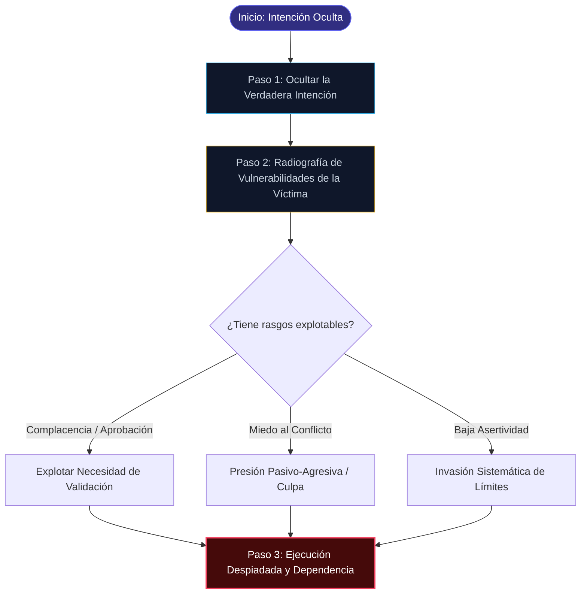

## El Proceso de Manipulación

Las personas tienden a creer que la manipulación es eficaz por diferentes razones. Tienen ideas diferentes sobre lo que hace que la manipulación sea eficaz. En particular, hay tres criterios que implican al manipulador y que deben cumplirse para que la manipulación tenga éxito. En ultima instancia, es el manipulador el principal responsable de la manipulación y de determinar si funcionara, anuque hay ciertos ragsos de personalidad que tienden a ser especialmente vulnerables a los intentos de manipulación. Los tres criterios que deben cumplirse para garantizar el éxito de la manipulación son:

* El manipulador debe ocular las verdaderas intenciones
* El manipulador debe conocer las vulnerabilidades mas viables de la victima* El manipulador debe ser lo suficientemente despiadado para seguir

Hay que tener en cuenta que la presencia de estos tres criterios no garantiza que la manipulación vaya a funcionar siempre. Sin embargo, deben estar presentes para que funcione.

### Ocular las verdaderas intenciones

Si alguien se acercara a ti y te dijera: "Te voy a obligar a invitarme a cenar", es probable que te negaras rotundamente. Las personas tienden a ser contrarias: se inclinaran por hacer exactamente lo contrario de lo que otra persona afirma que haga, simplemente porque _quieren_ tener su libre albedrio. Por eso, la manipulación solo funciona realmente bien cuando se oultan las verdaderas intenciones. De esta manera, la victima no es consciente de la manipulación que esta teniendo lugar y es mas probable que caiga en ella. Estara desprevenida y, por lo tanto, sera mas susceptible que si ya estuiera en guardia y pendiente de cualquier intento de forzar sus manos.

### Comprender las vulnerabilidades

En ultima instancia, la única forma de llegar a alguien es conociendo sus puntos debiles. Aprovechando los puntos debiles de la otra parte, puedes averiguar exactamente como presentar lo que queires para asegurarte de que te lo den. Por ejemplo, si sabe que esta tratando con una persona que le gusta complacer a la gente, puede mencionar que tiene una necesidad muy importante que quiere averiguar como satisfacer y expresarlo de la manera adecuada para que la otra persona le pregunte si puede ayudar. Este es un ejemplo de vulnerabilidad. Otros pueden ser:

* Necessitan una aprobacion externa
* Miedo a las emociones negativas
* Falta de asertividad
* Lucha por conocer su verdadero yo
* Lucha contra la autosuficencia
* Sentires fuera de control
* Ser ingenuo
* Falta de confianza en si mismo
* Ser demasiado concienzudo

Por supuesto, también hay otras vulnerabilidades, y puedes empezar a detectar otras mas personales si sabes lo que estas haciendo. Tu trabajo a la hora de manipular a los demas sera averiguar esas vulnerabilidades y utilizarlas.

### Imprudencia

En ultima instancia, la manipulación suele ser perjudicial para, al menos, una de las partes que esta siendo victima. En la mayoria de los casos, la persona manipulada puede perder algo, y la mayoria de las personas se sienten culpables ante la idea de hacer perder a otra persona algo personal. Por esta razon, el manipulador exitoso no debe preocuparse por la otra persona lo suficiente como para poder eludir la culpa que supondria hacerle daño. Para muchas personas, simplemente son demasiado ematicas para desentenderse completamente de los demas. Para otros, sin embargo, resulta fácil ignorar cualquier sentimiento de culpa por haber utilizado a la otra parte. Siguen adelante con sus vidas después de conseguir lo que quieren sin pestanear.

### Tacticas de Manipulación

Normalmente, los manipuladores ejercen algun tipo de control sobre sus objetivos. Tienen que hacerlo para salirse realmente con la suya. Sin embargo, no hay dos manipuladores iguales. Algunos pueden favorecer el refuerzo positivo, mientras que otros prefieren castigar. Sea cual sea el metodo, no se puede negar que la manipulación puede ser agotadora, insana y, a veces, completamente peligrosa.

En esta seccion, identificaremos las cinco tacticas distintas que los manipuladores suelen utilizar. Tenga en cuenta que estas tacticas estan separadas de las tecnicas que se discutiran en breve. Las tacticas son una especie de categorías de diferentes formas de manipulación, son la forma mas simplificada de clasificar las tecnicas que se presentaran, y utilizan algun tipo de tendencia o proceso psicológico para controlar a la otra persona.

### Refuerzo positivo

En lugar de considerar lo positivo como algo bueno, piensa en lo positivo como si te proporcionaran o dieran algo. Cuando se te da un refuerzo positivo para animarte a hacer algo, se te presenta algun tipo de motivador. Recibirasalso como resultado directo de tu eleccion en la acccion o para conseguir que hagas algo.

Por ejemplo, una forma de refuerzo positivo es recibir un elogio o una recompensa por completar una tarea como se esperaba. En particular, durante la manipulación, se le puede ofrecer un elogio si hace lo correcto sin que se le pida o se le anime a hacerlo. En definitiva, su objetivo es animar. Otras formas de refuerzo positivo son:

* Alabanza
* Reconocimiento publico
* Expresiones faciales
* Aprobacion
* Amor o afecto
* Regalos

### Refuerzo negativo

El refuerzo negativo, por otro lado, implica el uso de situaciones negativas con la eliminacion de esa situación negativa como recompensa. Cuando se le proporciona un refuerzo negativo, se le dice efectivamente que si hace algo, una situación negativa sera remediada de alguna manera. Esto utiliza la situación negativa y el deseo de ser rescatado de esa negatividad como la motivacion para empujarte hacia una determinada acción.

Por ejemplo, imagine que esta en un aprieto: puede darse cuenta de que le faltan 1.000 dolares para pagar sus facturas en tres dias y entrar en panico. Un manipulador puede decir que le dara esos 1.000 dolares y, por lo tanto, le ahorrara la incomoda y aterradora posibilidad de perder su casa. Otro ejemplo podria consistir en decirle a un niño que no tendra que lavar los platos si en su lugar hace lo que usted quiera.

### Refuerzo intermitente

El refuerzo intermitente se refiere a proporcionar un refuerzo positivo solo a veces. Hacerlo provoca dudas, miedo y el deseo de seguir intentando pescar esa aprobacion o refuerzo positivo que se desea. La ausencia de lo que se ofrece de forma intermittente puede hacer que las personas se esfuerccen mas por conseguirlo.

Tal vez la forma mas fácil de entender el refuerzo intermitente sea fijarse en los juegos de azar. En el juego, de vez en cuando se puede ganar, pero la mayor parte del tiempo se pierde. El hecho de ganar ocasionalmente y el saber que se tiene la oportunidad de ganar son suficientes para que la gente siga invirtiendo dinero en el juego, aunque probablemente este periodendo mas dinero del que ha ganado.

Esta forma de refuerzo puede ser la mas efectiva, ya que hace que el individuo se vuelva adicto a la persecucion del éxito o la satisfaccion. Piensa en una relación abusiva por un momento: la victima a menudo se vuelve adicta al refuerzo intermitente del periodo de luna de miel dentro del ciclo de abuso, y eso es suficiente para mantener al individuo atrapado.

### Castigo

Cuando se habla de castigo, se piensa en la inclusion repentina de algo negativo como respuesta a un fracaso o a unegativa que pretende ser desagradable para animar a la otra persona a actuar como se espera. Esto hace que la otra parte ceda, a menudo, porque la otra parte que recibe el castigo tiene miedo o esta herida, y sea fisica o emocionalmente, y quiere evitar ese mismo resultado en primer lugar.

Piensa en las multas que te ponen: el dinero que pagas es, en parte, administrativo para sufragar el coste del policia que ha puesto la multa y del juez que la preside. Sin embargo, la mayor parte de esa multa esta diseñada para castigarte. Estas perdiendo una cantidad de dinero porque has cometido algun tipo de delito.

Algunos ejemplos de castigos son:

* Gritando
* Danar (fisicamente, es decir, azotar)
* Haciendo de victima
* El tratamiento silencioso
* Molesto
* Chantaje

### Appendixzie traumatico de una sola prueba

Por ultimo, el aprendizaje traumatico se refiere al uso del abuso o el trauma en casos muy específicos para entrenar a la otra parte a sentir que debe ceder para evitar desencadenar dicho abuso en el futuro. En efecto, se consigue la obediencia directa aterrorizando a la otra parte para que obedezca en primer lugar. Este es uno de los tipos de manipulación mas daninos que reciben las personas.

* Abuso de cualquier tipo
* Establecer el dominio
* Permitir que las emociones se descendrelen

### Tecnicas de Manipulación

La manipulación se presenta de varias formas mas alla de esas cinco tacticas diferentes. Algunas personas pueden dar luz de gas, mientras que otras bombardean y desvalorizan. Otros pueden optar por profundizar en el control mental. Hay varias tecnicas de manipulación diferentes que se pueden utilizar en diversas situaciones, lo que significica que siempre tienes muchas opciones. Lo que puede funcionar en una situación no esta necesariamente garantizado que funcione en otra, y la mayoria de las veces, los manipuladores tendran varias tecnicas diferentes en su bolsillo trasero para sacarlas cuando sea necesario.

Entender cada una de estas diferentes formas de manipulación significica que puedes estar preparado. Cuando estas preparado, te vuelves menos susceptible a esa forma de manipulación. Podra protegerse eficazmente porque conoco los patrones y puede reconocerlos cuando se producen, lo que le permitira evitar ceder. Esta seccion proporcionara una explicación de los ocho metodos comunes que se utilizan.

### Bombarde de amor y devaluacion

Esta forma de manipulación es particularmente comun en las relaciones con narcisistas. El manipulador colmara a la otra persona de amor y regalos para esencialmente hacerla adicta a ellos. Entonces, cuando el manipulador quiere algo que no se esta dando, ese amor sera revocado de repente, a menudo con el daño intencional o derribando al individuo algunas clavijas. Pueden dejar de responder o decirle a la victima que ya no le importa la otra persona. La idea es hacer que la victima desee de nuevo esa etapa de bombardeo de amor para que se esfuerce mas por conseguirlo. Suele ocurri en un ciclo.

### Esta es la forma por excelencia del refuerzo intermitente.

**Luz de gas**

En la "luz de gas", el manipulador trata de hacer que la otra parte se sienta totalmente incompetente y dude de si puede o no identificar con precision lo que ocurre a su alrededor. El objetivo es que se sientan inestables y que sus percepciones de la realidad sean incorrectas. Por ejemplo, pueden decirle a la victima que la percepcion de la victima nunca ocurrio, o que la victima esta haciendo que las cosas sean mucho peores de lo que realmente fueron. El que hace "luz de gas" negara y rechazara los pensamientos y opiniones de forma tan convincente que la victima confiara en el y, con el tiempo, el manipulador mantendra el control total.

Esta es una forma comun de castigo en situaciones de abuso. Durante el tratamiento silencioso, la persona que esta siento ignorada sera borrada por completo -el individu no reconocera su presencia o que ha dicho o hecho algo. Si la persona que esta siento ignorada dice algo, la persona que esta ignorando la mirara fijamente. El propósito de esto, es hacer que la otra persona sienta el desagrado que siente el manipulador. También puede llevar a que el individuoc manipulado este tan desesperado por volver a ser como antes que cumla con cualquier peticion que se le haga.

### Culpabilizacion

La tactica del viaje de la culpa esta diseñada para hacer que la persona que esta siento manipulada se sienta culpable, simplemente porque la culpa es una emoción motivadora, y el sentiimiento de culpa es uno de los que impulsa a la gente a hacer todo lo posible para aliviarlo. Si eres capaz de hacer que alguien se sienta culpable, lehaces sentir que la única manera de escapar de esa culpa es haciendo lo que le has pedido que haga. Por ejemplo, tu hermano puede decirte que no puede permitires mantener su casa si no le prestas el dinero y que, si te niegas, sera, culpa tuya si les quitan los hijos o si tu hermano pierde la custodia.

### Haciendo de victima

A menudo, el manipulador dara la vuelta a las cosas, de modo que reflejen que el manipulador es en realidad la victima de las circunstancias y no el agresor de la situación. Por ejemplo, si un manipulador se ve envuelto en una discusion con otra persona, puede decir a todos los demas que el fue la victima de alguna manera o forma para ganar simpatia. Tergiversaran la verdad para asegurarse de que se les cree no responsables de lo que haya sucedido.

### El chivo expiatorio

En el chivo expiatorio, se hace recaer sobre otra persona la responsabilidad de una situación. Pueden hacer recaer todos sus culpas sobre el chivo expiatorio, sobre todo cuando se trata de un niño, pero también pueden simplemente negarse a dar la misma consideracion al chivo expiatorio. Esta es otra forma de refuerzo intermitente.

### Control mental

Otro metodo comun de manipulación es el control mental. Cuando se controla la mente de otra persona, se la esta influyendo para que haga algo que no quiere hacer, aunque no sea necesariamente lo que querria hacer. Sin embargo, este es un metodo que toma mucho tiempo, ya que el que esta haciendo el control tiene que llegar primero a una posición de confianza con la persona, luego trabajar lentamente hasta la situación y luego tomarla cuando sea el momento adecuado.

### Intimidacion encubierta

Esto se refiere al tipo de intimidacion en la que no se sabe muy bien por que se siente miedo, pero no se puede evitar. Simplemente sientes que algo va a salir mal o que hay algun tipo de problema al que te enfrentaras si no te empenas en hacer primero lo que se espera de ti. En el caso de la intimidacion encubierta, no se puede precisar con exactitud, pero se sabe que hay algo que le inquieta.

## 📖 Capítulo 2: Cuando y por que Utilizar la Manipulación

Ahora bien,?tienes curiosidad por saber por que la gente decide utilizar este tipo de manipulación??Por que alguien necesita ese nivel de control sobre las acciones o los scintientos de otra persona??Quien utilizaria estas formas de manipulación??Quien es realmente lo suticientemente despiadado como para seguir adelante sin culpa ni arrepentiimento? Todas estas son preguntas fantasticas, y este capitulo trata de responder al mayor número posible de ellas. Cuando se responda a estas preguntas, el retrato del manipulador sera mucho mas claro.

**zQuien Manipula?**

Los manipuladores se presentan de varias formas. Algunos son mas jovenes y simplemente no han aprendido a interactuar con el mundo. Otros simplemente son manipuladores por naturaleza: utilizan intencionadamente sus habilidades para conseguir lo que quieren sin tener en cuenta como perjudicia a otras personas. En ultima instancia, sin embargo, los manipuladores tienden a tener varios rasgos en comun. Esta seccion abordara varios rasgos y tendencias que pueden ajudarte a identificar a un manipulador en el proceso de manipulación.

**Siempre son las victimas**

No importa lo que haya sucedido: el manipulador siempre sera la victima o no tendra la culpa de alguna manera. El manipulador podria sacar una pistola y dispararte, y racionalizaria que no tuvo eleccion e insitiria en que el fue la victima mientras sostiene la pistola humeante en su mano. Este es un rasgo comun de los manipuladores, y que los hace merecedores de simpatia, lo que les da ventaja en muchas situaciones diferentes. Intentaran averigur como pomer a todos tus amigos y familiarares de su lado y te culparan de todo. Lo peor es que, como son tan habiles para hacer exactamente esto, a menudo pueden convencer a otras personas para que caign en la trampa.

**Regularmente distorsionala l verdad**

El manipulador siempre tergiversara la realidad. El manipulador, experto en tejer redes de mentiras, siempre tendra una forma de reescribir la historia, cambiar una situación o hacerla de otro modo, para que su relato sea el correcto. Un ejemplo de ello es hacerse la victima. Otras veces, simplemente pueden inventar mentiras porque las mentiras les convienen, como decir que estan luchando por llegar al trabajo porque hubo un accidente de coche y que llegaran pronto, o afirmar que no pueden salir a la calle para llegar a su coche porque hay un oso sentado junto a el. Algunas mentiras pueden parecer increiblemente poco convincentes, pero insitiran con vehemencia en que esta diciendo la verdad.

**Son pasivo-agresivos**

Los manipuladores tienden a ser pasivo-agresivos. Una parte de esto consiste en asegurarse de que sabes cual es tu lugar alredredor del manipulador: lo utilizan para afirmar su dominio y ejercer encubiertamente su propia influencia y deseo sobre ti. Por ejemplo, utilizaran intencionadamente la pasivo-agresion para hacerte sentir mal, y luego ses entiran satisfechos de haber tenido el poder necesario para hacerte sentir mal en primer lugar.

**Te presionaran**

El manipulador esta convencido de que siempre tiene la razon pase lo que pase, y con eso en mente, no dudara en presionarte para conseguir lo que quiera de ti en cada momento. Sabe que su manera es la correcta, y forzara el punto hasta que estes de acuerdo.

**No trabajaran para resolver un problema**

Si descubre que hay un problema con el manipulador, buena suerte: no trabajara para llegar a algun tipo de solucion. En su lugar, seguiran como si no pasara nada, o al menos, como si no les pasara nada. No podrian preccuparse mas por su propios problemas, siempre y cuando no sean los del manipulador.

**Siempre mantendran la ventaja**

El manipulador tiene una extrana manera de mantener siempre el control en casi cualquier situación. A menudo, encontrara la manera de asegurarse de que puede encontrar una forma de seguir mandando. Siempre elegiran el restaurante al que vas, o siempre te invitaran a salir de tu zona de confort y a entrar en la suya, todo ello hecho-intencionadamente para mantener el poder y el control sobre la situación. Cuando hacen esto, garantizan, efectivamente que son capaces de mantenverse al mando el tiempo suficiente para mantenerte desequilibrado y asegurarse de que siempre tienen la ventaja.

**Siempre tendran excusas**

Cuando cometen un error, los manipuladores suelen tener algun tipo de excusa. Hubo un accidente de coche en el camino, o simplemente les despidieron sin ninguna razon. No importa cual sea el problema; habra algun tipo de excusa que surgira para quitarle la culpa al manipulador y echarsela a otro.

**Te harán sentir poco seguro de ti mismo**

Algo en el manipulador siempre te hará sentir incompetente e incapaz de hacer algo bien. Esto significica que constantemente sentiras que tu eres el problema en lugar de ver que todo el problema puede haber estado descansando firmemente en el manipulador todo el tiempo.

**\(\iota\)Por que Manipular?**

Los manipuladores tienen todo tipo de razones para manipular a los demas, y algunos simplemente no tienen ninguna razon. Cuando empieces a entender la motivacion que hay detras de estos impulsos, estaras mas inclinado as comprender las tecnicas que suelen utilizar los manipuladores de todo el mundo. Esto significica entonces que seras capaz de averiguar como contraatacar. Puedes defenderte a ti mismo y a los demas basandote en el conocimiento que tienes. Saber por que la gente manipula a los demas puede ser una habilidad fundamental que debes desarrollar si quieres tener éxito en el mundo que te rodea.

**Quieren avanzar en la vida**

Cuando sientes que necesitas avanzar de alguna manera, ya sea por necesitar el dinero para conseguir lo que queries o necesitabas, la manipulación es una forma de conseguirlo. Cuando manipulas a alguien, por lo general lo estas utilizando como una especie de trampolin para ti mismo con el fin de asegurarte de que puedes, de hecho, soportar futuras luchas mientras también avanzas en la agenda que tienes. Normalmente, esta es la mas egoista de las razones de esta lista: estos manipuladores lo hacen simplemente porque pueden.

**Necesitan poder y superioridad**

Al igual que la ultima razon para la manipulación, a menudo los manipuladores necesitan sentir que tienen el poder. Simplemente, solo estan seguros de si mismos mientras esten en una posición de poder sobre otras personas. Si sienten que su superioridad va a ser cuestionada de alguna manera, se sentiran inseguros. Sentiran que la única manera de sentires comodos es si ejercen e imponen su propia superioridad, que se dan a si mismos a traves de la manipulación de los que les rodean.

**Necesitan control**

Cuando las personas son particularmente controladoras, pueden encontrar que la manipulación es una de las formas mas fáciles de obtener los resultados deseados. Cuando eres capaz de manipular a otra persona para que haga lo que tiene que hacer, puedes asegurarte de mantener el control en casi cualquier situación. Puede que tengas que encontrar una forma de animar a la otra persona de forma encubierta para que haga lo que tu quieres, pero en cuanto lo consigas, podras mantener el control de forma efectiva, incluso si la otra persona no se da cuenta de que tu tienes el control de la situación en cuestion. La necesidad de tener el control puede ser especialmente motivadora para las personas cuando deciden manipular.

**Necesitan manipular para mejorar su propia autoestima**Algunas personas, como los narcisistas, tienden a sentir que solo estan a gusto consigo mismos cuando otras personas les prodigan atención o admiracion. Estas personas tienden a recurrir a la manipulación para conseguir esa atención, especialmente si no son especialmente destacadas o merecedoras de atención en primer lugar. Al manipular a otras personas para que les presten la anisada atención, son capaces de sentires mejor consigo mismos.

### Estan aburridos

Algunas personas simplemente disfrutan viendo como arde el mundo y se empean en manipular a otras personas simplemente para entretenerse. Lo tratan como un juego o un retro, probando intencionadamente los limites para ver hasta donde pueden llegar sin ninguna razon o motivacion real, mas alla de aburrirse para guiarse. Estos pueden ser algunos de los manipuladores mas peligrosos, y que no tienen ningun objetivo real en mente: simplemente quieren causar estragos y pasar un rato jugando con otras personas a pesar de no obtener nada mas que su propia satisfaccion a cambio.

### Tienen una agenda oculta

La mayoria de las veces, el manipulador tiene algun tipo de razon para manipular a los que le rodean. Esto suele ocultarse al objetivo, pero puede descubirse con suficiente tiempo e información. Piesna que algunas personas buscan intencionadamente a personas vulnerables con motivos ocultos. Puede que se casen para conseguir dinero, o que se ofrezcan intencionadamente como cuiddores de un familiar anciano para robarle dinero. No importa cual sea la agenda oculta, el manipulador tiene una buena razon para tratar de mantenerla oculta.

### No se identifican adecuadamente con las emociones de los demas

A veces, la manipulación es involuntaria y un efecto secundario de la simple incapacidad de identificarse con otras personas. Efectivamente, carecen de empatía, y esa falta de empatía es suficiente para que no puedan identifier facilmente cuando han hecho algo que es manipulador, ni reconocer automaticamente cuando lo que han hecho es problematico. Son personas que simplemente no entienden las normas sociales por una u otra razon. Pueden tener un trastorno de la personalidad o de la salud mental.

### Cuando se Produce la Manipulación

Nadie quiere estar en el extremo receptor de la manipulación, y sin embargo parece estar a nuestro alrededor. El mundo esta literalmente rodeado de diferentes personas y de sus intentos de manipular. Se puede ver en la television y en los medios de comunicación. Se puede ver en la religigion y en la politicta. Ocurre en todo tipo de relaciones cuando se vuelven malsanas. No hay una forma real de evitar la manipulación, y eso en si mismo puede ser increiblemente descorazonador.

Sin embargo, dado que la manipulación est\(\acute{a}\) en todas partes, es prudente entender como es en una amplia variedad de situaciones y casos. Usted quiere ser capaz de notar cuando esta sucediendo y averiguar la mejor manera de luchar contra ella para asegurarse de que realmente es capaz de protegerse a si mismo. Cuando eres capaz de protegerte de la manipulación, puedes garantizar que, como minimo, no estas siendo utilizado regularmente por otras personas simplemente porque te niegas a permitir que te utilicen.

En esta seccion, echaremos un vistazo a la manipulación en varias relaciones y contextos diferentes para tener una breve visión general de lo que se puede esperar y por que ocurre.

### En las relaciones

Esto se refiere especialmente a las relaciones romanticas. Las relaciones romanticas parecen atraer la manipulación con frecuencia, especialmente si uno de los miembros de la pareja es el menos conflictivo y tiene miedo de defenders. Cuando esto ocurre, es posible que te encuentres con un gran dilema: tienes que averiguar cual es la mejor manera de dejar una relación romantica plagada de manipulación, lo que puede ser difícil si el manipulador ha hecho bien su trabajo.

En particular, cuando visted est\(\acute{a}\) en una relación y corre el riesgo de ser manipulado, se d\(\acute{a}\) cuenta de que es probable que la otra parte avasalle completamente la relación. Es posible que la otra parte intente que te muevas mas r\(\acute{a}\)pido de lo que normalmente te sientes comodo, insistiendo en que pases al siguiente nivel de la relación en un romance relampago. Si la persona parece demasiado buena para ser verdad en una situación asi, normalmente se puede suponer que, en primer lugar, estaba llena de manipulación y deberia evitarse si es posible.

### En las amistades

Los amigos manipuladores pueden tratar de ponerse en tu lado bueno lo antes posible, pero pronto caeran en el habito de necesitarte siempre pero nunca estar disponibles cuando los necesitas. Al principio, supondras que se trata de una coincidencia, pero con el tiempo te daras cuenta de que en realidad se trata de un patrón, lo que te dejara atascado para decidir si quieres dejar la amistad por completo o si prefieres, en cambio, aguantar la falta de apoyo del manipulador y disfrutar de lo que puedas.

### En las iglesias

Las iglesias también suelen manipular a las personas, intentando forzarlas a situaciones y acciones que no necesariamente desean. En particular, veras comunmente amenazas de condenacion y castigo si no viven segun una vida muy específica, y eso es un ejemplo perfecto de manipulación. Utilizan su autoridad para forzarte y hacerte sentir que no tienes mas remedio que obedecer. Cuentan con ello: asumen que seguiras donando, siviendo y asistiendo porque te amenazan si no lo haces. Anuque mucha gente no lo vea como una amenaza, que te digan que puedes ser excomulgado o que seras condenado por la eternidad son dos formas de asustar a alguien para que se comporte de una manera determinada.

### En politica

Los politicos intentan con frecuencia manipularse unos a otros durante los debates e intentaran manipular a la gente durante los discursos. Se puede ver en la forma en que se sostienen y en como interactian entre si que estan entrenados y guionizados sobre lo que deben hacer, e incluso la forma en que se paran ha sido guionizada para evitar cualquiera de los tipicos signos de incomodidad, como cruzar los brazos. En su lugar, para ser vistos como mas poderosos, pueden juguetear con un reloj o una piezo de joyeria para tratar de oculart su reacción visceral para mostrar signos de angustia.

### En los cultos

Las sectas suelen utilizar tecnicas de lavado de cerebro en las que pueden derribar personalidades enteras para instalar las suyas propias, mas obedientes, en ortas personas. Pueden recibir a la gente con los brazos abiertos, haciendoles sentir que son bienvenidos y que seran felices, pero con el tiempo, la manipulación y elavado de cerebro aumentaran. Finalmente, las personas quedan como cascaras de si mismas, obligadas a obedecer y hacer lo que se les diga si quieren evitar el castigo. Se puede ver esto en los cultos extremos en particular, y los cultos pueden ser tan efectivos que los lideres pueden literalmente ordenar a sus seguidores que se maten a si mismos o a otros, y lo harán, como en el culto de Jamestown, en el que todos bebieron una bebida con sabor a veneno como suicidio en masa.

### En puestos de venta

A veces, las personas que occupan puestos de ventas tienen que ser astutas con la forma en que deciden presentarse para garantizar que pueden, de hecho, cerrar una venta. Pueden optar por utilizar ciertas apelaciones a la autoridad o a la emoción en un intento de convencerle, o pueden tratar de asustarle para que se someta en otros casos. Sin embargo, sea cual sea la situación, es habitual ver a los vendedores intentar todo tipo de influencias para que usted compre algo. Incluso algo tan sencillo como pregnantarte un par de veces que si puede ser una forma de manipulación extraida de la programacion neurolinguistica, dependiendo de si la otra parte esta preparada con las tecnicas. En particular, gran parte de la influencia que veras en los entornos de ventas tiende a ser persuasión o PNL.

### En los tribunales

En los tribunales, cuando los abogados se enfrentan a menudo para averiguar la verdad, es posible que se produzcan manipulaciones. Especialmente si los abogados estan especialmente anisos por probar sus propias posiciones,puede que te encuentres con problemas en los que ambas partes empiecen a lanzarse intentos de manipulación. Puede que formulen sus preguntas de una manera cargada para intentar que la otra parte caiga en la trampa. Pueden intentar inculpar a la otra parte o presionarla para que confiese. En ultima instancia, aunque se supone que la sala del tribunal es particularmente imparcial, a menudo se pueden ver intentos de manipulación para controlar al otro.

### En las negociaciones

Los intentos de negociacion son otra area en la que se pueden ver intentos de manipular o influir en el otro. Ambas partes tienen un cierto deseo, y es probable que intenten salirse con la suya en algun grado. Por supuesto, las negociaciones también conllevan un compromiso, por lo que habra que hacer algunas concesiones, pero el responsable de esas concesiones puede cambiar en función de los resultados de la negociacion.

## 📖 Capítulo 3: El Poder de la Persuasión

?Alguna vez has intentado decidir que hacer para cenar una noche y tu pareja o tu hijo se te han acercado con unargumento completo sobre por que deberias ir a cenar a tu restaurante de sushi favorito? Tal vez el argumento este muy bien expuesto para unset. Tu hijo seinala que no tendrias que cocinar ni limpiar, lo que significica que tendrias mas tiempo para pasar con tu familia, algo que escasea desesperadamente estos dias. Su hijo seinala que a todo elmundo le gusta el sushi, asi que no puede equivocarse al ir al restaurante y que toda la familia encontrara algo que comer. Por ultimo, tu hijo te dice que sabe que te apetece mucho ir a comer sushi porque siempre quieres ir a comer sushi.

Puede que te des cuenta de que tu hijo tiene razon -todo eso es cierto- y aceptes ir. En este caso, su hijo le acaba deonvencer para que salga a cenar. Ahora bien, el argumento y el intento de persuasión pueden haber sido bastante simplificados, pero siguen contando como una forma de influencia. Usted no estaba pensando en salir a cenar hasta que su hijo le seinalo todas las razones por las que debia hacerlo. Esto significica, pues, que tu hijo ha influido en tu eleccion.

Por supuesto, la mayoria de las veces, los intentos de persuasión tienden a ser un poco menos obvios. Pueden ser tansencillos como redactar las cosas de forma que te lleven a tomar una decisión concreta. Puede ser senalar que la otra parte sabe mas porque resulta ser un experto en lo que se esta vendiendo. Sin embargo, sea cual sea la forma, lo que hace la persuasión que no hace la manipulación es que pone la cuestion a la vista de todos.

Un poco mas aceptable que su forma hermana de influencia, la persuasión se centra mas en el libre albedrio que en el intento encubierto de convencer a alguien para que ceda y sea controlado. En particular, es posible que ten encuentres bien con la persuasión simplemente porque es mas abierta que el intento encubierto de manipular. Sin embargo, son bastante similares, y en este capitulo se le presentara lo que es la persuasión.

**?**

La persuasión, al igual que la manipulación, es una forma de influencia social. Esta diseñada para cambiar los pensamientos, los sentimientos o los comportamientos de otra persona por razones que se enumeran o se dictan para la otra persona en el intento de consequir que esta cambie. Esto significica que la otra persona es muy consciente del intento desde el principio. Al igual que su hijo le senalo que le gustaria ir a cenar sushi, cualquier otra forma de persuasión le va a decir lo que deberia queerer o hacer. Te animara a hacer algo en concreto en un intento de persuadirte, pero siempre podras rechazarlo y seguir con tu eleccion inicial.

Normalmente, la persuasión es increiblemente poderosa. Estas creando un argumento de algun tipo para otra personale intentas seguir con ese argumento. Quieres que los demas vean que tu argumento es válido y que tienes la idea correcta. Quieres averiguar como hacer precisamente eso sin que haya una forma clara y fácil de salir de ella. Todo esto significica que tienes que averiguar que es lo que motivar a tu objetivo y luego averiguar como motivarlo.

Esto suele ocurrir de diferentes maneras, como en los principios de la persuasión o con la comprension y el uso de laretorica. Sin embargo, lo que si es cierto es que, al final del intento, deberias conseguir que alguien tenga al menos, una idea de lo que quiere. O bien estaran de acuerdo con usted, o bien no estaran de acuerdo y seguiran adelante, y dependera de usted averiguar cual.

**Persuasión vs. Manipulación**A primera vista, los dos parecen estar estrechamente relacionados: ambos son intentos de convencer o hacer que alguien haga algo. Sin embargo, es probable que unted persuada a alguien casi todos los dias y, sin embargo, se proponga no manipular nunca a los demas. Es capaz de mantener la línea porque ambas cossas son completamente diferentes.

Sin embargo, hay que tener en cuenta las diferentes definiciones de los dos intentos de influencia. En la manipulación, se intenta cambiar por medios injustos para los propios fines egoistas. En cambio, en la persuasión se busca hacer que alguien haga algo.

Esto significica que, principalmente, la manipulación es desleal o secreta por defecto: busca utilizar y abusar de las personas para satisfacer al manipulador y lo que este quiera. La persuasión, en cambio, es simplemente una forma en que las personas interactian con quienes las rodean. Intentas persuadir a alguien para que te ayude porque sientes que puede ser un activo valioso y crees que también obtendra algo de ello. Cuando intentas persuadir a alguien eres totalmente sincero, pero cuando manipulas no lo eres.

Por ejemplo, considere que, por alguna razon, necesita que le lleven al trabajo manana. Te acercas a tu vecino y le dices: "Oye, me he dado cuenta de que a tu jardin le vendria bien un poco de cuidado,?quieres que te ayude hoy?" Estoy libre todo el dia". El vecino acepta, y los dos charlan alegremente mientras se occupan de los trabajs deljardin. El vecino, al terminar todo, te pregunta si necesitas ayuda, ofreciendote a cambio. Tu le respondes que, en realidad, necesitas que te lleven al trabajo y que lo agradecerias mucho.

Por otro lado, si hubieras querido manipular al vecino para que te llevara, habrias salido por la manana como de costumbre y habrias intentado desesperadamente arrancar el coche mientras gemias en voz alta y polpeabas el valante antes de mirar tu reloj con exasperacion. En este caso, no estas interactuando directamente con la otra persona: estas dejando claro que estas descontento, pero no te diriges a tu vecino.

Resulta que tu vecino ve tu situación y se ofrece a ayudarte, consiguiendo que te lleven sin que tengas que pediray ayuda. Eso es manipulación. Has hecho algo intencionadamente pensando en tu propio interes. No ayudaste a tu vecino, y simplemente te aprovechaste de su ambilidad cuando se ofrecio a llevarte sin ninguna oferta de reciprocidad.

Como puedes ver, la manipulación frente a la persuasión puede ser un poco compleja de entender si no sabes lo que estas viendo, pero es importante. En efecto, cuando manipulas a otra persona, estas intentando que haga algo por ti sin que tengas que pedirselo abieramente de ninguna manera.

### Utilizar la Persuasión

Entre las dos, la persuasión se considera generalmente acceptable desde el punto de vista social y algo que no sera problematico para unted si se encuentra en el extremo receptor de la misma. Es posible que no sientas que la persuasión es particularmente amenazante en la forma en que se considera tipicamente la manipulación, simplemente porque cuando alguien intenta persuadirte, suele ser honesto contigo. Le dira exactamente lo que queiere o necesita y normalmente le ofrecera razones por las que deberia ayudarle, que a veces pueden ser una negociacion de servicios o simplemente apelar a la logica o a cualquier otra cosa para demostrar que su ayuda no seria literalmente un inconveniente para unted, sino que le salvaria la vida.

Cuando se planea utilizar la persuasión contra orta persona, es probable que se necesite algun tipo de plan. En general, tendra que saber exactamente lo que quiere y como tiene que llegar a ese resultado. Si quiere conseguir un trabajo, por ejemplo, puede darse cuenta de que los pasos para conseguirlo requieriran que solicite trabajos y trabaje en su curriculum tanto como sea posible. Puede que vea que hay poco margen de error y que tendra que intentar activamente encontrar es trabajo.

Cuando hagas tu plan, puedes empezar a pensar a quien pediras Ayuda.?Conoce a alguien con algunos contactos??Tienes algun amigo que trabaje en algun sitio con ofertas de empleo??Tienes alguna habilidad que pueda conseguirte ese trabajo que realmente necesitas o quieres? Si puedes responder afirmativamente a cualquiera de estas preguntas, puedes averiguar a quien quieres dirigir tu persuasión. Después de todo, siempre tiene que haberalguien en el extremo receptor cuando se intenta persuadir a alguien.

Después de identificar a quien va a persuadir, debe averiguar como desea persuadirlo. Ahora bien, esto sera un poco mas complicado de averiguar: hay docenas de maneras de intentar persuadir a alguien y, en ultima instancia, tendra que elegir la que mejor funcione para usted. Cuando pueda identificar exactamente como desea persuadir a otra persona, podrá empezar a reunir el mejor conjunto de herramientas posible para hacerlo.

Ahora bien, no entraremos en las herramientas de persuasión hasta el proximo capitulo, asi que mantengase firme en esse concepto particular. Sin embargo, reconozca que hay varias tecnicas de persuasión que se pueden utilizar, siempre y cuando se empene en usarlas con eficacia. Con el plan en mente y las herramientas en mente, y reconociendo que no solo estas persuadiendo para conseguir ayuda, tienes que averiguar que estas dispuesto a ofrecer a cambio.?Por que deberia ayudarte la otra persona??E Hara algo a cambio??Les beneficiar de algunal manera? Recuerda que la manipulación es la que se hace a si misma. Cuando estas persuadiendo a alguien, todo elmundo deberia ver al menos algun tipo de beneficio por ayudar o estar de acuerdo con lo que estas intentando persuadirle.

Por ultimo, un vez averiguado el quien, el que, el como y el por que, ya puedes intentar utilizar tu tecnica. Ahora es el momento de acercarse y hablar con quien hayas identificado como la persona a la que estas pidiendo ayuda. Recuerde que debe intentar preguntarles si puede ayudarles antes de entrar de golpe en el tema de todo lo que busca de ellos.

Esto significa que puedes hacer un punto para pedir y persuadir. Debe senalar todas las razones por las que ayudar, seria bueno para la otra persona, asi como lo que usted hará a cambio. Al fin y al cabo, la persuasión es un "toma y daca", y debes dejar claro a la otra persona que tienes la absoluta intención de dar y recibir para que no se sienta presionada o atrapada en el proceso. Al hacer esto, le aseguras que no estas simplemente utilizandola, especialmente cuando siques ayudandola.
Llegados a este punto, deberia tener una idea generalmente sólida de que la persuasión es algo que puede implicar d y recibir, es decir, que tanto el que da como ambas personas deberian beneficiarse. Como regla general, el que recibe nunca debe ser el único que se beneficie de la persuasión. Esto puede ocurri en varios contextos. Puede ver a personas comprando una casa y observar que la persuasión se produce durante la venta. Puede ver que la persuasión, ocurre en las interacciones regulares con su pareja romantica simplemente como un efecto secundario del hecho deque ambos interactuan regularmente entre si y a menudo tendran algo u otro que realmente quieren o necesitan. Se puede ver en la crianza de los hijos, y también en las negociaciones. Los lideres también son maestros de la persuasión, especialmente si son lideres eficaces, y a menudo veras que los mejores lideres son muy queridos e incriblemente persuasivos. Saben manejar sus herramientas tan bien que quienes les rodean siempre estan dispuestos a ayudar.

En esta seccion nos dedicaremos a repasar varios contextos en los que puedes encontrarte con un intento de persuasión a lo largo de tu vida. Es increiblemente comun ver que la persuasión aparece con regularidad porque se utiliza con mucha frecuencia en terminos de interacciones. Si quieres que alguien haga algo, la mejor manera de conseguir que lo haga es pidiendole que lo haga. Si puedes hacer eso, estas en el buen camino para persuadirles.

### En ventas

Cuando vested esta comprando algo, como un coche, puede encontrase con alguien que esta interesado en intentar venderle algo que no le interesaba necesariamente al principio. Para que sea un intento de persuasión, el coche recién presentado debe hacer algo por usted, debe serle útil de alguna manera, y sera vested quien determine si el uso de ese nuevo coche es suficiente para animarle a seguir adelante con la adquisicion del nuevo coche o si quiere seguir con la que era su eleccion original.

Tal vez se decanto por un sedan pequeño porque no le gusta conducir nada muy grande. Sin embargo, tienes dos niinos pequeños y te encuentras con que siempre te frustra no tener suficiente espacio para las sillitas del coche, el cochetico, la bolsa de los panales y las compras que puedas hacer durante el dia. Esto significica que su coche, a pesar de que se siente comodo conduciendo, no es uno que necesariamente vaya a estar comodo utilizando de forma regular.

El vendedor ve que necesitas algo mas de espacio y te recomienda también algunos SUV compactos. Son lo suficientementente grandes como para que quepan el resto de tus pertenencias sin que te cueste meter la compra cuando vayas a la tienda durante el dia. Ahora, para ser justos, el SUV es un poco mas caro, y tu lo sabes. El vendedor también lo sabe, y puedes suponer que se llevara una comision algo mayor por el SUV que por la berlina.

Sin embargo, después de meditarlo, te das cuenta de que el vendedor tenia razon: necesitas el espacio. Necesitas espacio para tus hijos, sus necesidades y cualquier cosa que puedas coger cuando salgas, y tu cochetico apenas cabe en el maletero tal y como esta sin nada extra. Entonces te decides por el SUV.

Ahora bien, lo que hace que esto sea persuasión y no manipulación es el intento de asegurarse de que vested sabe lo que esta haciendo y de que el vendedor esta intentando ayudarle de verdad. Ahora bien, si el vendedor estuiera simplemente tratando de convencerte de que adquieras el coche mas grande del mercado con la cuota mensual mas cara, eso habria estado mas en la línea de la manipulación, pero teniendo en cuenta que el vendedor te mostro algunas opciones razonables y no te presiono, se considero en cambio persuasión.

### En las relaciones

Este tipo de concesiones también se da en las relaciones; por ejemplo, imagina que tu y tu pareja estais dispuestos a dar el siguiente paso y a iros a vivir juntos. Sin embargo, ninguno de los dos quiere dejar su apartamento. En ultima instancia, la mejor manera de conseguir que uno de los dos salga de su casa y se instale en la del otro es a traves de la persuasión: ambos tendran que dar las razones para quedarse en sus respectivos apartamentos mientras la otra parte se muda.

Dado que ninguno de los dos intenta manipular de forma solapada para quedarse en su propia casa y ambos estan dispuestos a considerar con calma lo que ocurre y cuales serian las razones para quedarse o marcharse con el fin de decidir racionalmente el mejor curso de acción, esto se considera un intento de persuasión.

### En la crianza de los hijos

En la crianza de los hijos, lo mejor que puedes hacer es aprender a hablar con ellos para que te entiendan con claridad y eficacia. Esto significica que tienes que averiguar cual es la mejor manera de comunicarte con tu propio hijo, y eso podria ser muy diferente de lo que usarias con otra persona que conozcas o con el hijo de otra persona. Si aprendes a comunicarte con tu hijo de forma eficaz, podras utilizar la persuasión de forma habitual.

Cuando se cria a un niino, lo que se hace es intentar averiguar la mejor manera de ayudarle a convertirse en un adulto responsable y maduro, productivo y capaz de relacionarse con los que le rodean. Esto significica que tienen que desarrollarabilidades como la forma de persuadir a alguien o la mejor manera de comunicarse cuando necesitan algo. Esto significica que debe ensenar con el ejemplo: debe hablar con su hijo utilizando los mismos patrones de persuasión que utilizaria con un amigo o familiar.

Por ejemplo, si realmente quieren una galleta y la piden amablemente, puedes decirles muy educadamente: "?Estoy muy orgullosa de que uses tus modeles! Pero y sabes que la cena esta a punto de terminar y tienes que asegurarte de que guardas espacio para comer tu cena.?Que tal si lo hacemos manana después de comer porque no necesitasazucar después de cenar?". De este modo, usted negocia una nueva hora para comer la galleta y su hijo esta de acuerdo.

Ahora, por supuesto, podria haber dicho simplemente: "No hay galleta; es demasiado tarde", y que eso fuera el fin de la discusion, pero eso no le habria hecho ningun favor a su hijo. En lugar de eso, esta dejando claro que las buenas habilidades de comunicación son fundamentales si quieren tener éxito. Les estas ayudando a convertirse en los mejores adultos posibles porque les estas ensenando habilidades como la persuasión desde el principio.

### En la negociacion

La negociacion es algo a lo que solo ciertas personas se enfrentan de forma habitual, pero casi todo el mundo se enfrentara a ella en un momento u otro. Si tienes que negociar con alguien, la persuasión es la forma perfecta de empezar a intentar que alguien vea tu propio lado. En efecto, puede exponer sus argumentos para que las cosas se haban a su manera, ofreciendo sus propias concesiones, y luego ver que succede después. Usted quiere que su interlocutor en la negociacion se sienta dispuesto aceptar el trato que usted ha propuesto sin sentir que se esta aprovechando de el, porque aprovecharse no es uno de los principales objetivos de la persuasión, sino ser justo y comunicativo.

### En el trabajo

Por ultimo, en el trabajo, es probable que necesites persuasión en algun momento.?Necesita un dia libre para un viaje? Tendra que convencer a su jefe de que lo necesita.?Quiere s un aumento de sueldo??Por que se lo merece??Como cambiar a tu propio productividad si consigues ese aumento para justificarlo cuando lo pidas??Que puedes, hacer para que ese aumento merezca la pena?

Sin embargo, mas alla de las negociaciones con los empleadores, también hay que estar preparado para negociar con los clientes o los socios comerciales, y para ello también se necesita la persuasión. En definitiva, cada vez que tengal que pedirle a alguien que haga algo, estara tratando de persuadirle para que lo haga. Por eso es tan importante dominar la persuasión.

## 📖 Capítulo 4: Tecnicas de Control Mental con Persuasión

Ya ha visto lo importante que puede ser la persuasión en varios contextos diferentes. Llegados a este punto, es hora de empezar a ver las tecnicas que puede utilizar para persuadir a otras personas. Recuerde que la persuasión consistent en ser claro en lo que se pide. Pero, por otro lado, también se trata de convencer a la gente de que haga lo que tu quieres. Tienes que ser capaz de caminar por esa fina línea sin caer en ninguno de los dos lados si quieres ser eficaz.

Este capitulo le presentara tanto los principios de la persuasión como la retorica de la persuasión. Se le guiara a traves de todos y cada uno de los pasos de la persuasión y se le proporcionar a el razonamiento de que debe hacer un punto para desarrollar realmente estas habilidades. Cada una de ellas tiene su propia e importante utilidad si esta dispuesto a esforzarse por aprenderlas.

**Principios de la Persuasión**

En ultima instancia, esta es exactamente la clase de divisi on que se ve normalmente: cuando se apela a la autoridad, gana el que tiene mas conocimientos. Al final, gana el que se considera mas autoridad por sus credenciales o su experiencia.

Esto significica que cuando quiera apelar a la autoridad, lo que tiene que hacer es asegurarse de encontrar una manera de dejar claro queted es, de hecho, una autoridad en el tema. Si usted es el vendedor de coches, quizas tenga cartas y fotos de sus clientes felices que le han comprado coches y se han ido totalmente satisfechos después de su ayuda. Tal vez deberias prestar atención al hecho de que cuando la gente entra, lo primero que quieres que vean es que estas cualificado en tu trabajo. Puedes preparar todo para que puedan ver tu diploma o tus premios, o te aseguraras de que se enteren en los primeros minutos de la reunion.

### Compromiso y coherencia

El siguiente principio de la persuasión se conoce como compromiso y coherencia. Cuando se trata de compromiso y coherencia, se esta jugando con el hecho de que la gente tiende a gustar de lo que es familiar y esperado. Esto significica que la gente siempre tratara de cumplir con un compromiso que ha asumido, y cuanto mas a menudo se comprometan, mas probable sera que continuen haciendolo y se convierta en algo normal.

Por ejemplo, digamos que le pides a tu vecino, que resulta ser tu companero de trabajo, que te lleve al trabajo. No es, literalmente, ningun inconveniente, porque los dos viajais a la vez. Después de varios viajes en los que tu companiero de trabajo te lleva al trabajo, al final se convierte en algo esperado y ya no tienes que pedirselo: simplemente esperas junto al coche de tu vecino antes y después del trabajo cada dia para coger ese viaje. En efecto, la primera vez que accedieron a llevarte, se encreraron en una cadena en la que tu les pedias repetidamente que te llevaran y accedian a hacerlo con regularidad.

A la gente le encanta ser coherente; es valioso serlo y, por eso, la gente suele seguir adelante, aunque no le guste y no quiera continuar.

También puedes enaar a la gente para que haga cosas por ti con este mismo proceso. Si quieres algo como que tu companiero de trabajo te cubra un turno, puedes empezar por hacer una simple pregunta de si como respuesta; por ejemplo, preguntarle si ha tenido una buena semana hasta ahora. Tu companiero dice que si, y entonces le preguntas si puede intercambiar tumos contigo para asegurarte de que puedes ir a un concierto que has estado esperando.

Gracias a que ya ha empezado a decir que si a otras cosas, su companiero de trabajo va a estar en un estado de animo en el que y esta diciendo que si, asi que puede continuar. Después de aceptar también algunas cosas mas pequeñas, es posible que te encuentres con alguien que este dispuesto a acceder a peticiones mas difíciles o mas grandes en nombre de la coherencia.

### Me gusta

Este es quizas uno de los principios mas sencillos de la persuasión: todo lo que tiene que recordar es que cuanto mas le guste alguien o algo, mas probable sera que sienta que lo que le ha gustado es valioso, y mas probable sera que istano de valioso, y mas probable sera que istano de valioso, y mas probable sera que le convenzan a su favor. Por ejemplo, es mas probable que hagas un favor a alquien que te gusta mucho que a alquien que no te gusta nada.

Por suerte, hay varias formas de conseguir caerle bien a otra persona. Puedes, por ejemplo, imitar a alquien hasta que le caigas bien. Esto significa que estarias copiando sus comportamientos de la manera mas encubierta posible, lo cual puede no ser particularmente secreto si no sabes lo que estas haciendo. Una vez que lo hayas preparado todo y hayas imitado a la otra persona hasta el punto de que esta te devuelva el reflejo, podras continuar.

Sin embargo, si no estas seguro de como proceder con el mirroring o simplemente no quieres lidiar con ello, hay otra tecnicas que también puedes utilizar, como elegir hacer que alquien te guste intencionadamente. Esto no es tan dififici como parece.

Comience por establecer algun tipo de conexión entre vted y la otra parte; tal vez, comente que puede identificarse con la otra persona cuando llega con su hijo a una cita. Digale que usted tiene un hijo de la misma edad y que volver a trabajar a esa edad es muy difícil.

Una vez establecida la conexión, querras establecer contacto visual y seguir halbando. Puede ofrecer a la otra parte algun elogio o cumplido, con la intención de hacerle sentir que realmente le interesa lo que esta diciendo o lo que piensa. El truco es que el cumplido que hagas tiene que ser genuino, y debes decirlo en serio.

Por ultimo, si quieres resultar simpatico, debes dejar claro que los dos estais del mismo lado. Tal vez le indiques que ambos trabajareis juntos para conseguir un coche a la otra persona. Tal vez le convenzas de que ambos intentareis resolver su problema, sea cual sea, con ellos. Este establecimiento de camaraderia hace entonces que los socios se preoccupen menos por ellos.

### Reciprocidad

El siguiente principio de la persuasión es la reciprocidad. Cuando se apela a la reciprocidad, efectivamente, se trabaja con la actitud de que se ayudara a cualquiera que te ayude a ti primero. Dejas claro que estas encantado de ayudarles si crees que responderan de la misma manera. Esto no es tan legitimo como puede parecer a primera vista.

Piensa en que, cuando un amigo te compra un regalo, sientes que debes corresponderle. Esto es intencionado en el desarrollo humano, asi que sientes el impulso de corresponder cuando otra persona te ofrece algo. Esto significa que cuando otra persona te ha ayudado, estaras mas inclinado a yudarla cuando necesite ayuda. Te proteges eficazmente con tus propios comportamientos altruistas para asegurarte de que tanto tu como la otra parte podais recibir en vuestros momentos de necesidad.

Si quiere aprovecharse de esto, por ejemplo, puede empezar por ponerse en contacto con alguien de quien necesite ayuda. Tal vez quiera que su vecino cuide de su perro mientras tusted se va de viaje por la noche. Entonces te ofreces a hacer algo por tu vecino. Tal vez limpiie su jardin antes de preguntarle si puede cuidar de su perro durante el dia. Le dices que lo único que tiene que hacer es dejar salir a tu perro un par de veces y todo ira bien.

Después de haber sido ayudado por tusted, se siente obligado a cumplir y ayudarle austed también. Se compromete a cuidar de tu perro durante el viaje, y eso es una cosa menos de la que tendras que precouparte durante los proximos

[MISSING_PAGE_EMPTY:173]

La escazez se refiere a la offerta y la demanda. En efecto, cuanto mas habitual o fácil de conseguir es algo o alguien, menos importante es. Esto se puede ver a menudo en los articulos materiales: los articulos de edicion limitada tienden a ser mucho mas demandados que el mismo articulo en un color estandar. Por ejemplo, si realmente quieres esa videoconsola mas nueva, pero quieres la específica de tu serie de juegos favorita, es probable que tengas que encontrarla en un sitio de venta de segunda mano y esperar que puedas encontrarla a un precio normal. De lo contrario, no tendras mas remedio que seguir adelante sin esa consola en concreto.

Esto se debe a que la consola normal es comun. Es fácil de conseguir y, por lo tanto, no es especialmente importante para ti, ni se considera tan valiosa como la normal para ti.

Ahora bien, puede que se pregunte como puede relacionarse la oferta y la demanda con la persuasión de alguien para que haga algo. La respuesta es que debes asegurarte de que eres capaz de convencerle de que tienes demanda. Tal vez descubra que su pareja parece darlo por sentado. Si tienes una charla seria con tu pareja sobre como no te sientes amado o respetado, y durante esa charla, mencionas que prefierias estar en cualquier sitio menos alli porque es muy agotador vivir completamente sin querer.

Esto deberia indicar a tu pareja que no siempre estaras disponible; solo lo estaras mientras quieras estarlo, y eso aumenta inmediatamente tu valor. También puedes hacer esto con otras personas. Rechaza el primer intento de programar algo contigo y di que la cita no te conviene. Cuando llegues a una cita un poco mas tarde, puedes convencer a la ortra parte de que vales el dinero que se va a invertir en ti. Quieres que la gente sienta que ha tenido suerte al conseguirte. Al fin y al cabo, eres único: tratate como tal.

### Prueba social

Por ultimo, la prueba social se refiere a la tendencia de la gente a dejarse llevar por la presión de los companeros. Se trata de una palabra elegante para referirse a la presión de los companeros y consiste en que uno se empena en elegir lo que hacen los demas. Si no sabes lo que deberias hacer, decides seguir lo que ves a tu alrededor. Si ves que tus companeros estan bailando en circulo, pero no sabes por que estan bailando en circulo, es probable que te unas a ellos sin entender por que, y eso esta bien. Lo haces de todos modos y nunca averiguas por que.

Cuando quiera utilizar esta forma de persuasión con eficacia, solo tendra que establecer una zona de control.?Recuerdas por que a tantos manipuladores les gustaba la ventaja de jugar en casa? Es para poder manipular su entorno. Tu también puedes hacerlo. Por ejemplo, si quieres que alguien haga algo por ti, asegurate de pedirselo cerca de otras personas que esten haciendo activamente lo que les pediste que hicieran en primer lugar.

Por ejemplo, si quieres ir por ahi recogiendo firmas y donaciones para una causa, querras asegurarte de que los que te rodean vean que consigues lo que quieres. Cuando ven que otras personas estan firmando y donando, es mas probable que lo hagan, especialmente si reconocen los nombres, o sienten que tienen que seguir el ritmo de sus companeros. Por lo tanto, esto funciona bien para mantener a la gente a raya simplemente manteniendo el ambiente que les rodea.

### Retorica

Otra serie de tecnicas que pueden ayudarte a ser mas persuasivo es el arte de la retorica. La retorica es el arte de halbar o escribir de forma persuasiva en un intento de hacer que otras personas vean las cosas a tu manera. Si eres capaz de formular tus argumentos con retorica, puedes asegurarte de que te diriges a otras personas de forma convincente y difici de rechazar o ignorar.

En particular, la retorica implica tres metodos distintos de persuasión: son tres tecnicas que se utilizan habitualmente para asegurarse de que la otra persona acepte su sugerencia. Se conocen por sus nombres griegos: Ethos, Pathos y Logos.

> [!CAUTION]
> **Criterios Indispensables de Manipulación:** Para que una maniobra sea considerada manipulación oscura, el perpetrador siempre debe cumplir tres condiciones: ocultar sus verdaderos fines, identificar la debilidad exacta del objetivo y carecer de reparos éticos para avanzar.