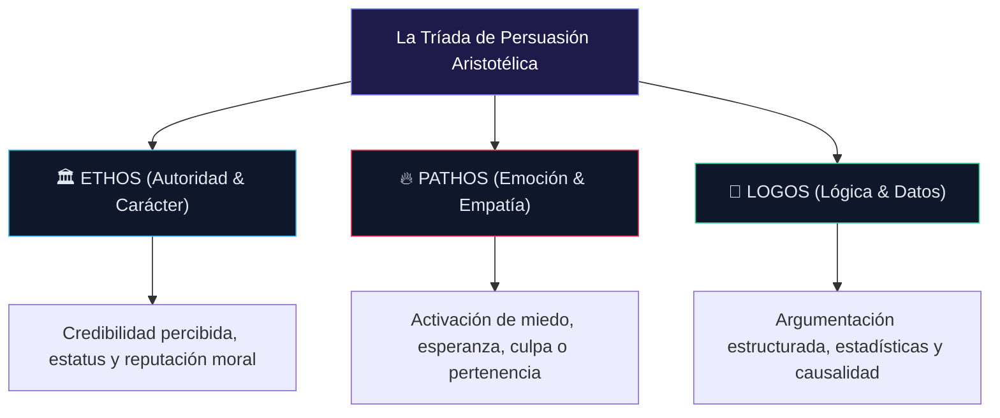

## Logos

La apelacion a la logica y a la razon es la forma final de la retorica. Con el Logos, buscas establecer la mayor cantidad de razones posibles que no se pueden negar para hacer lo que estas pidiendo. Puedes s\(\mathrm{\acute{e}}\)nalar las cifras y los hechos que apoyan lo que estas pidiendo, o bien utilizar estudios que apoyen tu opinion. Los que utilizan el Logos tienden a arrojar tantos datos como sea posible a la otra persona, esperando que algo se pegue.

De las formas de persuasión, esta puede parecer la mas válida: después de todo, como se pueden falsificar las estadisticas y los estudios? Sin embargo, el problema con esta forma de persuasión puede surgir en el hecho de que es increiblemente fácil malinterpretar o utilizar de forma incorrecta las estadisticas, especialmente si esas estadisticas no se comprueban o el oyente no siente la necesidad de cuestionalras.

Por ejemplo, considere la diferencia entre correlacion y causalidad: puede presentar dos estadisticas diferentes como una correlacion, pero mucha gente asumira inmediatamente que hay una causalidad, a pesar de que puede no haber ininguna y las similitudes en las estadisticas pueden no ser mas que una coincidencia. Quizas la forma mas fácil de imaginar esto es considerar que a medida que aumentan las ventas de helados, también lo hace el indice de delitos violentos.

Para alguien que no este familiarizado con las estadisticas o con la correlacion frente a la causalidad, puede suponer automaticamente que el helado y la delincuencia estan relacionados. Sin embargo, ambos son simplemente el resultado del aumento de la temperatura. Las ventas de helados tienden aumentar durante los calurosos meses deverano, pero también aumenta la delincuencia, ya que el calor hace que el temperamento de la gente sea mas corto, que nunca. En realidad, no estan relacionados en absoluto, mas alla de que ambos tengan la misma causa.

## 📖 Capítulo 5: Como Influir en los Demas con la Ciencia de la Psicología Persuasiva

Hasta ahora, hemos discuido a fondo los conceptos y las tecnicas que hay detras de como persuadir a los demas, pero no hemos analizado realmente el acto de ser persuasivo. La persuasión es mucho mas que teoría, y anque la teoría es importante, también hay que tener en cuenta, en igual o mayor medida, los metodos con los que se puede ser persuasivo. Estos metodos utilizaran los principios de la persuasión y la retorica, pero también serviran como instrucciones sobre como ser persuasivo en general. No puede limitarse a decir que debe apelar a las emociones y dejarlo asi: existen otras tecnicas de persuasión.

Nos tomaremos un tiempo para ver como el influenciado toma la persuasión ofrecida. Veremos por que y como funcionan estos metodos y como utilizarlos. Estudiaremos exactamente como podemos influur en las decisiones que toman otras personas sin tener que coaccionar u obligar a la otra parte a hacer lo que le pedimos. En su lugar, se centrara en la mejor manera de convencerles de que deben tener una determinada mentalidad o tomar una determinada decisión.

En este capitulo, echar a un vistazo a como se construye la psicología de la persuasión, especificamente observando al lider emocionalmente inteligente, que es capaz de reunir seguidores con facilidad, y luego extrapolando mas alla de ese individuo en particular a otros también. Se vera como la inteligencia emocional favorece que las personas se conviertan en individuos persuasivos que son sin tener que coaccionar o forzar. Después de pintar el trasfondo de lo que utiliza la psicología persuasiva, se le guiar a traves de cuatro metodos diferentes que puede utilizar para asegurarse de que puede persuadir a los demas para que haban lo queted desea. A medida que avanza, tenga en cucenta que una de las diferencias mas definitorias entre la persuasión y la manipulación es que el persuadido siempre puede elegir no hacer lo que se le pide. El persuasor acepta el libre albedorio, y anuque el persuasor puede tratar de guiar al individuocha la que quiere, nunca lo hará de manera forzada. Decir no a la peticion signe siendo un resultado acceptable.

**Psicología de la Persuasión e Influencia**Piense por un momentto en la persona mas influuyente que conoce personalmente. Puede ser alguien con quien te relacionas habitualmente: un profesor, un jefe ou un amigo.?Que les hace tan influuyentes? La respuesta puede no ser que sean inteligentes, divertidos o guapos, sino que sean emocionalmente inteligentes.

Los individuos emocionalmente inteligentes tienden a ser mucho mas propensos a convencer a otras personas de que hagan lo que quieren o necesitan, simplemente porque saben como presentarse. Saben cual es la mejor manera de interactuar con los demas y son capaces de intuir la mejor manera de proceder. Curiosamente, muchas de las acciones que el individuo emocionalmente inteligente utiliza para intentar persuadir a los demas coinciden casi perfectamente con los principios de la persuasión y la retorica. Saben como utilizar esas tecnicas particulares casi instinitavamente, y el resultado final es alguien increiblemente habil en la persuasión.

Esto también hace que estos individuos emocionalmente inteligentes sean los que otros acuden en busca de orientacion. Si supieras que tu amigo siempre parece tomar la decisión correcta, probablemente acudirias a el cada vez que te sintieras en una encrucijada y no estuvieras seguro de que hacer a continuaicon. Esto se debe simplemente a que confias en el juicio de ese amigo y sabes que no te llevara por el mal camino.

Efectivamente, entonces, su capacidad de ser persuasivo con otras personas aumentara naturalmente simplemente aprendiendo a ser emocionalmente inteligente. Esa es quizas la mejor manera de aumentar naturalmente su capacidad de persuasión sin tener que pensar conscientemente en como persudir a los demas. Sin embargo, cuando tenga que pensar en ello, la mejor manera de averiguar como persudir a alguien es averiguar el mejor enfoque.

?Quiere llevar a alguien a una decisión que requiera su autoridad? Esto seria si tratas de venderle algo a alguien.?Busca que un amigo le haga un favor? Es posible que quieras utilizar un llamamiente emocional para hacerles sentir que tienen que ayudar a alguien que les importa.?Quiere s hacer que toda una multitud elija una acción que estas intentando impulsar? Si es asi, es posible que quieras utilizar palabras e historias cargadas en un intento de conseguir que todos esten motivados por igual.?Necesitas que una sola persona te haga un favor? Empieza preguntando si puedes ayudarles.

Como puede ver, hay varias tecnicas diferentes que deben utilizarse en cada momento para ayudar a que su mensajesea mas persuasivo. Sin embargo, debes ser capaz de averiguar la mejor manera de convencer a otras personas. Puede simplificar el acto de averiguar cual es la mejor manera de convencer a alguien para que haga algo en unos pocos pasos. En primer lugar, hay que empezar por identificar el objetivo de la persuasión. A continuación, debe averiguar la naturaleza de la persuasión que va a utilizar: cesta persuadiendo a alguien como una autoridad a la que hay que escuchar o como alguien que merece ayuda? A continuación, debe averiguar cual es la mejor manera de conseguir lo que espera obtener y, por ultimo, debe utilizar los metodos y tecnicas que haya decidido.

### Creat un Ilamamiento a las Necesidades

?Que te impulsa a actuar en tu vida para sobrevivir? No estamos hablando de las cosas que disfrutas en este momento, sino de lo que te obliga mas que cualquier otra cosa. La respuesta a esto es una necesidad: tus necesidades te motivan a actuar para satisfacerlas. Por ejemplo, siempre estaras motivado para encontrar comida cuando tengas hambre, o para encontrar refugio cuando tengas demasiado frio. Esto se debe a que tienes necesidades humanas básicas que satisfacer y que te mantienen vivo. Tus necesidades pueden variar desde las fisicas para mantenre vivo hasta las de sentitre realizado y, en ultima instancia, estos motivadores son increiblemente convincentes.

Antes de adentramos en la creacion y apelacion de necesidades, vamos a detenenmos a repasar la jerarquía básica de necesidades. Fijate en la piramide que aparece a continuación: Como puedes ver, en la base estan las necesidades mas importantes. Son las necesidades de comida, agua, aire, refugio, calor y reproducción. Estas son las necesidades minimas para mantenerse vivo y reproduccirse, como es el imperativo biológico. En general, debes satisfacer los tres niveles inferiores de necesidades antes de empezar a trabajar en ti mismo.

Cada una de estas categorías gestiona diferentes tipos de necesidades para usted y, en ultima instancia, las personassiempre se esfuerzan por mejorar y pasar de una a otra. Estas categorías abarcan necesidades como:

* **Necesidades fisiologicas:** La necesidad de sobrevivir y estar sano fisicamente: comida, agua, aire, refugio, reproducción, calor, etc.
* **Necesidades de seguridad:** La necesidad de sentrise seguro y protegido, como la necesidad de un acceso estable a los recursos y a la salud
* **Necesidades de amor y pertenencia:** La necesidad de sentir que se pertenece a los demas: es la amistad, la intimidad y el sentido de conexión con los demas
* **Necesidades de estima:** Se trata de una necesidad de respeto y reconocimiento
* **Necesidades de autorrealizacion:** Se trata de una necesidad de ser la mejor persona que se puede ser.

En ultima instancia, la gente siempre se esfuerza por alcanzar la cima: la autorrealizacion. Sin embargo, no puedes trabajar hacia la autorrealizacion si tienes hambre o estas inseguro. Hay que asegurar las necesidades mas bajas antes de poder trabajar en la cima.

Cuando quiera crear una necesidad que pueda utilizar, puede encontrar que a veces, identificar una necesidad previamente existente puede ser mas fácil. Sin embargo, también puede crear una sensacion de urgencia para satisfacer una de estas necesidades. Por ejemplo, imagine que esta vendiendo un coche. En realidad, esta trabajando para persuadir a alguien de que adquiera un coche muy específico, aunque sabe que no esta especialmente interesado en el. Una forma de apelar a una necesidad es mencionar que el coche que le interesa a la gente no tiene las mejores calificaciones en terminos de seguridad. Senala que el coche es conocido por su bajo rendimiento en los accidentes y que el que tu propones tiende a ser mas seguro simplemente porque es mas grande y robusto, o porque tiene mejores indices de seguridad.

Si apela a esa necesidad de seguridad, es mas probable que acepte comprar ese coche en concreto. Si no les preocupa la seguridad, puede apelar a la necesidad de pertenencia: puede senalar que otras personas también tienden a preferir ese coche que usted quiere vender en lugar del que les interesa y aportar pruebas que apoyen esa afirmación.

