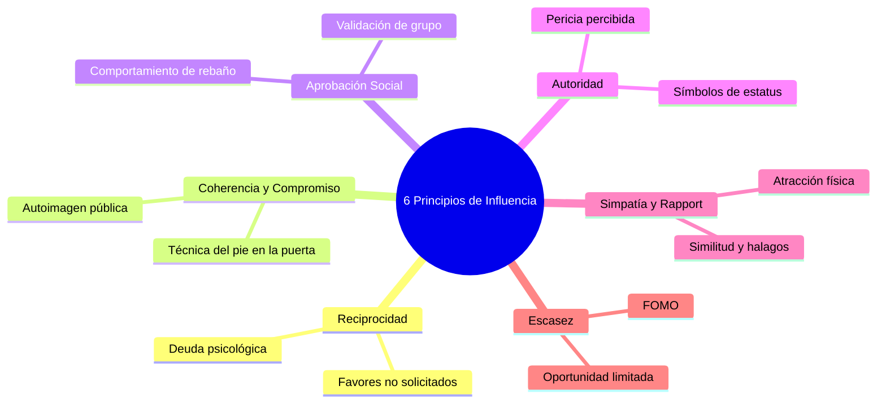

## Principios de la Persuasión

Los principios de la persuasión son de uso comun, e incluso puede descubrir que los utiliza activamente sin ser consciente de ello. Se trata de seis tecnicas comunes que se pueden utilizar para guiar directa o sutilmente los pensamientos de otra persona con el fin de asegurar que sus pensamientos se alineen con lo quest quiere impulsar. Esto no es manipular, es aprovechar la psicología de manera que pueda ser persuasiva y convincente para casi cualquier persona. Si la otra persona toma naturalmente la decisión a la que se inclina después de escuchar la persuasión, eso no es un acto de coercion y debe tratarse en consecuencia.

Cuando se examinan los principios de la persuasión, se observan seis tecnicas distintas que pueden utilizarse para persuadir. Se trata de la prueba social, la reciprocidad, el compromiso y la coherencia, la autoridad, la escasez y el gusto por algo o por alguien. Estas tecnicas pueden ser increiblemente convincentes si se sabe como utilizarlas con eficacia.

Lleggados a este punto, es el momento de profundizar en cada una de estas tecnicas. Se le guiara a traves de lo que la tecnica es, asi como la forma de utilizarlo, con un breve ejemplo para cada uno de los seis.

### Autoridad

Detengase y piense por un momento: Acabas de llegar a la reunion navidena de tu familia. Has llevado tu comida favorita a base de mayonesa, pero con las prisas y el ajetreo de la cocina, te has dado cuenta de que tu plato se ha quedado fuera en la encimera. Llegaste a la comida a mediodia, y te diste cuenta de que la comida seguia fuera a las 5:30 cuando era la hora de comer. Tu tia abuela te dice que la comida es segura y que todos estaran bien si la comen. Tu hermano, que es cocinero profesional, insiste en que la tiren porque no solo ha estado 5 horas y media en una occina caliente, sino también el tiempo que has tardado en llegar de tu casa a la comida.?A quien crees?

Naturalmente, se inclinara por creer al chef, que trabaja con alimentos a diario y esta al dia en las normas de seguridad alimentaria mas actuales. Te vas a inclinar por creer a la persona que ha tenido que pasar clases sobre seguridad alimentaria simplemente porque confias mas en el en asuntos como este.?Se ha parado a pensar por que lo haria? La respuesta es sencilla: Le considera una autoridad en lo que respecta a los alimentos. Es natural, después de todo, es un chef.

En general, la gente tiende a creer a las personas que considera figuras de autoridad. Aunque tu tia abuela puede haber sido una figura de autoridad en tu vida en algun momento, también reconoces que tiene tendencia a acumular y que le cuesta tirar cualquier producto de consumo, aunque haya pasado la fecha de caducidad. En efecto, no confias en ella como autoridad en materia de alimentacion.

Este es uno de los usos mas sencillos de los principios de la persuasión: si quiere ser persuasivo, tiene que asegurarse de que es una autoridad de alguna manera. La gente se siente mas inclinada a estar de acuerdo con una autoridad que con alguien a quien no ven como un experto. Esto es natural: tendemos a ceder ante las personas que creemos que saben lo que hacen. Precisamente por eso seguimos los consejos de medicos, abogados y mecanicos de todo el mundo: Confiamos en que saben lo que nosotros no sabemos, y la mayoria de las veces es cierto.

#### Escasez

Imagine que, en esa cena festiva, todos os dais cuenta de que alguien ha perdido una de las tartas que habian traido para el postre. Cuando llega el postre, todos se dan cuenta de que no hay suficiente tarta para todos, incluso si se cortan trozos en pequeñas cantidades. En el mejor de los casos, todo el mundo tendria un trozo de tarta sin mucho en su plato debido a la falta de las tartas que deberian haber estado presentes.

Por supuesto, ahora todo el mundo compite por uno de los trozos del pastel. De repente se considera que son mucho mas valiosos de lo que se hubiera percibido de otra manera por una razon: Son escasos. No todo el mundo puede conseguir un trozo de tarta, o al menos, no todo el mundo puede conseguir un trozo de tarta que le satisfaga, y por ello, todo el mundo considera que la tarta debe ser mucho mas deseeable de lo que se hubiera considerado en otras circunstancias.

Es el principio de la escasez. Cuando algo tiene poca demanda, de repente se considera mucho mas valioso. Anuque el pastel no sea un articulo muy caro para utilizarlo como ejemplo, la cuestion sigue siendo válida: Cuanto menos haya, mas se querra.

Piensa, en cambio, que eres un vendedor de coches. Tiene que ser capaz de vender este coche para obtener una bonificacion al mes siguiente, que es donde gana la mayor parte de su dinero. Ahora imagina que la persona con la que hablas no parece convencida. Parece que les parece que hacer un pago inicial mas alto es lo que mas les conviene, lo cual es, practicamente. Sin embargo, usted necesita realmente conseguir esa venta, asi que le ofrece un trato.

Le dices a la persona que esta comprando que si esta dispuesta a comprar el coche esa noche, conseguir a una ganga; sin embargo, el trato que le ofreces expira esa noche y tiene que tomar una decisión cuanto antes. La presión anadida hace que el comprador pose de debatirlo aceptarlo por una razon: Ese trato se hizo escaso.

La gente tiene aversion al riesgo. Es mucho mas probable que acepten algo con un pago garantizado que arriesgarse a no tener una oferta tan buena en el futuro. El hecho de poder ahorrar dinero ahorra de forma garantizada parece mucho mas convincente que el hecho de poder ahorrar mas dinero a largo plazo si tuvieran que esperar a tener un pago inicial mayor para suoche, y utilizaran esa logica para guiar su decisión.

Cuando se quiere apelar a la escasez, hay que asegurarse de hacer sentir a la otra persona que debe tomar una decisión cuanto antes. Por lo general, se inclinaran por el lado conservador y aprovecharan el trato que se les presente.

**Prueba social**

?Recuerdas que en la infancia te decian que no hicieras algo solo porque tus amigos lo hacian? Resulta que hay una buena razon para esa sugerencia: es mucho mas probable que la gente tome la decisión de seguir el ejemplo de otras personas si no sabe que esperar o que hacer.

En un entorno desconocido o cuando se esta estresado, es mas probable que la gente siga el ejemplo de aquellos con los que se puede relacionar de alguna manera. Esto significica que si necesitas convencer o persaudir a alguien para que haga algo, debes asegurarte de que sus companeros esten disponibles para mostrarles que hacer, de manera efectiva.

Piensa en las reuniones navidenas a las que asistias de niño:?Solias copiar lo que hacian los niños algo mayores??Recibiste sus comportamientos? La gente aprende a traves de la exposición, y eso es lo que lo hace tan poderoso. Piensa en los niños pequeños que copian las palabrotas de sus padres, o en los preadolescentes que empiezan a fumar solo porque sus companeros lo hacen, anuque no esten especialmente interesados en hacerlo. No es la debilidad lo que nos lleva a hacer estas cosas, sino la tendencia de las personas a aprender de forma natural de quienes les rodean.

Imagine que sigue vendiendo coches. Descubres que es mucho mas probable que la gente este de acuerdo con algo si les dices que sus companeros también suelen estar de acuerdo con la compra de ese coche en concreto por alguna razon. Si se trata de una familia joven, puedes senalar que a muchas personas con nios pequeños les gustan mucho las caracteristicas como poder pasar los pies por debajo de la matricula para abrir el malatero, o poder arrancar el coche a distancia cuando estan dentro, terminando los ultimos preparativos antes de salir, todo ello porque hace la vida mucho mas comoda cuando y llevas un par de humanos diminutos que intrinsecamente hacen mas difícil todo lelacionado con los viajes.

Al fin y al cabo, cuando se viaja con nios pequeños, hay que tener en cuenta si todos han ido al bano, si llevan ropa segura en el asiento del coche, si tienen sus meriendas y juguetes, asi como una muda de ropa presente y mucho mas. Si haces hincapie en todo esto, descubiras que tus argumentos de venta son mucho mas efectivos a largo plazo, porque dejas claro que a otros padres también les gustan los coches con esas caracteristicas.

**Me gusta**

Otro uso comun de la persuasión es a traves del principio de que alguien o algo nos guste. Naturalmente, tendemos a ser mas persuaididos por aquellos que nos gustan, simplemente porque si vamos a hacer el esfuerzo de ayudar a otra persona, lo vamos a hacer porque realmente queremos ayudar. Esto significica entonces que si quieres convencer a alguien para que te ayude a hacer algo, o para que obedezca lo que le estas sugiriendo, querras hacerte simpatico a ti.

La simpatia por alguien puede darse casi instantaneamente de varias maneras. Puedes caerle bien a alguien de forma rapida simplemente haciendo que sea un espejo de alguien, de forma similar a una tecnica comun a la PNL. También puedes pasar por el proceso de gustar intencionadamente a alguien a traves de un proceso de tres pasos.

Este proceso de tres pasos es bastante sencillo: Tienes que hacerte relacionable de alguna manera, tienes que ofrecer un cumplido y tienes que hacerte ver como un equipo. Esto funciona por varias razones: cuando eres afin, automaticamente te ven como mas humano de lo que eras hace un momento. Piensa en la cantidad de personas con las que interactúas habitualmente:?Cuantas de ellas son capaces de recordar activamente??Puede recordar quien le ayudo en la tienda de comestibles o quien se cruzo con usted en el trabajo? A menos que tenga algun tipo de supermemoria, lo mas probable es que no lo recuerde. Sin embargo, si puede hacer que se le relacione de alguna manera, sera mas memorable y mas persuasivo. Como ves a tanta gente a lo largo del dia, tiendes a olvidar que son personas y no simples borrones con los que te cruzas. Al cambiar eso, automaticamente querras prestarles mas atención.

Cuando haces un cumplido a la otra persona, estableces una asociacion específica entre tti y la otra persona: Que eres una fuente de buenos sentimientos. Para algunas personas, esto empieza a rozar la línea de la manipulación emocional: se trata de desencadenar intencionadamente sentimientos muy específicos con un propósito muy concreto y, por esa razon, deberias asegurarte al menos de que cualquier cumplido que ofrezcas sea legitimo y lo hayas dicho en serio. Si no querias decir el cumplido y solo lo dijiste para que te gustaran, es probable que hagas exactamente lo contrario: en lugar de ser visto como simpatico, seras visto como manipulador, y mal.

Por ultimo, quiere establecer que usted y la otra persona son un equipo. Al hacerlo, se desencadena la camaraderia necesaria para el éxito de la persuasión. Cuando la otra persona siente que estais en el mismo equipo, es mucho menos probable que intente defenderse de ti, simplemente porque no te ve como una amenza. Por ello, tasted es mucho mas capaz de persuadir. Sus mentes estaran mas abiertas y aceptadas porque no piensan que usted tratara de aprovecharse de ellos.

Ahora, volvamos al ejemplo de vender algo a alguien. Imagina que tu proximo cliente entra con un niño pequeño. Te sientas en tu mesa para hablar con la otra persona y, al hacerlo, le ofreces un cubo de juguetes que guardas en un cajon precisamente para esa ocasion; sabes que los nios se ponen nerviosos cuando estan en una mesa durante mas de 2,5 segundos. Sonries mientras le ofreces los juguetes y comentas de forma disimulada que tu también tienes un niño de esa edad en casa y que siempre es difificil pasar por las citas, asi que te has propuesto tener tus propios juguetes por si acaso. Naturalmente, ahora has ofrecido un dato sobre ti mismo, y eso te ha hecho mas afin.

A continuación, esperas un poco. Después de un rato de trabajo, haces un comentario sobre como el niño se comporta increiblemente bien y que el cliente ha hecho un gran trabajo con el. Esto hace que el cliente se sienta bien y este contento.

Por ultimo, les senalas que estas encantado de ayudarles, o les dices que te ayuden a Ayudarles. Esto establece ese trabajo en equipo que necesitas para convencerles de que hagan lo que necesitas.

### Coherencia y compromiso

El siguiente principio de la persuasión es la coherencia y el compromiso: la gente suele ser coherente con sus compromisos por una razon: ser coherente te hace fiable. La gente quiere que se le considere fiable porque ser fiable es poderoso: se valora mucho y si consigues que la gente te vea como alguien fiable, seguiran acudiendo a ti. Si eres un vendedor fiable, por ejemplo, otras personas volveran repetidamente a ti para hacer sus compras porque confian en ti. Si pagas tus prestamos de forma fiable, tu credito aumenta y es mas probable que la gente te conceda prestamos también en el futuro.

Como la gente quiere ser fiable, suele seguir el mismo patrón de respuesta y ofrecimiento de ayuda una y otra vez. Por ejemplo, si le pides a tu mejor amigo que cuide a tus hijos una noche del fin de semana y el acepta, es mas probable que siga cuidando a tus hijos con regularid tados los fines de semana porque ya ha accedido a hacerlo una vez, y quiere seguir accediendo para que se le considere coherente. Entonces, seguiran cuidando a los nios cuando se les pida porque no lo ven como una tensión o un problema. Sin embargo, con el tiempo, parece que ya no se trata de un cuidado ocasional de los nios, sino de algo que ocurre a diario y que debe continuar. Ese amigoprobablemente seguirA cuidando a los niños sin quejarse hasta que se convierta en un problema porque quiere ser coherente.

Todo lo que tienes que hacer para aprovechar este principio es conseguir que alguien este de acuerdo contigo en un punto antes de pedir otra cosa. Una tactica comun para esto es pedirle a alguien un boligrafo para que se mentalice en decir que si en lugar de no, y es mas probable que siga diciendo que si en el futuro.

#### Reciprocidad

Finalmente, el ultimo principio de la persuasión es la reciprocidad. Para entender este principio, imagine que se siente obligado a ofrecer a otra persona algo a cambio después de que esta le haya dado algo. Si alguien se ofrece a ayudarte, intentas corresponder de alguna manera. Por ejemplo, si tu amigo te hace un regalo de cumpleanos, te sientes inclinado a ofrecerle también un regalo a cambio en su cumpleanos.

Esto funciona por una razon muy concreta: La gente esta intrinsecamente programada para querer devolver los actos de altruismo por ellos.?Su amigo le dio algo o le ayudo en realidad a beneficiarse de alguna manera que no sea la deacerle feliz? Lo mas probable es que no, pero el hecho de que te hayan dado algo en primer lugar puede ser suificiente para que sigas dandoles algo en el futuro. En efecto, te garantizan que te esforzaras por atenderles si lo necesitan porque te han dado a ti.

Cuando quiaras utilizar el arte de la reciprocidad, no pienses en lo que pueden hacer por ti, sino en lo que tu puedes hacer por ellos. Preguntales que necesitan que hagas antes de ir a exigirles y puede que te sorprendas al ver el resultado.

[MISSING_PAGE_EMPTY:256]

Otra línea de pensamiento en torno al arte de la persuasión es la retorica. Esta es, literalmente, el arte de ser persususivo en primer lugar, y si puedes dominarla, podras utilizar estas herramientas en la conversacion general. Estas tecnicas se han transmitido desde la Edad Media, y si han seguido siendo relevantes, entonces deben ser titles, al menos en una u otra capacidad.

En definitiva, la retorica tiene varios requisitos. Hay que saber controlar el lenguaje y conocer la cultura en la que se trabaja. Además, debes entender la situación retorica, que determinara lo que intentas hacer, tu audiencia, el tema, como vas a hablar y el contexto. Todo ello se combina para crear la retorica que vas a exponer.

El propósito de tu situación sera reconocer por que estas escribiendo o hablando.?Que es lo que pretende? A continuación, debe averiguar de que esta hablando: el tema. Esto debe determinar lo que esta tratando de informar or persuadir. Debe ser lo suficientemente amplio como para poder trabajar con esto, pero también lo suficientemente limitado como para tener un propósito muy específico al hacerlo. A continuación, debe analizar la audiencia, la persona a la que se dirige. Puede que esta sea lo mas difícil de trabajar, ya que no podrá controlar totalmente a la audiencia. No es posible conseguir que todo el mundo haga lo que tu quieres por capricho, y por eso tienes que hacer todo lo posible para trabajar con el publico que tienes y no con el que que tienes. Por ultimo, esta el escriptor: Esta es la persona que hace la persuasión.?Que esta aportando? Por que hablas de lo que hablas??Que importancia tiene para ti?

Una vez identificada la situación, puedes empezar a abordar los tres recursos de la retorica: Logos, Ethos y Pathos.

### Logos

Logis es una apelacion a la logica. En su forma mas sencilla, consiste en averiguar como convencer a tu audiencia de que no hay otra opcion que estar de acuerdo contigo en lo que dices. A menudo se recurre a las estadisticas o a otros hechos para conseguir que se entienda el argumento. Se trata de presentar un argumento tan sólido que el publico no tenga mas remedio que estar de acuerdo con el.

Por ejemplo, imagina que estas tratando de persuadir a alguien para que compre ese coche por el que tanto estas presionando. En ese momento, empiezas a hablar de todas las estadisticas que significan que el coche del que hablas es mas seguro. Es posible que saques a relucir los indices de colision, o como estadisticamente ahorran mas gasolina que otros coches. Intentas bombardear a la otra persona con tanta información que es innegable que la mejor opcion.

disponible es comprar el coche, independientemente de la opinion personal.

