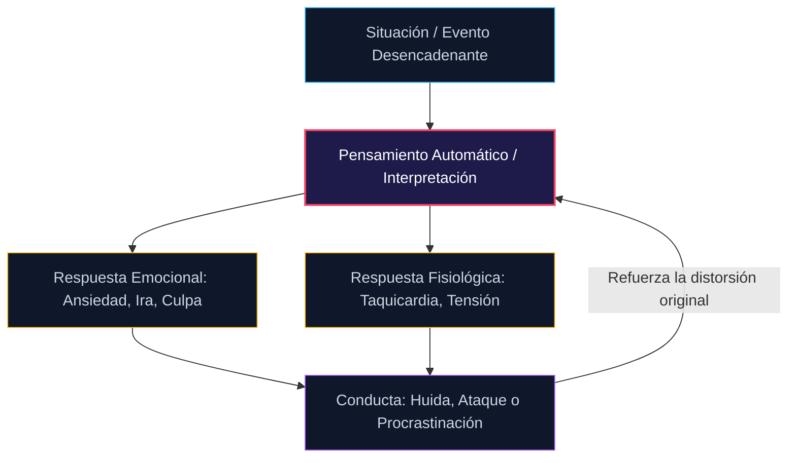

## Como Funciona la TCC

En última instancia, la TCC funciona principalmente porque examina de cerca como los comportamientos y los pensamientos están innatamente relacionados entre si. Aunque puede centrale intencionadamente en los comportamientos, esto se debe más bien a que los comportamientos son mucho más sencillos de observar que cualquier otra forma. Se puede saber lo que hace alguien de un vistazo, pero no siempre se puede saber el tono emocional de alguien solo por su mirada.

Este ciclo entre comportamientos y pensamientos tiene en realidad un punto más: es el cuadro pensamientos-sentiminentos-conductas.

Efectivamente, nuestros pensamientos influyen en nuestros sentiminentos. Si piensas que eres inutil, sentiras que no tienes confianza en ti mismo. Sin confianza en ti mismo, no estaras dispuesto a solicitar ese trabajo que realmente necesitas. Si no te presentas a ese trabajo, obviamente nunca lo conseguiras, y volveras a estar atrapado en lo horrible que eres y en lo mucho que desarias poder cambiarte por otra persona.

Eso significica que el ciclo se ha completado oficialmente. Pensaste que eras inutil, sentiste que eras inutil, fuiste inutil como resultado directo de esos pensamientos, y luego continuaste usando eso como evidencia de lo inutil que eres.

Esta es exactamente la razón por la que los sentiminentos negativos pueden ser tan increiblemente difíciles de dejarimplantados en otra persona: cuando están ahi, esa otra persona va a tener que trabajar increiblemente duro para sacar esos sentimientos negativos en un proceso que se conoce como reestructuracion cognitiva.

La reestructuracion cognitiva es efectivamente la columna vertebral de la TCC en este punto: es la capacidad de detenerse, analizar sus propios pensamientos y luego cambiarlos con otra tecnicas. Al hacerlo, puede descubrir que, de hecho, funciona. La razón por la que funciona es porque rompe con el ciclo mencionado anteriormente: si los pensamientos negativos generan sentimientos negativos, lo que genera un comportamiento negativo,?que sucede si se produce un cambio hacía sentimientos positivos?

Por ejemplo,?que pasaria si reemplazaras el pensamiento de ser inutil por un pensamiento de esforzarte por cambiar tus tendencias como individuo negativo? Si quisieras cambiar ese pensamiento en particular, tendrias que implantarlo de alguna manera en tu cerebro y luego averiguar la mejor manera de estar reforzandolo constantemente.

Al principio, ese pensamiento positivo esta en tu mente, pero te resulta difícil utilizarlo. Esto tiene sentido: es un tema difícil de abordar y, sin embargo, abordarlo es la única opcion correcta. Así que, después de insitir en que te esfuerzas al maximo en la vida y de ver a la chica del bar con la que no consequisite entablar una conversación a pesear de tus deseos de hacerlo, tomas esa determinacion y te acercas a ella. Por supuesto, el mero hecho de acercarte, algo que te ateraba hacer, es suficiente para que empieces a sentirte un poco más seguro de ti mismo y con éxito.

Tus procesos de pensamiento empiezan a ayudarte a tener éxito. Descubriras que cuanto más positivo sea el lenguaje que utilices, más positivo te sentiras. Cuanto más positivo se sienta, más probable será que se comporte de forma positiva. Efectivamente, entonces, eres capaz de vencer los problemas clave en tu vida, uno a la vez.

?Tienes ansiedad? Puedes averiguar como eliminar esa respuesta ansiosa en Interneto en un libro como este.?Te sientes solo y quieres encontrar una cita? También puedes hacerlo, siempre y cuando te esfuerces activamente en intentarlo. No importa cual sea tu problema de salud mental, casi siempre hay una forma de utilizar la TCC para afrontarlo mejor de una forma u otra.

Sin embargo, es importante tener en cuenta que si se va a utilizar la TCC, es necesario reforzarla regularmente. Quieres asegurarte de que sigue siendo eficaz, y la mejor manera de hacerlo es flexionar repetidamente los musculos que utilizarias con la TCC en primer lugar. Esto significica que si la TCC te ayuda con la ansiedad, usala con tus sittomas de ansiedad tanto como puedas. Incluso si cree que los sintomas no son tan graves, intente utilizarla. Descubrira que es capaz de reforzarlos mejor y más eficazmente simplemente utilizandolos de forma regular.

> [!TIP]
> **Premisa Fundamental de la TCC (Epicteto / Beck):** «No son las cosas las que atormentan a los hombres, sino la opinión que ellos tienen sobre las cosas». La TCC no cambia la realidad externa; reprograma el pensamiento intermedio para desarmar la reacción emocional destructiva.