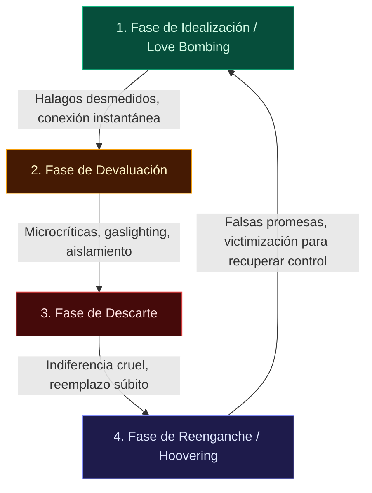

## Abuso narcisista

Finalmente, la última forma de abuso que se discute aquí es el abuso narcisista. El abuso narcisista se refiere a cualquier abuso que haya ocurrido por parte de un narcisista. Este libro dedicara varios capitulos a discutir el narcisista y el abuso narcisista a medida que avanza.

En particular, los narcisistas son particularmente insidiosos con su abuso. Tienden a ser abusivos simplemente porque no ven ninguna razón para no salirse con la suya. Tienen una visión distorsionada de la realidad que les rodea y, por ello, tienden a intentar intimidar a todo para que se ajuste a su propia visión del mundo. Esto es bastante problematico: cuando intentan activamente que todo lo demas se ajuste a sus delirios, acaban perjudicando a varias personas en el proceso.

Sin embargo, más especificamente, los narcisistas son maestros en la manipulación y el abuso. Son expertos en hacer que el abuso que están distribuyendo parezca que debe ser culpa de la víctima, y no reconoceran nada más allá de eso como la verdad. De hecho, están tan seguros de sus propios puntos de vista, que afirmaran que la percepción de la verdad de cualquier otra persona es falsa. Por ahora, lo único que importa es que sepas que el abuso narcisista existe en su propia categoría y que abarca todos los tipos de abuso. Más adelante profundizaremos en este tema.
Cuando has sido víctima de abusos, puedes descubrir que has empezado a cambiar. Puede que al principio no te des cucenta, pero con el tiempo, notas que ya no eres la persona que solias ser. En particular, puede encontrar que algunos de los siguientes efectos están presentes en su vida. Estas son efectivamente tus heridas emocionales en respuesta al daño que has soportado. Recuerda que algunos abusos pueden ocurir sin dejar nunca una marca física, pero las cicatrices emocionales que hay permaneen potencialmente durante toda la vida. Algunos de estos efectos son:

* **Ansiedad (incluido el trastorno de estres postraumatico):** Cuando has sido víctima de abusos, es probable que vivas constantemente en un estado de hipervigilancia. Tienes miedo de lo que va a pasar si siques en la relación, pero también tienes miedo de lo que pasar a cuando te vayas. El trastorno de estres postraumatico también es un trastorno de ansiedad comun que sufren muchas víctimas de abuso, y esto se analizar en profundidad en el Capitulo 7: Los efectos del abuso narcisista.
* **Depresión:** Cuando se teme constantemente por la vida o el sentido de si mismo, es increiblemente comun sufrir depresión, así como perder la capacidad de disfrutar de la vida. Puede que le cueste disfrutar activamente de lo que ocurre a su alrededor o que sienta que no puede levantarse de la cama. Es posible que sufra de falta de energía y de motivacion para cuidar de si mismo, de sus responsabilidades y de su hogar.
* **Comportamientos arriesgados:** Cuando has sido maltratado, puedes encontrarte con que pasas más tiempo del habitual actuando. Puede, por ejemplo, conducicir con exceso de velocidad o sin cinturon de seguridad. Puede tener relaciones sexuales arriesgadas y sin proteccion con ortas personas. Puede usar o abusar de las drogas. En última instancia, no te importa lo que te pueda pasar, así que no tomas las precauciones necesarias que se utilizarian para mantenerte a salvo.
* **Abuso de sustancias:** Es posible que decida automedicarse con drogas y alcohol, o que descubra que supareja maltratadora le anima a alimentar su adiccion. Descubres que las drogas o el alcohol te sirven como una especie de liberacion y evasion del maltrato y esto puede convertirse muy rapidamente en una espiral de abuso de la sustancia, y potencialmente incluso de adiccion o sobredosis si no tienes cuidado.
* **Autolesiones o pensamientos suicidas:** Otro mecanismo de afrontamiento comun es la autolesion. Es posible que te hagas daño intencionadamente para tener una sensación de control sobre la situación en la que te encuentras. Aunque no es saludable, sientes que eres capaz de control cuando te haces daño, y eso puede hacerte sentir que has recuperado algo de poder. Si tienes pensamientos de autolesion of suicidio, es importante que acudas a un professional medico autorizado, y que se considera una emergencia medica y podrás obtener la ayuda que necesitas.
* **Baja autoestima:** Cuando te dicen constantemente que no te lo mereces o que no eres digno, acabas interiorizandolo y creyendo que es verdad. Esto no significa que seas debil o que lo hagas cierto, solo significica que lo has escuchado tan a menudo que lo crees. Sin embargo, la falta de autoestima puede significar entonces que no confias en ti mismo y que dudas de tu capacidad para salir de la relación.
* **Evitar las relaciones u otros desencadenantes:** Si has sufrido abusos en el pasado, puedes optar por evitar las relaciones por completo. Especialmente si has sufrido en más de una ocasion, puedes sentir que es más sencillo evitar las relaciones por completo que tratar de encontrar una saludable.

### El ciclo del Abuso

Antes de abordar el resto de este libro, hay un concepto importante que debe recordarse: el abuso existe en un ciclo. Este ciclo no solo es generacional, lo que significica que los niños que crecieron en un entorno abusivo crescen para crez ellos mismos entornos abusivos, sino también en el sentido de que el abuso dentro de una misma relación tiende a ocurir dentro de un ciclo muy específico y predecible durante el cual las cosas son a veeces comodas y felices, pero otras veeces, el abuso es altamente prevalente. La gente suele tomar esos periodos de luna de miel, los periodos durante los cuales el abuso esta austenite, como señales de que vale la pena salvar la relación, pero considera esto por un momento: Si la relación solo fuera abusiva todo el tiempo, ¿aguien querria quedarse? Nadie querria aguantar el maltrato sin parar; tiene que haber también algun tipo de bien para que la persona siga interesada en quedarse y motivada para continuar con la relación.

El ciclo del maltrato se produce en cuatro etapas distintas: La acumulacion de tensiones, un incidente, la reconciliacion y la calma.

Durante la primera etapa de construcci\(\hat{\text{o}}\)n de tensiones, hay una tensi\(\hat{\text{o}}\)n presente en la relación. Puede sentir que la comunicación se rompe o que usted y su pareja simplemente se molestan constantemente. La víctima puede sentir que se dirige hacía otro incidente de abuso y tratar de hacer cualquier cosa para intentar complacer y aplacar alabusador con la esperanza de evitarlo. La comunicación continuar\(\hat{\text{a}}\) degradandose y puede haber discusiones of desacuerdos frecuentes durante este periodo.

La segunda etapa, conocida como la etapa del incidente, es cuando se produce el abuso. Por lo general, se produce un gran estallido: puede tratarse de abuso físico, o puede ser una discusion o un intento de controlar o coacocionar al la víctima. El agresor puede gritar, insultar, amenazar con rise, intimidar, intentar forzar la intimidad sexual o intentar otras formas de violencia o abuso. Este es el gran acontecimiento aterrador que la víctima intentaba evitar.

Tras el incidente, el maltratador se da cuenta de que se ha producido el abuso y pasa a controlar los d\(\hat{\text{a}}\)nos. En particular, buscara la reconciliacion, que es el nombre de esta etapa. A menudo se disculpara, pero esa disculpa suele ser poco sincera y tiene como objetivo simplemente aplacar a la víctima. A menudo se culpa a la víctima en este momento, o el maltratador negara que el abuso haya ocurrido en absoluto. También se le puede restar importancia para convencer a la víctima de que las cosas no son tan malas como ella las ve. También es comun en esta etapa una disculpa con la promesa de mejorar, buscar asesoramiento o trabajar de alguna manera en la relación. Sin embargo, estos esfuerzos por mejorar la relación ra ra vez, o nunca, se producen realmente.

Por último, una vez completada la reconciliacion, llega la calma en la tormenta: es el breve respiro durante el cual la víctima recuerda todas las razones por las que se enamoro o se vivo arrastrada a la relación en primer lugar. Esta es la etapa conocida como el periodo de luna de miel. Durante este tiempo, la relación parece estar bien -el abuso se olvida o se perdona, y el abusador a menudo se encuentra colmando a la víctima de afecto y regalos. Durante este periodo, la víctima recuerda por que quiere seguir en la relación.
En este punto, después de leer las luchas que tantas personas enfrentan en las relaciones abusivas, puede tener una sola pregunta que pasa por su mente: _c_por que no se van simplemente? Después de todo, seria tan sencillo como salir por la puerta y no volver, _c_verdad?

Aunque siempre es una posibilidad dejar la relación, hay mucho más que desmenuzar al respecto. Es una cuesition complicada: si, irse es lo correcto cuando se esta en una relación abusiva, pero a menudo hay factores externos, más allá del hecho de que el abuso esta presente, que deben ser considerados. Recuerda que el maltrato consiste en ejercer el poder y el control, y cuando intentas dejar a un maltratador, estas recuperando directamente ese poder. Hasta ahora, en esa relación, el maltratador ha utilizado el abuso para mantener ese poder, y dejarlo no cambiara eso. A menudo, dejar es el momento más peligroso en una relación abusiva - el abusador probablemente tomar a repressalias y hará que dejar la relación sea lo más dificial y doloroso posible para forzar a la víctima a sometarse.

Más allá del peligro que supone dejarlo, puede haber otros factores que entran en juego dentro de esa relación en particular, como la dificultad para dejarlo porque hay **hijos de por medio.** Cuando hay nios en la relación, marcharse y no es tan sencillo como hacer las maletas y desaparecer, especialmente si los nios son compartidos. El progenitor maltratador sigue teniendo derechos sobre los nios que no pueden revocarse sin permiso judicial, y esa revocacion rara vez se produce. Las víctimas pueden optar por permanencer en la relación, para tener acceso a sus hijos en lugar de tener que compartirollos con el progenitor maltratador durante largos periodos de tiempo.

Otro reto y obstaculo comun con el que se topan las personas es el de su **cultura o religion.** Muchas culturas y religigones rechazan la idea del divorcio o la separacion, y otras todavia esperan la sumision de las mujeres a los hombres. Cuando te dicon que debes ser obediente a tu marido y que tu marido tiene derecho a pegarte o hacerte daño, vas a sentir que no puedes salir. Vas a estar tan atrapada en lo que es correcto por tu cultura y en tu relación que escapar se vuelve increiblemente mal visto. Si sabes que no puedes divorciarte a los ojos de tu religigon, o que te arriegas a que tu cultura te rechace por renunciar a tu relación, puede que descubras que eres más feliz manteniendo tu comunidad actual, incluso si eso significica tolerar el abuso.

Algunas personas simplemente no tienen la capacidad física para dejarlo debido a una enfermedad o a una **discapacidad**. Puede que no tengan la movilidad suficiente para vivir por su cuenta, o que necesiten ayuda para la supervincia diaria básica, y creen que su mejor oportunidad es quadarse en la relación y enfrentarse al maltrato. Incluso pueden tener problemas de salud importantes que les impidan cuidar de sus hijos, por lo que en lugar de dejar la relación, se quedan para seguir vivriendo con sus hijos en un esfuerzo por protegerlos.

Otras personas pueden sentires demasiado **avergonzadas** para pedir ayuda debido a los estigmas que rodean el abuso. Si has sido víctima de malos tratos, puede ser dififici acudir a los demas. Especialmente si tu pareja se ha pasado la relación diciendote que todo es culpa tuya, puedes sentir que te juzgaran duramente por tu propia victimizacion, a pesar de que la víctima nunca se merece el maltrato.

A veces, el **miedo** frena al individuio. Tal vez su pareja le haya amenazado con suicidarse o con hacerle daño si se va, o le preocupa como podrá mantenerse a si misma y a sus hijos sin que otra persona le ayude a pagar las necesidades del hogar. Puede que tenga miedo de que su agresor no se vaya sin luchar y que el maltrato se intensifique si intenta marcharse.

En particular, con respecto al miedo, en muchos casos, el **estatus de innigracion** también puede jugar un papel importante si la víctima no esta documentada en el pais, a menudo sienten que tienen que aguantar, ya que si van a los tribunales, o si la víctima pide Ayuda, la víctima simplemente será deportada. Especialmente si la persona tiene hijos que son ciudadanos del pais en el que la víctima esta inducementada, la víctima puede permanenteer en silencio para evitar ser deportada y separada.

Una importante **falta de recursos** también puede hacer que alguien que sufa algun tipo de abuso se sienta totalmente atrapado en una mala situación, y los abusadores lo saben. Precisamente por eso se aprovecharan del abuso financiero para hacer más dififici la salida. Puede que no tengas dinero para pagar una casa para ti y tus hijos. Puede que no tengas un coche para arte. Puede que no tenga acceso a las finanzas de la familia, e incluso si contribuye activamente a ellas, puede que no tenga acceso. Si simplemente no tiene los recursos, puede tener miedo de intentarlo, especialmente si esta embarazada o tiene hijos.

A veces, el simple hecho de **no contar con el apoyo** de amigos o familiares puede hacer que te sientas atrapado y solo. Sin acceso a ortas personas con las que hablar, puedes encontrarte con que no puedes hablar de lo que esta pasando, ni tienes a nadie a quien recurri cuando las cosas se ponen feas. Sin una especie de caja de resonancia en otra persona, puede descubrir que no ve la relación tan mal como puede pensar inicialmente, especialmente si ha sido una escalada lenta hasta ese punto. Por otra parte, es posible que tus amigos y familiares no vean el maltrato que estas sufriendo y a menudo traten de restarle importancia o se pregunten si es realmente tan malo como dices.

Por supuesto, una de las razones más convincentes que encuentran las personas para permanecer en sus relaciones a pesar del abuso es **el amor.** Aman de verdad a sus parejas, y eso es suficiente para que se queden en sus relaciones que, de otro modo, habrían dejado. Otras veces, lo que puede retenerte es el amor. Después de todo, si no amaras a tu maltratador, probablemente no estarias dispuesta a soportar el maltrato en absoluto.

Cuando amas a tu pareja, puedes afterarte a la esperanza de que el maltratador cambie, como prometio, y daras una oportunidad tras otra, esperando poder recuperar a la persona de la que te has enamorado. Una última razón por la que es probable que la gente se quede atras es que la relación y el abuso se han **normalizado.** Esto significica que les parece totalmente normal en lugar de ser algo que puede ser una enorme bandera roja. Piensa en que, en algunas culturas, puede estar totalmente bien hacer contacto visual y sonreir, pero en otras, el contacto visual se ve como una falta de respeto y el contacto visual grosero no esta normalizado en esos paises y culturas. Si has crecido rodeado de malos trato y estos se han normalizado, no verás el problema. Si has crecido en un hogar en el que los padres se gritaban habitualmente, puede que sientas que gritar es totalmente normal cuando te enfadas. Sientes que estos mecanismos de afrontamiento poco saludables no son más que expresiones apasionadas de sentimientos y no reconoces el abuso porque no lo reconoces.

## 📖 Capítulo 2: Reconocer el

**Abuso Emocional**

En los proximos capitulos abordaremos especificamente el abuso emocional. Ahora y sabe lo que es, al menos en la superficie: sabe que el abuso emocional es una forma de control psicológico y lo peligroso que puede ser. Sine embargo,?sabe como reconocerlo¿Sabe como etiquetar varias de las taticas de abuso más comunes? Esta formalo particular de abuso tiende a ser increiblemente encubierta -esta diseñada para ocultarse a plena vista- y al leer este capitulo, aprenderá a identificarla.

Si puedes pararte a pensar en un momento en el que sentiste que no eras lo suficientemente bueno, como si tu pareja, te estuiera haciendo un gran favor al quedarse contigo, puede que sea el momento de reevaluar vuestra relación. Si alguna vez te has dado cuenta de que la voz que utilizabas para hablar de ti era la voz de otra persona en lugar de la tuya propia, es posible que hayas suffido abuso emocional en algun momento.

El abuso emocional se conoce communente como abuso verbal o psicológico, y esta diseñado para hacerte sentiar mal contigo mismo. Esta pensado para hacerte sentir que no eres digno, que no mereces respeto y que no tienes el control. Todo el propósito del abuso emocional es ese dominio sobre la víctima, diseñado para conceder al abusador, rienda suelta sobre el individuuo. Cuanto más abuso emocional ha soportado uno, la mayoría de las veces, más servill se vuelve. Dejan de intentar defenders y poco a poco empiezan a creer que se merecen el abuso.

Este capitulo le guiará para que aprenda a reconocer los signos del maltrato. Aprendera a identificar los comportamientos más comunes exhibidos por las víctimas de abuso, así como los efectos a largo plazo de sufrira abuso emocional. A partir de ahi, se le guiará a traves de varias taticas de abuso emocional comunes y favorecidas, diseñadas para mantener a la víctima al borde, fuera de control y servil.

**Seinales de Abuso Emocional en la Relación**

Puede ser difícil detectar una relación abusiva, especialmente si usted esta en el exterior mirando hacía adentro. Sine embargo, una relación emocionalmente abusiva suele tener un aspecto drasticamente diferente al de una relación sana, y si usted puede pasar suficiente tiempo cerca de alguien en una relación emocionalmente abusiva, puede encontrar que es capaz de identificar varios de estos signos de forma regular. Tomese el tiempo necesario para familiarizarse con estos signos comunes de abuso emocional en una relación.

Si observa que un amigo o familiar tiene una relación con varios de estos signos, puede considerar la posibilidad de accerarse para asegurarse de que todo esta bien y ofrecer su propio apoyo si lo necesita. Estos signos pueden ser increiblemente estresantes tanto para el que sufe rel abuso como para el que puede estar presenciando esos comportamientos aborrecibles.

Si has sentido que una relación a la que has estado expuesto parece no ser del todo correcta, puede ser que sea de naturaleza manipuladora y abusiva. En estos casos, muchas personas creen que lo correcto es alejarse, pero si ves a alguien que esta luchando en una relación con varias banderas rojas, como las que se discutiran en un momento, lo más amable es tender la mano.

Identificar una relación emocionalmente abusiva puede ser bastante preoccupante y angustioso, especialmente si se trata de tu relación o la de un ser querido. Sin embargo, si puedes identificarla, puedes ayudar a la otra persona a escapar. Puedes ofrecer tu apoyo. Puedes entender que los comportamientos de aislamiento y evasion probablemente no provienen de la víctima, sino que son forzados por el maltratador.

Generalmente, identificar a una pareja abusiva de uno de sus amigos o miembros de la familia puede ser bastante obvio - aunque la víctima puede no estar dispuesta a admitirlo, todo el mundo sabe cuando esta teniendo que caminar sobre cascaras de huevo. Sin embargo, a menudo, cuando la gente tiene que lidiar con sus amigos o miembros de la familia que están siendo maltratados, sienten que deben elegir entre tolerar a reganadientes almaltratador, a pesar de estar increiblemente preoccupados por el comportamiento por miedo a ser cortados si no lo hacen, o dicen algo, solo para que el maltratador los congele. Después de todo, la única manera de ayudar a alguien a salir de una relación abusiva es si realmente quiere escapar de ella. Si no están interesados en escapar, no vas a poder hacer mucho más que ofrecerles apoyo hasta el momento en que decidan irse.

Ahora, imagina que tu mejor amiga, Cara, tiene un novio llamado Austin. Cara es la joven más dulce que conoces; unuca tuvo especial confianza en si misma, pero era tan amable que a nadie le molestaba su falta de autoestima. Simplemente le recordaban amablemente que era un miembro muy querido del grupo social y siempre la invitaban con gusto.

Aparentemente de la nada, Cara lo conocio: Austin era un hombre unos ainos mayor que ella, pero no le importaba. Era feliz porque el la colmaba de atenciones y amor. Siempre quería pasar tiempo con ella, le enviaba constantes mensajes y comprobaba como estaba. Sin embargo, si ella no respondia a un mensaje de texto en los cinco minutos siguientes a su envio, el la llamaba, y lo que le decía dejaba a Cara visiblemente angustiada. Cuando colgaba el telefono, se disculpaba y se marchaba, diciendo que el le exigia que llegara a casa, o que no estaria allí más tarde esa noche.

Con el tiempo, a medida que Austin se sentia más y más comodo, tu y tus amigos notasteis varias banderas rojas en la relación. Visteis como le gritaba a Cara con regularidad, tanto en publicó como fuera de el. Ella relataba momentos en los que el le gritaba y le reina a la cara en casa, y cuando intentabas señalar que no se lo merecia, simplemente se encogia de hombros y decía que se lo merecia porque no era especialmente inteligente y tenía suerte de tenerlo.

Pronto, parecia que incluso sus noches sociales se veian afectadas por la presencia de Austin: ya no permitia a Cara ir a esas reuniones simplemente porque el no podia estar allí también. De hecho, poco a poco solo se le permitia ir a los lugares en los que el también estaba presente, alegando que era promiscua y que le enganaria si la dejaban a su aire. Se dio cuenta de que, cuando el estaba cerca, parecia tener conocimiento de las conversaciones privadas, y quedo claro que vigilaba sus mensajes de texto. Pronto, sus cuentas en las redes sociales desaparecieron por completo.

Con el tiempo, notaste que Cara estaba cada vez más estresada. Parecia alejarse cada vez más del grupo, hasta que un dia se derrumbo y te dijo que el habia amenazado con suicidarse si ella lo dejaba y que, aunque tenía muchas ganas de irse, sentia que no tenía otra opcion que quedarse. Describio la mirada de furia absoluta y sin adulterar de el cuando le dijo que quería espacio y le dijo que estaba segura de que iba a herirla gravemente. Solo cuando ella se sacudio su interes por irse como una broma y que quería ver cuanto la quería, el parecio calmarse.

Parate a ver que problemas puedes identificar en ese breve pasaje sobre tu amiga Cara y Austin.?Que estaba haciendo Austin que era problematico¿Que comportamientos debería cortar por completo para que la relación mantuviera algun tipo de apariencia saludable¿Seria posible que esa relación se convirtiera en una relación sana, teniendo en cuenta lo mucho que se ha convertido en una relación abusiva?

Si te tomaste el tiempo, habras notado al menos seis banderas rojas distintivas sobre el comportamiento de Austin que se consideraria abusivo. En primer lugar, pasaba mucho tiempo **gritandole**. Intimidaba a todo el mundo con lo fuerte que era su voz, y constantemente mantenia a Cara en el suelo. A los gritos se sumaban constantemente **insultos y reprimendas** tan extremas que la propia Cara estaba convencida de que debia merecerlos.

No habia ninguna sensación de **privacidad** en la relación, y parecia que Austin estaba plenamente convencido de que Cara necesitaba algun tipo de acompanante para poder participar en cualquier actividad de grupo. Sabía que ella no era el tipo de chica que jamas caeria en la infidelidad, pero el estaba convencido de que lo era. Tuvo que comprobarlo regularmente, otra bandera roja, y finalmente, se le exigio que le llevara a cualquier lugar al que quisiera ir para asegurarse de que no se viera envuelta en ningun asuto raro.

### Como Identifier el Maltrato Emotional Hacía uno Mismo

Ahora que esta adquiriendo confianza para reconocer una relación emocionalmente abusiva en otras personas, puede que se pregunte si su propia relación es emocionalmente abusiva. Puede que ya sepa la respuesta a esto o que supiera que es abusiva antes de leer este libro, o puede que sospeche que es abusiva, y si este es el caso, puede que quiera prestar mucha atención a estas señales.

Tommenos un tiempo para profundizar en la perspectiva de Cara sobre su relación abusiva para ver realmente la perspectiva de la víctima. Todas estas señales que aparecen son enormes banderas rojas que Cara debería haberreconcoido, pero tuvo demasiado miedo de hacerlo. Puede que estuviera cegada por el amor a su pareja, o puede que simplemente estuviera atrapada en la idea de lo genial que seria estar en una relación, y estaba dispuesta a sopotar el comienzo del abuso.

En última instancia, la única forma en que puedes identifier realmente el abuso emocional será a traves de la busqueda de como te sientes en un momento dado. Debes ser capaz de reconocer tus propias emociones, desarrollando esa autoconciencia de tus propios estados actuales. Existen varios patrones de como suelen sentires las víctimas de abuso emocional, y aunque la víctima puede reconnocer que es infeliz, puede ser diffici articular realmente como se siente si no sabe como transmitirlo.

Leer esta seccion a traves de la perspectiva de Cara es un intento de remediando. Veremos como se ha sentido Cara, reflexionando sobre si esta en una relación de abuso. Desde fuera, puede que y estes seguro de que esta siendo maltratada, porque lo esta. Sin embargo, desde el lado de la víctima es mucho más difícil identificarlo.

En primer lugar, Cara se da cuenta de que no es feliz. Lo sabe, pero le cuesta identificar exactamente por que no es feliz o por que se siente desgraciada. En general, entiende que los comportamientos a los que ha estado expuesta son problematicos, pero no sabe como articularlos. No esta segura de si esta reaccionando de forma exagerada o actuando como si las cosas fueram mucho peor de lo que realmente son, y luego se da cuenta. **Siente que no puede confiar en si misma**.

Una de las tácticas favoritas del abusador emocional es la llamada luz de gas, de la que hablaremos con mayor profundidad más adelante, pero a todos los efectos, esta destinada a hacerte sentir que no puedes confiar en tus propias percepciones de la realidad. Esta diseñado para hacerte sentir que siempre estas equivocado sobre como ve s el mundo, o que siempre estas exagerando, cuando en realidad, puedes tener razón. Esto se debe a que es probable que confies en tu pareja si sientes que tus propias percepciones son erroneas, y el maltratador cuenta con ello.

Esto es exactamente lo que ocurrio con Austin: ella sentia constantemente que sus propias emociones eran erroneas. Interiorizo el abuso y se culpo a si misma porque repetia como un loro lo que el decía, no lo que realmente creia de si misma. Reconnocer esto es increiblemente poderoso: significica que entiende la raiz de su problema. Ha perdido la confiamza en si misma.

Al perder la confiamza en si misma, siente que esta fuera de **control**, y con razón. No tiene ningun control real sobre su vida, lo que hace o a donde va. Se le dice constantemente lo que puede hacer y por que no puede ir a ver a otras personas. Se ha dado cuenta de que ha caido en la conformidad simplemente porque era mejor que lidiar con la alternativa -sus amenazas de suicidio y sus arrebatos de ira que la dejarian **tenerosa de su pareja.**

Tener miedo de el es otro problema. Después de todo, nunca deberias sentir que tienes que tener miedo de tu pareja o de lo que pueda hacer. Si sientes que le tienes miedo a tu pareja, es posible que tengas que reevaluar y averiguar que esta pasando para que sientas miedo. Puede que encuentres la respuesta de forma relativamente sencilla, o que te des cuenta de que es una señal inconsciente de que deberias tener más cuidado o desconfiar de tu pareja. Por desgracia, Cara habia pasado tanto tiempo escuchando sus miedos que le costaba escapar.

Sus amenazas de suicidio la dejaron con tres sentiminentos diferentes: tenía **miedo de cuidarse a si misma** porque intentar hacerlo enfurecia constantemente. En su mente, ella estaba destinada a colmarle de lo que el quería, y sus necesidades carccian por completo de sentido. Ella se **sentia** constantemente **culpable** debido a sus propias tecnicas de manipulación. Aunque nunca podia expresarlo, siempre se sentia culpable por todo. Eso le hacía perder la autoestima y le costaba recuperarse. Finalmente, entre el deseo de evitar el miedo y la culpa, se encontro con que preferia **caminar sobre cascaras de huevo alredder de su pareja**. Era más feliz manteniendolo contento y cumpliendo con lo que se le pedia porque el cumplimiento significica que no tenía que preccuparse de que el se enfadara o tuviera un arrebato. Era fácil apaciguarlo y mantenerlo contento.

Un análisis más profundo y una autorreflexion Ayudarian a Cara a darse cuenta de otros dos aspectos importantes de su vida que constituian importantes señales de alarma: **Se disculpaba** constantemente, incluso cuando lo sucedido no tenía nada que ver con ella. A pesar de que ella no tenía la culpa, era más fácil disculparse en un intento de aplacar un desafortunado efecto secundario de caminar sobre cascaras de huevo de forma regular.

Descubrió que, a pesar de amar a Austin con todo su corazón, **ya no deseaba tener intimidad con el**. Esto es una gran señal de alarma: las personas que se aman suelen querer tener intimidad. Lo hacen para acercarse lo más posible al otro y lo hacen desde una posición de confianza y amor. Sin embargo, cuando ya no se sienten seguros o no confian en su relación, en su lugar se encuentran con un panico constante. Las personas necesitan sentires seguras para para interesarse por la intimidad, y las personas que sufren abusos rara vez sienten esa seguridad necesaria.

En medio de todo esto, sin embargo, quizás lo más confuso de todo para Cara era que sentia una **intensa necesidad de proteger al maltratador.** Sentia que tenía que racionalizar sus comportamientos y decir a todos los que la rodeaban que el no era tan malo porque ella lo amaba. Quería ser capaz de protegerle precisamente porque le quiere.

Todas estas son realizaciones increiblemente comunes que guian a las personas a darse cuenta de que, de hecho, están en una relación emocionalmente abusiva. Se dan cuenta de que sus propias vidas son tan parecidas a la historia de nuestra amiga ficticia, Cara, que se sorprenden. Pueden darse cuenta de lo peligrosa que es la relación en realidad, y al darse cuenta de ello, pueden comenzar el proceso de curacion a medida que continuan progresando.
El abuso emocional tiene todo tipo de efectos negativos que duran mucho más que la relación. Es posible que lleves estas señales contigo mucho después de haber terminado la relación y, en algunos casos, no desapareceran sinningun intento de recibir terapia o buscar alguna otra forma de tratarlo. Estas son efectivamente las cicatrices de su abuso: puede que no haya recibido ninguna física, pero las emocionales son igual de reales y duraderas.

### Un sentido de si mismo danado

Si has sobrevivido a una relación de abuso emocional, es muy probable que tu propia autoestima se haya visto danada de alguna manera. La táctica del maltratador emocional es hacerte sentir que no eres lo suficientemente bueno, y con frecuencia son bastante buenos en esto. El resultado final es que con frecuencia te ves a ti mismo como danado o no particularmente valioso, y puede que ni siquiera te des cuenta de que lo haces.

Es posible que ponga sus necesidades en último lugar o que simplemente las ignore por completo. Es posible que se diga a si mismo con regularidad que no puede hacer lo que quiere. Es posible que te autosabotees o dejes las cosas para más tarde porque no te sientes capaz.

### Alexitimia (incapacidad para identificar las emociones)

Es un palabra elegante para referirse a la incapacidad de identificar o sentir con precision las propias emociones. En efecto, te vuelves insensible a tus emociones y vives una vida de insensibilidad. Puede que tengas emociones, pero no eres consciente de que están ocurriendo. Aunque tu lenguaje corporal muestre tu emoción, si alguien te pregunta, lo negaras, diciendo que en realidad no sientes esa emoción. Después de tanto tiempo de ser abusado emocionalmente y de sentir tus emociones, te has desconectado de ellas.

### Depresión

La depresión es un efecto comun a largo plazo de vivir en una relación emocionalmente abusiva, simplemente por el elhecho de que no vas a encontrar que disfrutas de la vida y de lo que haces si esta constantemente ensombrecido por el abuso. Incluso después de escapar, puede sentir que no puede encontrar el disfrute. Esto puede presentarse como una especie de desesperanza en tu vida como si las cosas nunca pudieran mejorar, o que siempre seras miserable entu vida.

### Lucha por la concentracion

Otro efecto comun del abuso emocional prolongado es la incapacidad de concentrarse bien. Esto suele ser un efecto secundario de la depresión y la ansiedad: estas demasiado ocupado preocupandote por otras cosas para concentrarte realmente en lo que tienes delante.

**Dificultades para dormir, o dormir demasiado**

El abuso emocional, comunmente asociado a la depresión, puede hacer que te sientas demasiado nervioso como para dormir, provocando insomnio, o que duermas más de lo debido como forma de evasion para no enfrentarte a la realidad.

**Ansiedad**

Un efecto secundario comun de vivir la vida sintiendo que todo lo que uno hace esta siendo escudrinado es la ansiedad. Cuando has caminado sobre cascaras de huevo durante tanto tiempo, tu cuerpo pasa de forma natural a estar en un estado predeterminado de excitacion y ansiedad. Esto significa que es mucho más probable que la sufras, incluso después de escapar de la situación.

**Dolor cronico**

Una vida vivida con ansiedad y depresión suele causar también todo tipo de problemas físicos, y es posible que acabe viviendo con dolor cronico muy rapidamente. Incluso después de ir a los medicos y hacerse praebas, usted encuentra que no hay ninguna razón particular para el dolor que usted esta sintiendo y se agrupa con su depresión y la ansiedad.

**Tácticas de Abuso Emocional**

Los abusadores emocionales tienen todo tipo de tácticas de las que les gusta tirar para mantener a sus víctimas firmemente bajo sus pulgares. Estas tácticas pueden parecer que no son nada, como encontrar formas de hacer comentarios despectivos bajo la apariencia de una broma, o pueden ser realmente danilas, como decirle directamente a alguien que se haga daño o se suicide. Estas diferentes formas de abuso emocional son todas peligrosas a su manera, y deberias estar atento a ellas siempre que sea posible.

**Luz de gas**

La luz de gas es particularmente insidiosa como forma de abuso emocional. Esta diseñado para hacerte sentir que no puedes confiar en ti mismo, haciendote sentir que eres inestable, indigno de confianza y que te estas volviendo loco. Es una de esas tecnicas que suele llevar mucho tiempo establecer, pero una vez establecida, sientes que no puedes escapar de ella.

Cuando alguien te hace la luz de gas, niega que lo que estas diciendo sea cierto. Puede empezar diciendote que te equivvocaste en algo pequeño o sin importancia, como por ejemplo, diciendo que estas recordando mal algun detalle pequeño e insignificante sobre algo. Con el tiempo, los detalles se vuelven más significativos, y el abusador finalmente niega lo que sucede delante de ti, y tu sientes que tienes que creeirle. Especialmente porque en ese momento se percibe que siempre se equivoca y siente que no puede saber de que esta hablando, simplemente toma lo que su pareja dice al pie de la letra. Como confias intrinsecamente en tu pareja, no crees que intente mentitre intencionadamente.

**Manipulación emocional**

La manipulación emocional es el acto de hacerte sentir una determinada emoción deliberadamente para que actues en consecuencia. Si quieren que hagas algo por ellos, encontraran alguna manera de hacerte sentir una emoción que conduzca a su respuesta deseada, y entonces se saldran con la suya. Por ejemplo, si a tu pareja no le gusta tu hermana, puede que se empene en decirte que tu hermana hizo algo imperdonable para que te enfades. Con tu enfado, entonces te peleas con tu hermana para defender a tu pareja, y acabas rompiendo los lazos.?Acaso ese suceso que dijo tu pareja ocurrio alguna vez? Probablemente no, o al menos, no de la forma en que tu pareja lo hizo parecer, pero tu pareja si consiguió que terminaras la relación sin tener que ser el quien te dijera que lo quería.

**FOG**

FOG por sus siglas en ingles significica Miedo, Obligacion, Culpa. Es una forma comun de manipulación emocional que te hace sentir una de esas tres emociones para mantenerte bajo control. Sin embargo, a diferencia de la manipulación emocional general, cuando te mantienen bajo FOG, tu pareja esta haciendo algo para mantenerlo. Tu pareja debe tener algo sobre ti para que te sientas obligado y así poder hacerte sentir culpable para obtener la respuesta deseada de ti. Como esto es un poco más intenso, suele reservarse para relaciones como las de los padres con los hijos, simplemente porque es fácil seiorear a otra persona a la que has hecho nacer y criar. Sin embargo, una pareja romantica o un amigo pueden no tener algo similar que sostener sobre la cabeza de su víctima.

**Asesinato de personajes**El asesinato del caracter es el arte de hacerte sentir que eres un individu do defectuoso para mantener el poder sobre ti. Puede consistir en hacer que te controles por medios como decirte que siempre eres muy difícil o que nunca haces nada bien. Podría implicar decirte que no vales nada o que eres inutil. También podría implicar decir mentiras sobre ti a otras personas. En definitiva, la difamacion se hace para hacerte parecer menos competente o menos querido. Especialmente si estas terminando la relación con el abusador, puedes encontrarte con que el oella le dira a todos los que te rodean que eres iracional, que te drogas o que haces algo que esta increiblemente mal visto.

## 📖 Capítulo 3: Como Combatir el Abuso Emocional

El abuso emocional es aterrador. Nadie quiere sentir que es menos importante o que tiene que andar constantemente con pies de plomo. Si estas suffriendo abusos emocionales, puede que te des cuenta de que anoras los dias en que eras feliz, si es que alguna vez te sentiste así en el pasado. Puede que descubras que el abuso es aterrador. Puede que e sientas rota, golpeada o desesperada. Puede parecer que es imposible escapar y que esta será su vida para siempre.

Recuerda que hay esperanza para ti.

Puede que te lleve tiempo y esfuerzo salir, pero puedes hacerlo. Debes recordar que estaras jugando el juego largo y reconocer que el trabajo duro valdra la pena cuando finalmente estes vivendo una vida que disfrutes. Puedes alcanzar esa felicidad que te mereces y, en la mayoría de los casos, puedes cortar el contacto con tu maltratador de alguna manera. A no ser que tengais hijos menores de edad, al separar los lazos o divorciarse del maltratador, no tienes ninguna razón para seguir en contacto. Si, incluso si esa relación es con uno de los padres, tu propio hijo adulto u otro miembro de la familia, puedes liberarte y dejar la relación para siempre.

Sin embargo, eso llevara tiempo. Este capitulo pretende estabilizarte antes de que puedas empezar a salir. Piensa en este capitulo como una especie de dispositivo de flotacion de seguridad: es tu primera línea de defensa contra el abogamiento en el oceano de abusos en el que has estado varado durante tanto tiempo. Aguanta un poco más y encontraras la seguridad.

En este capitulo, se le proporcionaran nueve métodos distintos que puede utilizar para hacer frente al abuso en el momento. A menudo es imposible para muchas personas simplemente levantarse y marcharse, y es precisamente por eso que este capitulo se propone asegurar que vsted sea capaz de enfrentar el abuso antes de poder escapar. Será un proceso, pero el uso de estos métodos te ayudara a encontrar algun tipo de consuelo en medio del abuso. Estaras protegiendote activamente a ti misma, a tu psique y a tu futuro si planeas salir y utilizas estos métodos.

Tenga en cuenta que estos métodos están pensados especificamente para combatir el abuso emocional. Si esta sufriendo maltrato físico, es absolutamente necesario que salga de la caso ln antes posible, y normalmente puede hacerlo con la ayuda de la policia local. Si hay maltrato físico, deberias poder solicitar una orden de alejamiento en el juzgado local o presentar cargos en la comisaria local. El maltrato físico puede ir muy rapidamente hacía abajo, por lo que es importante que se haga frente a el inmediatamente con una huida y con toda la ayuda legal que pueda conseguir.

Cuando luchas contra el abuso emocional, no suele haber una amenaza para tu vida o tu salud física, y estas tecnicas que ayudaran a conservar tu salud emocional. El abuso emocional requiere que vsted reaccione ante el, por lo que si se niega a participar, se distancia del abuso y tiene sus propios métodos para combatir Dinentras pone en orden todos sus patos legales, por lo general puede evitar la peor parte. Si sabes que tu pareja es abusiva emocionalmente y te dice que eres initil desde un punto de vista de querer manipularte, puedes ser capaz de recordarte a ti mismo que esto es solo tu abusador siendo un abusador y que no es verdad, o puedes señalar las formas en que no eres inutil para que lo reconozcas.

Ahora, sin más preambulos, comencmos a abordar varias formas que puedes utilizar para protegerte. Al armarse contra el abuso, puede descubrir que este deja de ser tan angustioso cuando ocurre, aunque todavia puede molestarle.

**Identifier y Reconocer**Lo más poderoso que puedes hacer es nombrar el abuso por lo que es. Esto significa que tienes que ser capaz de reconocer lo que es y reconocerlo por lo que es. Al etiquetar el abuso como lo que es, eres capaz de distanciarte de el. Ya no se trata de que tu causes problemas o no seas lo suficientemente bueno; ahora tu problema es que estas en una relación con alguien que es abusivo. Sin embargo, eso tiene una solucion relativamente sencilla: Dejarlo. Aunque dejar la relación puede ser bastante complicado y conlleva una serie de pasos a seguir, especialmente si estas casado o tienes hijos, ser capaz de reconocer que el problema no eres tu, después de todo, puede ser increiblemente liberador.

Al reconocer que usted no es el problema o que no es defectuoso, es capaz de quitarse la culpa de encima. Ya no tienes la culpa del dolor que has sufrido, y eres capaz de señalar con precision esa culpa firmemente donde debe estar: en el abusador. Piensa en las implicaciones de esto y en el alivio que muchas personas sentirian al reconocer que en realidad no son inutiles, no son dignos de ser amados, o cualquier otra cosa de la que el abusador haya tratado de convencerlos.

Una vez eliminada la culpa, es posible que encuentres una nueva confianza en ti mismo: si tu ne eres el problema, no tienes necesidad de arreglarte en ese momento. Lo que tienes que hacer es dejar el problema porque no eres responsable de nadie más. Por muy buenas intenciones que tengas, no puedes cambiar a ortas personas de ninguna manera. No puedes convencer a tu maltratador de que sea la persona carniosa que creias que era; lo único que puedes hacer es saber cuando es apropiado salir de la relación por completo.

### Preparando la Salida

Una vez que hayas reconocido el abuso en tu relación, es el momento de hacer us planes a largo plazo.?Cuales son tus objetivos finales¿Que esperas conseguir¿Que quieres hacer contigo misma? Hay todo un mundo fuera de tu maltratador, y el mundo es tu ostra. Puedes hacer lo que quieras sin preocuparte de lo que piense el maltratador y de si este estará de acuerdo o ridiculizara tus decisiones.

Establecer esa meta para ti, esa imagen de éxito a largo plazo, puede ayudarte a mantener la motivacion. En los momentos de debilidad, y habra momentos de debilidad en los que consideres que las cosas serian mejores si perdonaras y olvidaras, puedes recordar ese objetivo, esa imagen de lo que que e quiesre en la vida. Esa puede ser la luz que te guie y te mantenga en el camino.

Dejar la relación va a ser la parte más peligrosa para ti, y por esta razón, va a requerir una planificacion meticulosa, especialmente si teneis algo que os una legalmente. Los hijos casi siempre crearan complicaciones legales, durante las cuales tendrán que acordar la custodia o luchar por ella, y entonces tendrá que interactuar con su ex durante el resto de la infancia de sus hijos, así como durante los acontecimientos importantes de sus vidas si el también se interesa por ellos. Por esta razón, es recomendable que dedique bastante tiempo a reunir sus pruebas. Planea lo peor mientras esperas lo mejor.

En particular, dejar la relación tiene muchos matices diferentes que deben seguirse y que serian increiblemente difíciles de cubriar apropiadamente en un subcapitiulo, así que mientras la preparacion para dejar la relación es absolutamente un paso en la lucha contra el abuso emocional en este momento, también tendrá su propio capitulo más adelante dentro del libro. El capitulo 9 estará dedicado a asegurarte de que sabes como dejar la relación, guandotte a traves de las partes más criticas y lo que necesitas para asegurarte de que tienes.

### Evitar que se Produzcan Abusos

Mientras este presente en la misma casa con el maltratador, es importante hacer el esfuerzo de evitar activamente que se desencadene el maltrato. Aunque normalmente no esta bien esperar que la víctima se acomode al maltratador, en este caso, puede ayudarle a pasar las proximas semanas o meses mientras reune todo lo que necesitara y hace su caso un poco más fácil.

Esto significica que tendrás que entender cuales son los desencadenantes de tu pareja. Esto puede ser un poco difícil de identificar y puede tomar un cantidad significativa de tiempo, pero si puedes hacerlo, evitaras tener que lidiar con tanto abuso. Si desea averiguar los desencadenantes de su pareja, tendrá que pensar en todas las veces que ha visto a su pareja explotar sobre usted.?Que ha provocado la explosion¿Por que lo ha hecho¿Puedes ver un patrón en la explosion constante con estimulos específicos? Averiguar que es lo que suele desencadenar el abuso puede ser suficiente para ayudarte a evitar la mayoría de las iteraciones del mismo.

Tal vez la mejor manera de evitarlo sea simplemente ser muy agradable. Haz lo que se espera de ti sin discutir. Piensa en ello como en mantener la paz hasta que puedas escapar, tratandolo como una parte de tu plan a largo plazo y no como una debilidad por tu parte. No hay nada de debilidad en estar dispuesto aceptar lo que te dicen, por muy degradante que sea, para poder escapar. Hacerlo es el epitome de la fortaleza, mostrando tu verdadera dedicacion como superviviente. Sobreviviras al abuso, incluso si eso significica rebajarte y estar dispuesta a no luchar durante un breve periodo de tiempo.

### Gestion del Estres

Por supuesto, estar dispuesto a soportar ese abuso significica que probablemente también estaras bastante estresado. Después de todo, que alguien te diga que no puedes hacer nada bien puede ser increiblemente estresante. Puedes sentir que has hecho todo lo posible, solo para que el narcisista o el abusador venga y se ria en tu cara. Piensa en como se siente un niño después de haber pasado una hora construyendo un castillo de arena, solo para que un maton lo derribe inmediatamente. Esto es similar a los sentimientos que puedes tener cuando te esfuerzas activamente, solo para encontrar que tu abusador esta dispuesto a despreciar tus intentos.

Por supuesto, el narcisista o el maltratador solo quiere sacarte de quicio; si es capaz de incitarte a responder, diciendote que eres terrible y que tienes que dejar de intentarlo porque, de todos modos, tus intentos nunca van a ser salvables, puede utilizar tu ira contra ti. Caeras en su trampa en lugar de negarte a jugar al juego.

La mejor manera de evitar un estallido propio como respuesta es desarrollar varias tecnicas de gestion del estres que te funcionen. En última instancia, esto implicara descubrir que es lo que mejor funciona para ti.?Te va mejor hacer ejercicio o salir a corner después de estar estresado¿Quizás quieras meditar¿Te gusta el arte? Todo eso puede ayudarte a mantenrete tranquilo con el tiempo.

Sin embargo, cuando estas en el momento, lo que realmente necesitas es una tecnica de conexión a tierra que te ayude a estar presente. Hacerlo puede ayudarte a retrasarte a ti mismo y a tus comportamientos el tiempo suficiente para que puedas evitar hacer algo que seria potencialmente peligroso. En concreto, vamos a ver una sencilla tecnica de respiración y conexión a tierra que te permitira utilizar todos tus sentidos.

Cuando te sientas estresado, querras identificar varios estimulos sensoriales diferentes de tu entorno mientras respiras profundamente. Hacerlo puede ayudarte a calmarte lo suficiente como para evitar que te desahogues.

Empieza por respirar profundamente. Cuando hagas esto, debes inhalar durante cinco segundos y exhalar durante cinco segundos para asegurarte de que estas calmando tu cuerpo. Con la siguiente respiración, identifica cinco cosas que puedas ver reconocelas conscientemente. Puedes ver una planta de interior, un juguete que tu hijo ha dejado en el suelo, tu gato, una silla y la luz que esta encentida en el pasillo.

Con la siguiente respiración, identificaras cuatro cosas que puedes oir a tu alrededor. A continuación, tres elementos que puedas tocar. Dos elementos que puedas oler en el aire y, por último, un sabor que este en tu boca o quepermanezca en el aire.

Seguir estos pasos puede ayudarte a calmarte: te distraera de la oleada inmediata de negatividad que tienes en respuesta al abuso y te permitira mantener la cabeza fria. Practicalo por tu cuenta en privado varias veces antes de intentar utilizarlo para mantener la calma en el momento en el que te están manipulando o maltratando activamente.

### Autocuidado

Con toda la toxicidad y la negatividad que se arremolinan a tu alrededor mientras soportas el abuso, puedes sentir que te arrastras. Lo que puede ayudarte es participar activamente en el autocuidado regular como respuesta. Cuando estes constantemente en modo de supervivencia, agotaras tu cuerpo. Te encontraras constantemente sufriendo los efectos negativos de la ansiedad y las hormonas del estres que te mantienen constantemente al límite. Cuando nunca se sabe donde va a atacar el peligro, puede ser increiblemente difícil mantenverse a salvo.

Cree una rutina que pueda utilizar para cuidarse a si mismo, incluso cuando el estres parezca insuperable. Cuando haces esto, estas haciendo activamente un punto para cuidar de ti mismo, ya que tu pareja ha dejado claro que no tiene ningun interes en ayudarte a sanar o ser un individuho saludable. Deberas hacer varias cosas durante tu rutina de autocuidado: Asegurate de dormir lo suficiente con regularidad. Esto puede ser difícil, pero asegurate de intentar dormir a la misma hora todas las noches, sin importar lo estresado que estes por la vida. Quieres ser capaz de mantenerte sano. Mantente motivado para hacer ejercicio de forma activa con regularidad y comer lo más sano posible.

La rutina será su amiga, y programar activamente tiempo para usted, especialmente para hacer cosas que le gusten,será fundamental para mantenerse en el buen camino y ser capaz de hacer frente al abuso que pueda estar soportando.

### Negarse a Compromterse

Cuando te encuentres en una situación de abuso activo, como por ejemplo que tu pareja decida empezar a renirte, lo más importante que puedes hacer es negarte a participipar. Simplemente, trata de disipar la situación lo antes posible y acepta si es necesario. Simplemente dile que esta bien para quitar telo de encima y sigue con tu yida. Una vez más, esto no es un signo de debilidad: estas haciendo un punto para protegerte de futuros abusos. Te estas protegiendo activamente y diciendote a ti misma que no estas dispuesta a tolerarlo. Esto es algo bueno: estas mostrando verdadera fortaleza.

Mientras que la mayoría de la gente suele defender que una mentira que se deja sin rebatir se convierte en verdad, eso no es necesariamente cierto con la pareja abusiva. Las mentiras se dicen tanto si estas como si no, y estas más seguro si no intentas rebatirlas. Resulta más fácil simplemente aceptar y seguir adelante hasta que seas libre de escapar. Si no quieres tolerar el abuso en primer lugar, tienes que concentrarte en sobrevivir lo suficiente para escapar. No estamos hablando de que alguien diga en broma a todo el mundo que casualmente fuiste tu quien se como todo el pastel en el lugar de trabajo de la noche a la manana o cualquier otra tonteria; estas considerando que te reprendan y te digan que no eres digno como individuo. Acceptar y seguir adelante puede hacer que tu agresor se desentienda de ti antes.
Por supuesto, a pesar de que estes de acuerdo, debes tener en cuenta que estas evitando interiorizarlo realmente. Lo que se conoce como personalizacion, puede ser que a veces, es difícil no tomar lo que el manipulador o abusador esta diciendo como algo personal. Sin embargo, tenga en cuenta que a pesar del hecho de que el abusador esta diciendo esto y a pesar del hecho de que el abusador es alguien que usted probablemente ama, y puede ser difícil escuchar a su ser querido diciendole que usted no es nada.

Trate de enfocar este abuso de la misma manera que escucharia a un niño que lo reganara: si su hijo de 4 años lo llamara "cara de trasero" porque le dijo que se comiera las verduras para poder ir a la cama, no viviria la vida creyendo que realmente tiene un trasero por cara. En su lugar, probablemente se encogera de hombros, pondra los ojos en blanco a espaldas de su hijo y seguir adelante sin ofenderse.

Por supuesto, un maltratador va a lanzar insultos mucho peores la mayoría de las veces. Puede decirte que eres fea, que no vales nada, que no eres digna de ser amada o que eres una mercancia danada. Puede tratar de decirte que eres increiblemente afortunada de que el haya estado tan dispuesto a dejar de lado tus defectos para estar con alguien como tu. Tienes suerte de que haya estado dispuesto a aguantarte cuando eres tan tonta, incompetente o descuidada. Lo dira con un tono de naturalidad que puede hacer que te sientas tentada a creep. Sin embargo, recuerda que esta mintiendo. No se preocupa por ti. No quiere que seas feliz, quiere que estes controlada y utilizara cualquier método necesario para conseguir ese resultado.

La mejor manera de combatir esto es simplemente dejar de jugar. Dejale decir lo que dice, pero recuerdate que no es cierto. Rechaza lo que tiene que decir y etiquetalo como lo que es: un intento de manipularte y nada más. Si puedes rechazarlo como poco más que un intento de manipularte, podrás evitar gran parte del estres que conlleva. Sus intentos de manipulación emocional se vuelven infinitamente menos poderosos en cuanto les quitas el poder al negarte a permitir que te sigan molestando. Será duro. Incluso puede doler, pero negarse a jugar y negarse a tomarselo como algo personal cuando el maltratador lance sus mentiras significica que podrás escapar y sanar.

## 📖 Capítulo 4: Recuperación del Abuso Emocional

Cuando por fin has apretado el gatillo y has reconocido que has estado en una relación de maltrato, puede ser difícil, saber que viene después. Puede sentir miedo o inseguridad sobre como proceder. Puede que te des cuenta de que estas rota por dentro o de que tienes que sanar mucho. No pasa nada: acabas de sufrir un grave daño emocional y lleva tiempo recuperarse de el. En primer lugar, una vez que haya dado el paso de dejar una relación emocionalmente abusiva, debe celebar su poder: dejar una relación nunca es fácil, e incluso cuando ha sido abusado, es probable que todavia tenga sentimientos muy reales por su ex. Esto es natural. Sin embargo, con el tiempo, es posible que sientas que estas preparada para salir, que que bi\(\acute{\rm e}\)ne contrar una nueva relación y un nueva sentido de la vida.

Al principio, si no se procesa adecuadamente el abuso, este volvera a perseguirte constantemente. Es posible que le cueste confiar en otras personas o que sienta que el otro zapato va a caer en cualquier momento. Es posible que sufr a de ansiedad o de TEPT, que sufa de flashbacks o de insomnio. Puede que ests haro del suffrimiento, pero no sepas como evitar que continuie.

Cuando has sufrido todo este abuso, puedes sentir que no habra un final para ello. Sin embargo, ese final existe: todo lo que necesita hacer es encontrarlo. Puede recuperar su vida y empezar a curar las heridas que ha acumulado durante el tiempo que estuvo con una pareja abusiva. No es necesariamente rapido, ni fácil, pero hay acciones y pasos que puedes tomar para ayudarte a recuperarte del abuso emocional, poco a poco.

Puede que te ayude pensar en este proceso dia a dia. Si un dia le parece demasiado para procesar, trate de pensar en una hora a la vez, o incluso un minuto o un segundo a la vez si se siente particularmente sensible en ese momento. Inevitablemente, sentiramentos de debilidad durante los cuales no quera otra cosa que ceder y volver con su agresor. Esto es comin: puede ser más fácil estar con el abusador. Puede ser más familiar y, por tanto, más comodo. Incluso puede ser que descubra que echa de menos su pasado y los tiempos en los que usted y su pareja eran felices. Sin embargo, manten tu determinacion y sigue avanzando. No puede evitar que un maltratador siga maltratando.

Este capitulo le servir\(\acute{\rm a}\) de gui\(\gra{\rm a}\) para empezar a recuperarse de los abusos que ha sufrido. Poco a poco, si puedes implementar estas t\(\acute{\rm e}\)cnicas en tu vida, y puedes seguir los pasos, encontrar\(\acute{\rm a}\)s que tus heridas comienzan a sanar lentamente. Puede que dejen sus cicatrices, pero las heridas y no estar\(\acute{\rm a}\)n supurando.

### Tomese su Tiempo para el Duelo

Puede ser desconcentante para las víctimas de abusos darse cuenta de que realmente echan de menos a sus maltratadores incluso después de haber suffrido en sus manos, y sea física o emocionalmente. Sin embargo, esto es normal. Usted esta suffriendo la perdida de una relación. Estas renunciando a la relación que creias tener. Estas renunciando a la persona a la que creias amar, a la que quizá sigas amando profundamente, pero que no te amaba ni te respetaba. Esto puede ser una de las cosas más duras que jamas harás: te das cuenta de que no puedes vivir tu vida de forma saludable y feliz si no dejas a tu pareja, pero sabes que dejar a tu pareja también te dolera.

Es conveniente que te tomes el tiempo que necesites para hacer el duelo. Dedica ese tiempo a reconocer el daño que sientes y el dolor que has soportado. No fue tu culpa, ni lo merecias, pero eso no facilita el proceso.

El duelo se presenta en siete etapas distintas: shock y negacion, dolor y culpa, ira y negociacion, depresión, vuelta a la normalidad, reconstruccion y, finalmente, aceptacion. Estas etapas no son lineales: es posible que progrese y que un acontecimiento importante o un aniversario le haga volver a la negacion o a la rabia. Esto es normal, y recuerde que no hay dos personas que vivan el duelo de la misma manera. Sin embargo, lo que si es cierto es que si encuentra que su culpa es tan abrumadora que no puede funcionar adecuadamente o pasar sus dias, o encuentra que esta afrontando la situación de manera poco saludable, puede ser el momento de buscar Ayuda de un amigo o familiar de confianza, o de un profesional que pueda tomarse el tiempo para hablar con usted y ayudarle a obtener las herramientas que necesitara.

### Reclama tu Vida

Debido a que los abusadores emocionales recuentemente tratan de apoderarse de tu vida y convertiprogia, asegurandose de que seas obediente y estes dispuesta a hacer lo que sea necesario para complacerlos, puedes encontrar que has vivido gran parte de tu vida perdiendo tu tiempo y tu vida. Esto significica que has pasado semanas, meses o incluso años sacrificando tu tiempo, tus deseos y las cosas que quizá querias probar, todo en nombre de la relación.

Una forma saludable de empezar a sanar de eso, de tener que sacrificar tu persona, tus deseos y tu felicidad, es reclamarla. Reclama tu tiempo y dedicalo a hacer lo que queieres hacer. Comete esa tarta que te hubiera hecho recibir una mirada de desaprobacion. Pasa tiempo con ese amigo que tu ex odiaba. Persigue esa pasion que habias desechado después de que tu ex te dijera que era una quimera.

Esto puede ser difícil de hacer, especialmente si has descubierto que realmente sufriste dentro de tu relación o si fuiste castigado regularmente por hacer algo por ti mismo. Sin embargo, la mejor manera de asegurarse de que puede recuperar su vida para si mismo y comenzar a sanar es implemente haciendolo. Flexiona esos musculos del autocuidado y vuelve a tus aficiones. Accr cate a esos amigos y familiares que fueron dejados de lado.

Encuentra nuevas formas de vivir tu vida para ti mismo, y cumplelas. Aunque al principio le resulte difícil, rapidamente volvera a adquirir el hábito de reclamar la vida para si mismo y amar cada momento. Ahora bien, esto no significica que necesariamente estaras totalmente libre de estres, o que te habras curado completamente, pero empezaras a deshacer esas cuerdas instaladas que te decian que no podias vivir para ti mismo.

### Establezca sus Límites y Hagalos Cumplir

A menudo, las personas maltratadas sienten que no pueden tener límites, o no saben como hacer cumplir los límites que establecen. Es posible que siempre hayan sido ignorados por completo, por lo que sienten que no importan detodos modos, o puede que hayan sido castigados o se les haya hecho sentir locos cada vez que intentaron establecen un límite, por lo que se hizo más sencillo rechazar la idea de tener esos límites en absoluto.

Sin embargo, los límites son saludables. Son normales y se esperan en la mayoría de las relaciones normales. Estos límites son tu forma de indicar que solo toleraras cierto s comportamientos y que todo lo que vaya más allá de esos comportamientos será considerado inappropiado y no será bienvenido por ti. Por ejemplo, un límite normal y saludable es no aceptar los insultos. Puedes tener el límite de no ser insultado, y si alguien te insultara, darias un paso atras y reevaluarias esa relación por completo. Esa es una respuesta saludable a ese tipo de abuso, y nadie se inmutaria ante ella.

Sin embargo, su ex abusivo puede haberle hecho sentir que establecer un límite razonable como ese es problematico para su relación o que significica que no confia o no ama a su pareja. Esto no es cierto: incluso los matrimonios tienen límites, y esos límites mantienen la relación sana.

Cuando estableces tus límites, les dices a los demas que te respetas lo suficiente como para no tolerar la falta de respeto. Les dices a los que te rodean que te preccupas por ti mismo y que no te harán sentir menos importante o indigno. Declaras que te vas a proteger y que no vas a volver a caer en el abuso.

Lo importante aquí es que estableczcas esos límites y los hagas cumplir también. Ponga distancia entre usted y los que quieren romper sus límites. Si la gente quiere pistoear repetidamente los límites que has establecido, entonces probablemente estes mejor sin esas personas en tu vida.

Incluso si la persona que incumple constantemente tus límites es un miembro de la familia o un ser querido, estas en tu derecho de terminar la relación y dar un gran paso atras. Recuerda que si los que te rodean te quieren de verdad, respetaran tus límites, y cualquiera que este dispuesto a pistoear lo que queires o necesitas no te quiere de verdad.

