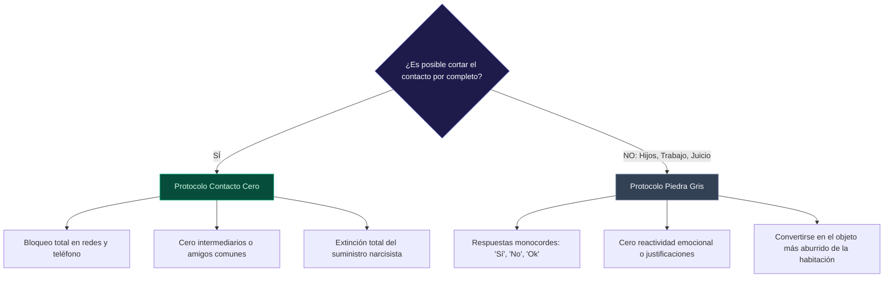

## Conviértete en la Roca Gris

Otra tecnica que es un poco mas realista si no puedes cortar por alguna razon, como por ejemplo si compartes hijos con un ex narcisista, es convertirte en la roca gris. Piensa en la ultima vez que diste un paseo al aire libre. Tal vez pasaste por tu jardin, o tal vez fuiste de excursion.?Puedes recordar alguna de las rocas que viste?

Lo mas probable es que no pueda. Y esto es normal. Las rocas son tan mundanas e irrelevantes para tu vida diaria que no tienes ninguna razon para centrarte en ellas. Mirar las rocas no te importa porque son aburridas, y no memorizas ninguna de ellas.

Quieres canalizar eso con el narcisista. Si puedes canalizar lo aburrido y mundano de esa roca, puedes aburriar al narcisista para que no se moleste contigo en el futuro. Todo lo que tienes que hacer es asegurarte de ser lo mas sencillo posible en todas y cada una de las interacciones con ellos.

Digamos que tienes hijos con tu ex, y por eso no puedes simplemente cortar con ellos. Si te pregunta como te va, simplemente ignoras la pregunta. Si te pregunta por los niños, contesta brevemente y con los menores detalles posibles. Si tiene alguna exigencia para ti, en lugar de argumentar sobre lo ridicula que es, puedes decir: "De acuerdo". Y dejarlo asi si vas a ceder, o ignorarlas si no son aceptables.

Al igual que con el metodo de corte, descubiras que el narcisista arremetera en un intento de que le respondas, pero sigue ignoradolo. No necesita reconocer nada que no tenga que ver con los niños o con otros esfuerzos compartidos. Esto significica que cualquier cosa que no requiera una respuesta no la obtendra, y con el tiempo, el narcisista se aburrira de ser ignorado. Hay poco que ganar de ser totalmente ignorado, y el narcisista lo sabe.

Al final, es probable que el narcisista pierda el interes y te deje en paz, al igual que con el metodo de corte.

### Approcchar el Tiempo

Otro metodo comun que puedes utilizar, preferiblemente junto con el metodo de la roca gris, es aprender a utilizar el tiempo a tu favor. Es probable que el narcisista este acostumbrado a que saltes cada vez que te lo pida. Esto significica que espera absolutamente que ese comportamiento continuie. Asumira que saltaras cada vez que te envie ese mensaje. Si te pide ayuda, asume que dejaras todo y acudiras en su ayuda.

Lo que puedes hacer para eliminar esa suposicion en particular es asegurarte de ponerle fin activamente. Poner al narcisista en silencio en tu telefono, si puedes, para que sus mensajes no te molesten mientras llegan todos valando, y no responder. Deberias establecer una cantidad de tiempo arbitaria para responderle, si es que lo haces, simplemente porque no hay razon para que respondas a su entera disposicion. Si estas ocupada, entonces estas ocupada, y tu telefono es para tu propia comodidad, no para la comodidad de los que te rodean.

Empieza por retrasar tus respuestas durante unas horas. Tal vez decidas que esperaras a leer los mensajes del narcisata durante una horas dequees de que lleguen, y luego aplicaras otra hora durante la cual estaras debatiendo la mejor manera de enforcar tu respuesta. Esto significica que habra un minimo de dos horas entre el momento en que te das cuenta del mensaje y el momento en que respondes si crees que merece una respuesta.

Esto sera difícil al principio, especialmente si has sido entrenado para responder al narcisista cada vez que te pide que hagas algo. Te resultara difícil superar esa programacion que te hace sentir que no tienes otra opcion que responder inmediatamente. Sin embargo, eso es exactamente lo que quiere el narcisista, y tienes que averiguar la mejor manera de superarlo de una vez por todas. Superarlo es posible si te esfuerzas, y aunque sera incomodo, merecera la pena.

Con el tiempo, destruiras esa expectativa que tiene el narcisista de que estaras disponible en cualquier momento si el narcisista determina que debes estarlo. Descubirras que el narcisista te enviara cada vez menos mesajes, y eso esta absolutamente bien para ti.

### Cream y Hacer Cumplir los Limites

Cuando se tiene una relación sana, se esperan limites. Si vas a imponer limites, debes asegurarte de que los estableces de forma significativa para ti. Tus limites son basicamente las leyes de respeto a ti mismo, son la línea que trazas que marca los comportamientos que no vas a tolerant.

Por ejemplo, un limite muy comun que no se dice en la mayoria de las relaciones es que no habra violencia fisica. Esto significica que ambas partes son muy conscientes de que todo el mundo espera que no haya violencia fisica en la relación, y ambas partes estan dispuestas a reconocer y seguir ese limite.

A los narcisistas no les gustan los limites por una buena razon: se interponen en el camino del narcisista. Cuando el narcisista quiere controlar a alguien, no puede lograrlo exactamente si alguien tiene un limite especificamente porquerer ser libre de tomar decisiones por si mismo. El narcisista ve entonces ese limite como una especie de desafio: el narcisista quiere derribarlo y demostrar que no importa. Después de todo, el narcisista es especial,?recuerdas? Cree que se merece el honor de poder pisotearlo sin consecuencias, simplemente por su singularidad y superioridad.

Por supuesto, ese no es el caso. Usted absolutamente puede y debe establecer limites, no importa lo que el narcisista dice, y si alguien trata de aplastar por completo los limites, entonces vsted sabe que no son seguros o respetuosos de las personas a tener en su vida. Si van a titar voluntariamente us limites sin tener en cuenta como te sientes, no puedes confiar en ellos en absoluto, y eso es un problema. Deberias poder confiar en las personas de tu vida.

Cuando estableczas un limite, debes asegurarte de declararlo explicitamente al narcisista, asi como de acompanarlo de una consecuencia. Por ejemplo, puedes decirle al narcisista: "Si vas a seguir menospeciadome, terminare esta visita hasta que estes dispuesto a hablarme como un adulto respetuos". La proxima vez que te menospecie, y volvera a hacerlo para poner a prueba ese limite, deberas poner fin a la visita. Puedes simplemente levantarte, recoger tus pertenencias, reconocer que no estas de acuerdo con ese comportamiento y marcharte, diciendole que puedes volver a intentarlo cuando este dispuesto a ser respetuoso.

Lo mas probable es que se queje y le de un ataque por ser tan cruel por castigarle por su mal comportamiento, pero piensalo asi: no le estas castigando, te estas protegiendo. Estas estableciendo un limite razonable para no ser insultado o menospeciado, y no es un castigo para el insultador que tu pongas distancia entre el y tu.?Llamarias castigo a la serpiente si te negaras a tocarla porque supieras que te iba a morder? No, es protegerte a ti mismo.

Puedes volver a intentar la interaccion después del periodo de tiempo que diijste que pasaria entre la siguiente falta de respeto a los limites, reiterando el limite que tienes para ti y la consecuencia de ignorarlo. El truco aqui es que debes cumplir cada vez que pongas una consecuencia. Tienes que ser capaz de decirle al narcisista que honraras tus propios limites para protegerte, le guste o no, y que lo haras para protegerte. Su comoddidad no es tu responsabilidad, y si realmente quisiera continuar con la visita, no te habria causado tantos problemas ni habria ignorado tus muy razonables limites.

### Cream un Poco de Distancia

A veces, el mejor enfoque para una relación con un narcisista es crear un lento desvanecimiento de la frecuencia de contacto con ellos. Efectivamente, poco a poco te tomaras mas y mas tiempo para contactar con ellos entre los intervalos normales, estirando el tiempo entre la frecuencia de contacto cuando empiezas y donde te gustaria estar.

Por ejemplo, imagina que tienes un padre narcisista. Usted quiere a su padre, pero es increiblemente agotador tratar con el. En la actualidad, intenta llamarte todos los dias al menos dos veces, y te das cuenta de que esta ejerciendo una enorme presión sobre tu propia vida diaria. Al fin y al cabo, vested tiene su propia vida y sus propios hijos, y aunque entiende que un padre quiera comunicarse con su hijo mayor, también sabe que esta demasiado ocupada para tener dos conversaciones de una hora al dia, lo que supone la friolera de un 13% de sus horas de vigilia. Es un tiempo que podria dedicar a sus hijos, a attenderse a si mismo, a las tareas domesticas o simplemente a sentarse y disfrutar del sincio. Al fin y al cabo, entre el trabajo, el colegio de los nios, las tareas domesticas, los deberes y asegurarse de que todo el mundo esta listo para el dia siguiente, uno siente que solo tiene unos minutos de paz para si mismo.

En este caso, podrias proponerte crear cierta distancia lentamente con tu padre narcisista. Podrias estirar lentamente la frecuencia con la que le respondes o te pones en contacto con el. Tal vez comiences por ignorar esa primera llamada telefonica cada dos dias; eso ya es significativo y te devuelve algunas horas de tu tiempo por semana. A partir de ahi, puedes decdiri hacerle saber a tu padre que estas ocupado cuando te llame y que le llamaras el fin de semana cuando las cosas esten menos estresadas.

Con el tiempo, se pasa de dos llamadas telefonicas al dia, a una llamada cada pocos dias, y finalmente a una cada semana o dos. Este proceso requiere tiempo y paciencia, pero con el tiempo podras alargar las visitas. Espera un poco de retroceso, como con todas las demas estrategias narcisatas, ya que el narcisista odia los cambios que no estan en sus propios terminos. El hecho de que usted cambie su horario y sus expectativas es un gran desaire para el, y no le gustara ni lo respetara, a pesar de que es lo mejor para usted.

## 📖 Capítulo 9: Dejar la Relacion Abusiva

Llegados a este punto, puede que te des cuenta de que tu relación esta arruinada. Esta danada sin remedio y sabes que necesitas salir. Sin embargo, dejar la relación siempre es mas fácil de decir que de hacer, y sobre todo si se convive y se comparten hijos, hay que tener en cuenta todo tipo de aspectos legales para poder salir sin problemas. Después de toda la información que ha obtenido al leer este libro hasta ahora, es posible que ahora reconozoa que el abuso en su relación no se va a ninguna parte, sino que esta ahi para quadarse. Esto es aterrador para la mayoria de las personas y no es algo que necesariamente quieras soportar. Sin embargo, esa es exactamente la razon por la que existe esta guía. Puedes dejarlo. Este capitulo le dira como irse, detallando lo que debe preparar. Puedes liberarte de las garras del maltratador de una vez por todas, rompiendo esas cadenas y liberandote de la vida de tormento y abuso que de otra manera tendrias que soportar.

Cuando estes seguro de que estas preparado para marcharte, recuerda tres cosas: Su pareja no va a cambiar. Usted no puede ayudar a su pareja a cambiar. Su pareja le prometera y rogara que se quede con usted, pero esto es porque no quiere perder el control. En ultima instancia, nunca se esforzara por cambiar a largo plazo, especialmente si es un narcisista, porque el trastorno de personalidad narcisista que padece le impide reconocer que el es el problema. Esto significa que va a seguir siendo la persona abusiva que es, sin importar cuanto quieras que cambie. Eso no es culpa tuya, y esta bien llorar por esa relación que has perdido. Sin embargo, no dejes que ese dolor te impida romper esas cadenas y encontrar la libertad y la salud.

**Ponga sus Patos en Fila**Por muy bonita que sea esta imagen, tener los patos en fila es la capacidad de tener todo alineado y listo para salir. Vas a intentar activamente asegurarte de que todo lo que vas a necesitar en tu salida esta en un lugar y preparado.

Esta etapa incluye todo lo legal que pueda necesitar.?Comparten hijos? Empiece a investigar sobre la custodia y lo que tendra que hacer para solicitar la custodia de emergencia. Es posible que si tiene documentacion que demuestre el maltrato, pueda obtener la custodia de emergencia de sus hijos. En algunos estados, si tusted no esta casada como madre, conserva la custodia completa, incluso si el padre de su hijo figura en el certificado de nacimiento. Asegurate de consultar a un abogado para comprobar la legalidad de estos aspectos y asegurarte de no cometer ningun errorique pueda perjudicar tu lucha por la custodia.

También querra asegurarse de que toda la documentacion importante esta alineada.?Sabe donde esta subdocumentacion legal??Tienes la tarieta de la seguridad social y el certificado de nacimiento??V toda la documentacion del cooche, el seguro, la propiedad conjunta y cualquier otra cosa que sea relevante para ti? Asegurese, de reunir todos los documentos legales importantes, asi como de reunir todo lo relativo a sus hijos. Asegurate detener los documentos que declaran la custodia si y esta resuelta. Si va a solicitar un orden de alejamiento y una custodia de emergencia, consiga todo eso también.

Con el papeleo alineado, necesitas asegurarte de que también tienes todos us objetos sentimentales e irremplazables, en un lugar que sea fácil de agarrar. Asegurate de tener los ordenadores, los discos duros, los albumes de fotos y cualquier otra cosa que te devastaria perder si el narcisista decide ponerse destructivo para castigarte por dejarlo. Querras poner todo esto en una bolsa que puedas llevar rapidamente, colocandola con todo el papeleo legal. Estas son tus bolsas de viaje: esta ahi para que las tomes y las dejes lo mas rapido posible si surge la necesidad.

Asegurese de que la bolsa de viaje también tiene cargadores: debe tener un juego de llaves de repuesto para el coche, algo de dinero, el cargador del telefono y del ordenador, cualquier cosa que vaya a necesitar para los nios si no tiene tiempo de parar y recoger las cosas de otra manera, y cualquier otra cosa que sepa que va a necesitar para un viaje de varias noches.

Recuerde que, en ultima instancia, sus pertenencias fisicas pueden ser reemplazadas, y aunque debe esforzarse por proteger sus pertenencias si puede, si no puede, no se moleste. Centrese en asegurarse de que usted, sus hijos y sus mascotas estan fuera si puede.

[MISSING_PAGE_EMPTY:422]

Cuando Ilgeue el momento, asegurese de no dudar: vaya tan pronto como dijo que lo haria para protegerse a si misma y a sus hijos y recuerde que esta haciendo lo correcto.

No es un proceso fácil: irse nunca es fácil, sobre todo si no llevas dinero encima o no tienes acceso a el. Sin embargo, sientete orgullosa de no estar dispuesta a dejarte llevar, sin poder vivir tu vida en paz y con seguridad. Estas eligiendo avanzar hacia la seguridad y la felicidad, y eso es bastante noble por si mismo.

Cuando estes preparada para escapar, ten en cuenta que tu tecnología puede ser tu peor enemigo: si intentas marcharte, tienes que asegurarte de que tu agresor no pueda rasterarte. Si tiene un telefono inteligente, considere la posibilitad de dejarlo atras y comprar un nuevo telefono desechable si puede hacerlo. Asegurese de cerrar la sesion de todas las iteraciones de rastreo familiar y monitoreo por GPS que puedan existir en sus telefonos, tabletas y computadoras. Además, asegurese de cambiar sus contrasenas en todas las cuentas, para que su agresor no pueda entrar y rasteralo a sus interlocutores.
Una vez que se haya marchado, es fundamental que se asegure de que su información se mantenga lo mas privada posible. Debera asegurarse de utilizar un telefono desechable o un nuevo número de telefono, que desea especificamente que no figure en la lista. No querra que nadie pueda rasterar su número hasta su nombre.

Mientras que la mayoria de las veces, cuando usted se muda, usted hace un punto para llenar una direccion de reenvio con la oficina de correos para asegurarse de que usted recibe todo su correo, considere la posibilidad de tener todo reenviado a un apartado postal en su lugar. Esto significara que la única notificacion que su ex puede recibir es que usted esta utilizando un apartado de correos en un area determinada.

Al establecer su nueva vida, querra asegurarse de desconcentarse de todas las cuentas bancarias o de credito que sean comparidas -asegurese de hablar con un abogado sobre la propiedad de antemano si es posible, y que esto puede cambiar de un estado a otro, dependiendo del estado civil y varios otros factores también. Es absolutamente necesario evitar el uso de cualquier tarieta a la que tenga acceso su ex, ya que este podrá ver donde realiza usted las transacciones, y eso puede ser suificiente información para hacerse una idea general de donde se encuentra, algo que probablemente quiera evitar.

Si por casualidad se queda en la misma ciudad o pueblo por motivos de trabajo, estudios u otras obligaciones, cambien su rutina. Si tiene hijos en la escuela y en la guarderia, puede considerar la posibilidad de volver a inscribirlos en otro lugar, ya que su ex, suponiendo que sea su padre, probablemente podria recogerlos sin ninguna protesta si asi lo desea. Cambiar la mayor parte de su rutina le ayudara a evitar que le rastreen facilmente. Ten en cuenta que tu telefono movil cargado debe estar siempre contigo, y que nunca debes dudar en pedir ayuda si la necesitas.

Una vez mas, recuerda que estas haciendo lo correcto al liberarte de la relación. Seguir estos pasos puede ser útil, pero si no puede acceder a los fondos o necesidades adecuadas, o no tiene un medio de transporte para salir del hogar, puede llamar a la línea directa de violencia domestica de su localidad. Ellos deberian tener recursos que puedan ayudarle a salir del hogar con sus hijos.

Como beneficio, las líneas telefonicas de ayuda contra la violencia domestica y los refugios tendran acceso a varios beneficios que realmente pueden ayudarle a salir de la relación abusiva y liberarse de una vez por todas. Tendras acceso a abogados, refugios, ayuda financera, consejeros y mas, todos ellos especializados en ayudar y trabajar con personas en situaciones como la tuya.

## 📖 Capítulo 10: Permanecr Libre

Una vez que haya salido finalmente de la relación, puede descubrir que, después de algun tiempo, lo echa de menos. Echara de menos a su ex, y aunque haya sido abusivo o amenazante, aun asi paso una parte de su vida con el y siente que quiere recuperar eso. Es natural echar de menos a las personas que te importan, pero en ultima instancia, debes tener la confianza en ti misma y la autodisciplina para recordarte que tomaste la decisión correcta de dejarlo.

En particular, puede descubrir que echa de menos los buenos tiempos, y eso es natural. Si tu relación no hubiera sido mas que negativa, nunca habria progresado mas alla de la cita inicial: el narcisista tenia que ser capaz de conquistarte de alguna manera, y eso suele implicar algun tipo de fachada y persona. Sin embargo, puede ser increiblemente difícil evitar los sentiminentos de querer volver con el abusador, incluso después de haber escapado finalmente de una vez por todas.

Ten en cuenta que si acabas de escapar de tu relación y sientes que quieres volver, no estas sola. Por termino medio, una persona necesita al menos siete intentos para liberarse de una pareja abusiva. Sin embargo, el hecho de querer volver y saber que otras personas regresan regularmente no significica que debas decidir simplemente volver porque echas de menos a tu ex: debes intentar resisitre. Conserva esa libertad por la que tanto has luchado y asegurate de seguir siendo libre.

En particular, este capitulo se tomara el tiempo de proporcionarle algunos consejos diseñados para ayudarle a no regresar a su situación de abuso a pesar de la tentacion y el deseo que pueda tener de hacer exactamente eso. Incluso si se siente deprimido donde esta, o siente que su casa seria mejor que la habitata de un refugio en la que esta, resista. Cada vez que sientas que deseas que las cosas sean diferentes o cuando te digas a ti mismo que estas luchando debido a tus propios fracasos, recuerdate que el abuso no es tu culpa. No es tu culpa que hayas sido blanco de un narcisista. Fuiste presa del abusador, y eso no tiene nada que ver con lo que eres o lo que mereces. Nunca podrias haber sabido que todo se desarrollaria de la manera en que lo hizo. Eso no es tu culpa, y nunca lo sera.

El camino hacia la recuperacion comienza cuando dejas de culpar a las acciones del narcisista. Esto significica que debes recharaz la idea de que de alguna manera tienes la culpa de todo lo ocurrido. El abuso recae firmemente en el narcisista, y debes recordartelo. Recuerdate a ti mismo que nadie merece ser abusado en tus momentos de debilidad, y recuerdate a ti mismo que puede que no estes donde eserabas estar, pero al menos eres libre. Has salido de esa jula de una vez por todas y por fin eres libre para estirar tus alas y aprender a volar.

Ahora que estas lejos, es el momento de mantenerte alejado. Puedes hacerlo.

